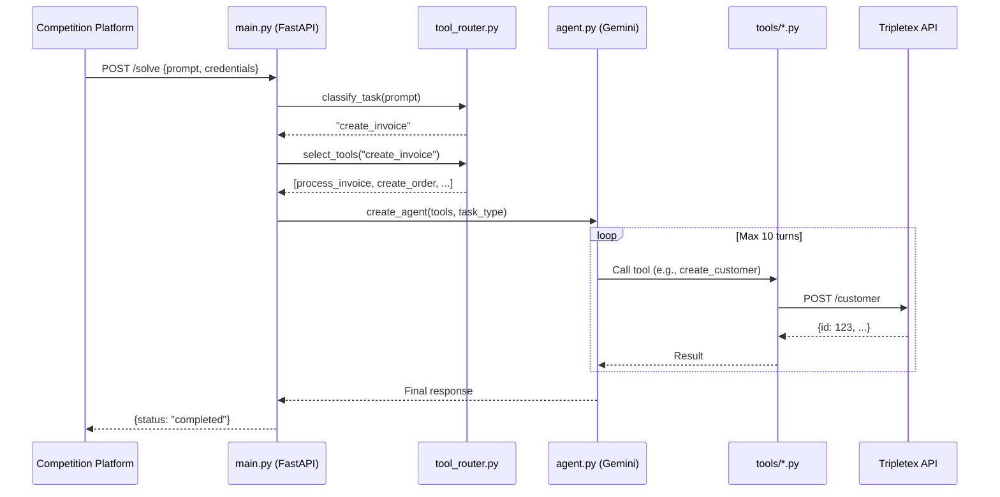
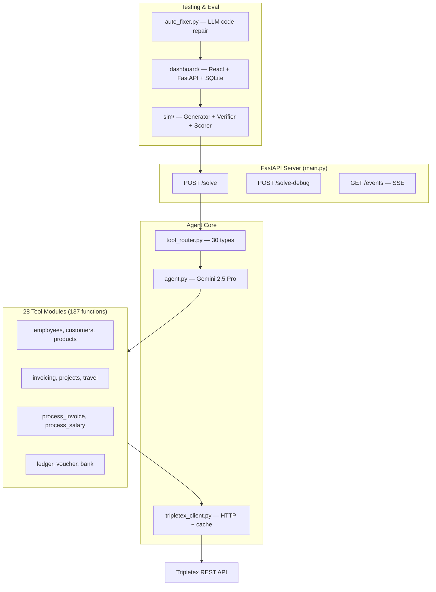
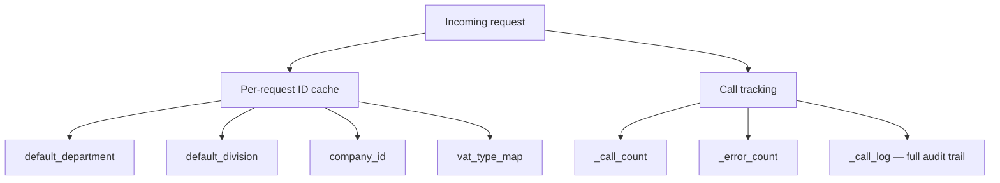

# Architecture

End-to-end system architecture for the Tripletex AI accounting agent.

---

## Request Flow

---

## Component Map

---

## Key Files

| File | Lines | Purpose |
|------|-------|---------|
| `main.py` | ~600 | FastAPI server, /solve endpoint, SSE events |
| `agent.py` | ~1800 | Gemini agent, system instructions, per-task prompts |
| `tool_router.py` | ~2100 | Task classifier (keyword scoring) + tool selector |
| `tripletex_client.py` | ~250 | HTTP wrapper with auth, caching, call tracking |
| `config.py` | ~15 | Environment config |
| `static_runner.py` | ~3500 | Deterministic pipeline (LLM extract + hardcoded steps) |
| `auto_fixer.py` | ~1000 | LLM-driven self-repair |
| `simulator.py` | ~400 | CLI competition simulator |
| `tools/__init__.py` | ~100 | Tool aggregation |
| `tools/invoicing.py` | ~400 | Invoice workflow (order → invoice → payment) |
| `tools/ledger.py` | ~350 | Voucher with balanced postings |
| `tools/projects.py` | ~300 | Project + PM entitlements |
| `sim/verifier.py` | ~929 | Field-by-field verification |
| `dashboard/app.py` | ~400 | Eval dashboard API |

---

## Data Flow

All state is per-request — no shared state between submissions:

The `TripletexClient` pre-warms caches on init (fetching default department, division, company ID, VAT maps) to save 1-3 API calls per request.
