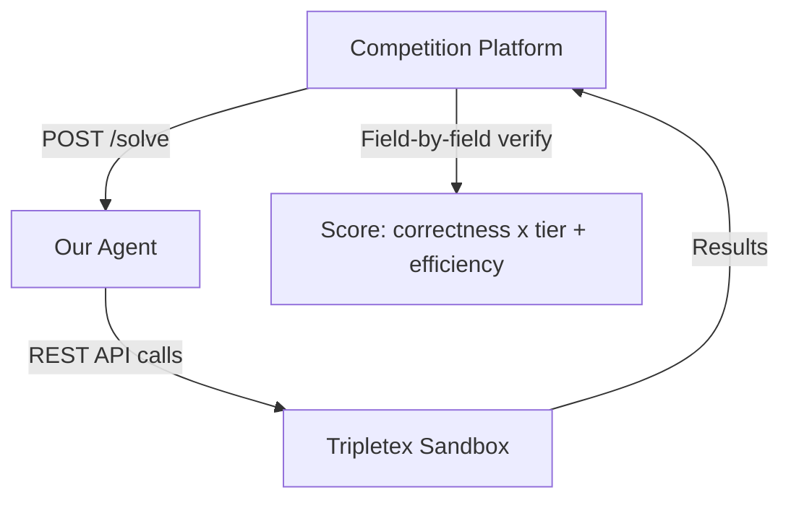
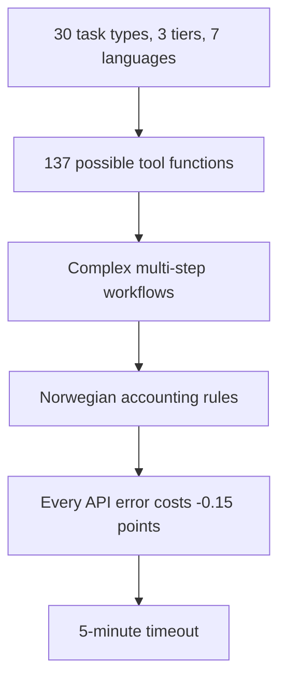

# Vision — Tripletex AI Accounting Agent

Competition entry for the Tripletex challenge in [NM i AI 2026](https://app.ainm.no).

---

## The Challenge

Build an HTTPS `/solve` endpoint that receives Norwegian accounting task prompts in 7 languages, executes them against the Tripletex REST API (Norway's largest cloud accounting platform, ~150,000 businesses), and gets scored on correctness and efficiency.

- **30 task types** across 3 difficulty tiers
- **56 variants each** (7 languages x 8 data sets)
- **7 languages**: Norwegian (bokmal), English, Spanish, Portuguese, Nynorsk, German, French
- **Fresh sandbox** per submission (starts empty)
- **5-minute timeout** per task

---

## The Problem

1. **Task diversity** — from single-call creates to 5-6 step invoice+payment workflows
2. **Tool overload** — 137 functions across 28 modules. Giving the LLM all of them wastes tokens and causes wrong tool calls
3. **Norwegian accounting** — voucher postings must balance, VAT rates (25/15/12/0%), bank account 1920, specific API quirks (isCustomer=True, invoiceDueDate mandatory)
4. **Efficiency pressure** — every 4xx error costs 0.15 points from the efficiency bonus. Pre-validation is essential
5. **Multi-language** — prompts arrive in 7 languages with Norwegian field values (ø, æ, å)

---

## The Solution

A **deterministic task router** classifies prompts into 30 types via keyword matching (zero latency, no vector DB), then gives the Gemini LLM agent only the 2-10 tools it needs. Pre-validation catches errors before they hit the API. Auto-recovery handles common collisions (email already exists, account not found).

| Component | Purpose |
|---|---|
| **Task Router** | Keyword classifier: 30 types, 7 languages, zero latency |
| **Gemini Agent** | Google ADK + Gemini 2.5 Pro, max 10 turns |
| **Tool System** | 28 modules, 137 functions, filtered to 2-10 per task |
| **Simulator** | Generate prompts, verify results, score — full competition sim |
| **Dashboard** | React + FastAPI eval runner with SQLite tracking |
| **Auto-Fixer** | LLM analyzes real competition failures, suggests code fixes |

---

## Results

| Metric | Value |
|---|---|
| Current score | 31.06 / 124.00 (25.0%) |
| Tasks scored | 20 / 30 (66.7%) |
| Perfect tasks | 3 (create_customer, create_product, create_department) |
| Best single task | 3.50 / 4.00 (create_employee_with_employment) |
| Total attempts | 161 |
