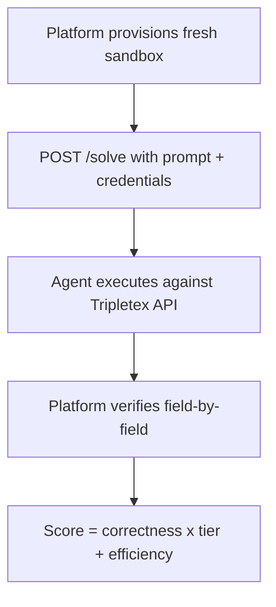

# Product Requirements — Tripletex AI Accounting Agent

## Challenge Overview

Build an HTTPS `/solve` endpoint that executes accounting tasks against the Tripletex API. Prompts arrive in 7 languages, covering 30 task types across 3 difficulty tiers.

---

## Submission Protocol



### Request Format
```json
{
  "prompt": "Opprett en ansatt med navn Ola Nordmann...",
  "files": [{"filename": "faktura.pdf", "content_base64": "...", "mime_type": "..."}],
  "tripletex_credentials": {"base_url": "https://...", "session_token": "abc123"}
}
```

### Authentication
- Basic Auth: username = `"0"`, password = `session_token`

### Constraints
- 5-minute timeout (300 seconds)
- Fresh empty sandbox per submission
- Must return `{"status": "completed"}` (HTTP 200)

---

## Scoring Formula

```
correctness = points_earned / max_points           [0.0-1.0]
base_score  = correctness × tier_multiplier        [0-3]
efficiency  = (baseline_calls / actual_calls) × tier - (errors × 0.15)
              (only if correctness == 1.0)
final_score = base_score + efficiency_bonus
max_possible = tier × 2
```

| Tier | Multiplier | Perfect base | Max with efficiency |
|------|-----------|--------------|---------------------|
| Tier 1 (Basic) | x1 | 1.0 | 2.0 |
| Tier 2 (Workflow) | x2 | 2.0 | 4.0 |
| Tier 3 (Advanced) | x3 | 3.0 | 6.0 |

**Max total**: 124.00 points (9 x 2.0 + 10 x 4.0 + 11 x 6.0)

Every 4xx API error costs **-0.15** from the efficiency bonus. Fewer API calls = higher bonus.

---

## 30 Task Types

### Tier 1 — Basic CRUD (x1, max 2.0 each)

| Task | Baseline Calls | Description |
|------|---------------|-------------|
| create_employee | 1 | Single employee creation |
| create_customer | 1 | Customer with isCustomer=True |
| create_product | 1 | Product with VAT type |
| create_department | 1 | Department |
| create_supplier | 1 | Supplier with isSupplier=True |
| create_contact | 2 | Customer + contact person |
| update_employee | 2 | Search + update fields |
| update_customer | 2 | Search + update fields |
| update_product | 2 | Search + update fields |

### Tier 2 — Multi-Step Workflows (x2, max 4.0 each)

| Task | Baseline Calls | Description |
|------|---------------|-------------|
| create_invoice | 4 | Customer + product + order + invoice |
| create_multi_line_invoice | 5-6 | Customer + N products + order + invoice |
| create_project | 2-3 | Customer + employee + project |
| create_travel_expense | 2 | Employee + travel expense |
| travel_expense_with_costs | 3-4 | + cost/mileage/per diem |
| invoice_with_payment | 5 | Invoice workflow + register payment |
| create_credit_note | 5 | Invoice workflow + credit note |
| create_employee_with_employment | 2-5 | Employee + employment + details |
| supplier_invoice | 2-3 | Supplier + incoming invoice |
| delete_travel_expense | 2 | Search + delete |

### Tier 3 — Advanced (x3, max 6.0 each)

| Task | Baseline Calls | Description |
|------|---------------|-------------|
| delete_customer | 2 | Search + delete |
| delete_supplier | 2 | Search + delete |
| delete_product | 2 | Search + delete |
| create_ledger_voucher | 1 | Balanced postings required |
| reverse_voucher | 2 | Search + reverse |
| delete_invoice | 5 | Create invoice first + credit note |
| create_opening_balance | 1 | Single API call |
| bank_reconciliation | 2-4 | Extract file + bank accounts + vouchers |
| process_invoice_file | 4-5 | Extract PDF + create invoice |
| year_end | 2-4 | Close period + reports |
| salary_with_bonus | 3-4 | Salary workflow |

---

## Languages

| Code | Language | Example Prompt |
|------|----------|----------------|
| no | Norwegian (bokmal) | "Opprett en ansatt med navn..." |
| en | English | "Create an employee named..." |
| es | Spanish | "Cree un empleado llamado..." |
| pt | Portuguese | "Crie um funcionario chamado..." |
| nn | Nynorsk | "Opprett ein tilsett med namn..." |
| de | German | "Erstellen Sie einen Mitarbeiter..." |
| fr | French | "Creez un employe nomme..." |

---

## Norwegian Accounting Rules

| Rule | Detail |
|------|--------|
| VAT rates | 25% (standard), 15% (food), 12% (transport), 0% (exempt) |
| Voucher postings | Must balance to 0 (positive=debit, negative=credit) |
| Bank account 1920 | Must have bankAccountNumber set for invoicing |
| isCustomer=True | Required for all customer entities |
| isSupplier=True | Required for all supplier entities |
| invoiceDueDate | Mandatory for invoice creation |
| Dates | Always YYYY-MM-DD format |
| Currency | NOK (Norwegian Krone) |
