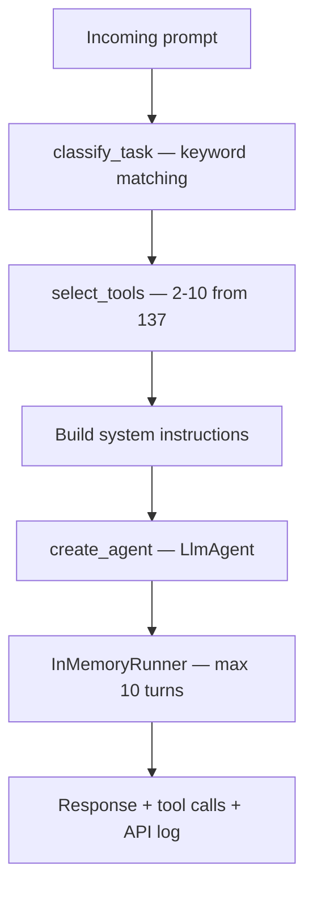
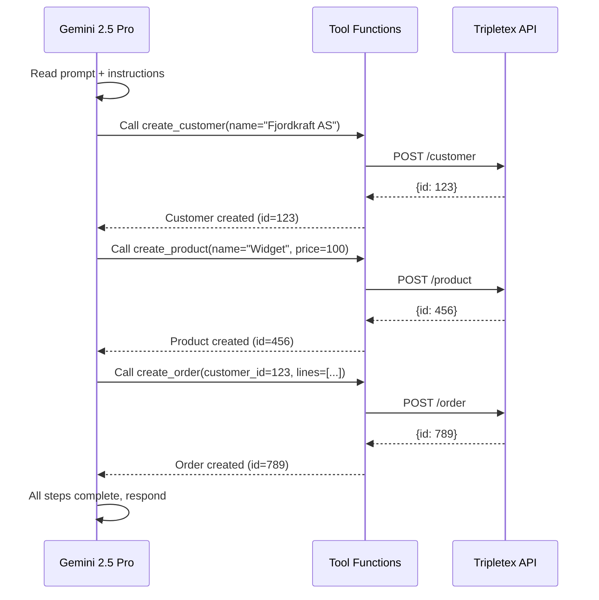
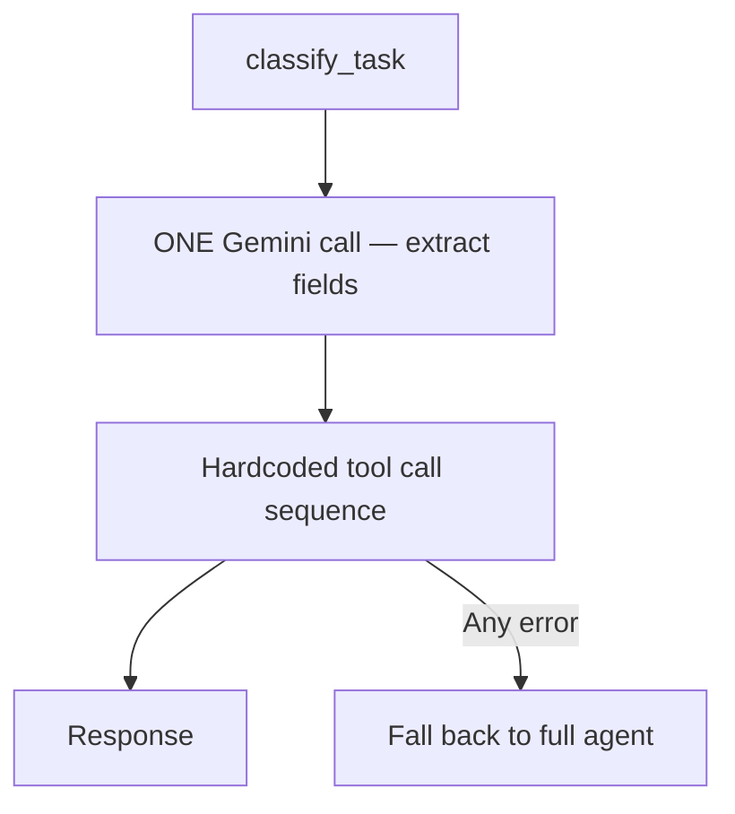

# Agent Pipeline — Gemini LLM with Google ADK

The core execution engine: a Gemini 2.5 Pro agent that receives a classified task, gets focused instructions and 2-10 filtered tools, and executes against the Tripletex API in max 10 turns.

---

## Pipeline

### Why This Architecture?

**Token efficiency**: Giving Gemini all 137 tools wastes ~5,000 tokens per request and causes wrong tool calls. Filtering to 2-10 tools saves 77% of instruction tokens and dramatically improves accuracy.

**Deterministic routing**: Keyword matching classifies tasks in microseconds with zero external dependencies. No vector DB, no embeddings, no API calls — just string matching in 7 languages.

**Focused instructions**: Each task type gets ~200 tokens of specific guidance instead of a 2,800-token monolith. The agent knows exactly what it needs to do.

---

## System Instructions

### Common Preamble (all tasks)

~7,000 tokens of universal rules:
- **Process**: PLAN -> EXTRACT -> EXECUTE -> STOP
- **Field rules**: preserve Norwegian chars (ø, æ, å), dates YYYY-MM-DD, isCustomer=True
- **Error handling**: single retry per error, never blind retry loops
- **Special cases**: "Account X not found" -> search + retry, "Invalid token" -> fail immediately

### Per-Task Instructions (~200 tokens each)

Specific guidance for each of the 30 task types:
- "create_invoice: customer must have isCustomer=True, VAT is automatic from product type"
- "create_voucher: postings MUST balance to 0, positive=debit, negative=credit"
- "create_project: PM needs dateOfBirth, userType=EXTENDED, employment record, entitlements 45->10->8"

### Tier Reference

Complete task hierarchy with expected call counts, helping the agent judge its progress.

---

## Execution Model

- **Max 10 turns** (MAX_AGENT_TURNS in config)
- **270-second timeout** (300s minus 30s HTTP margin)
- **Concurrency limit**: max 10 agents in parallel
- **SSE streaming**: live events via GET /events

---

## Static Runner (Alternative Path)

For well-understood tasks, `static_runner.py` bypasses the multi-turn agent:

- Single LLM call (temp=0.0) extracts structured parameters
- Deterministic pipeline executes tools in known order
- Falls back to full agent on any error
- Faster and more predictable for simple tasks

---

## Error Recovery

| Error | Recovery |
|---|---|
| Email collision ("bruker med denne e-postadressen") | Search existing employee, return it |
| Account not found | Search for correct account, retry with valid ID |
| Invalid/expired token | Fail immediately (can't fix) |
| Unbalanced voucher | Pre-validate before POST (never hits API) |
| Missing invoiceDueDate | Set = invoiceDate if not in prompt |

---

## Files

| File | Purpose |
|------|---------|
| `main.py` | FastAPI server, /solve endpoint, SSE events |
| `agent.py` | LlmAgent definition, system instructions, per-task prompts |
| `config.py` | GOOGLE_API_KEY, GEMINI_MODEL, MAX_AGENT_TURNS |
| `static_runner.py` | Deterministic pipeline with LLM extraction |
