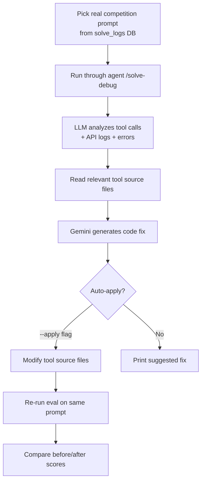

# Auto-Fixer — LLM-Driven Self-Repair

An automated system that picks real competition failures, analyzes them with Gemini, and generates code fixes for the tool functions — optionally auto-applying them to the source files.

---

## Pipeline



---

## How It Works

1. **Pick a task**: Random or `--pick` interactive selection from real competition logs
2. **Get real prompts**: Queries `solve_logs` for prompts with `source='competition'`
3. **Run eval**: Calls `/solve-debug` to get full diagnostic output (tool calls, API log, errors)
4. **Map to source files**: `_TOOL_FILE_MAP` maps tool names to Python source files
5. **LLM analysis**: Gemini reads the failure context + source code, identifies root cause
6. **Generate patch**: Gemini produces a Python code fix
7. **Auto-apply** (optional): `--apply` flag modifies tool source files directly
8. **Retry**: Re-runs the same prompt to verify the fix worked

---

## Usage

```bash
# Random task, suggest fix
python auto_fixer.py

# Specific tasks, auto-apply fixes
python auto_fixer.py --tasks create_employee create_invoice --apply

# Multiple retries
python auto_fixer.py --tasks update_customer --apply --retries 3

# Interactive task picker
python auto_fixer.py --pick
```

---

## Why This Matters

The competition sends real prompts in 7 languages with unpredictable phrasing. Lab tests pass but competition submissions fail on edge cases:
- Unexpected field formats
- Missing optional fields that turn out to be required
- Norwegian accounting terms the agent misinterprets
- Multi-language ambiguity

The auto-fixer closes the loop: real failure -> analysis -> fix -> verify. It's the research agent equivalent for the Tripletex challenge.

---

## Files

| File | Purpose |
|------|---------|
| `auto_fixer.py` | Main auto-fix pipeline |
