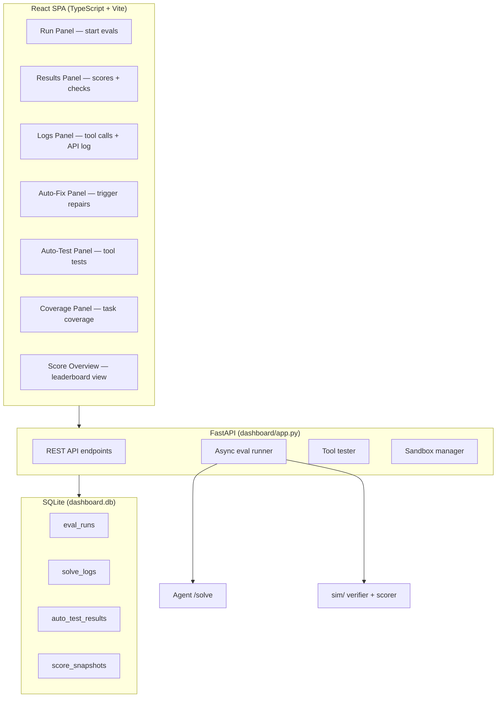
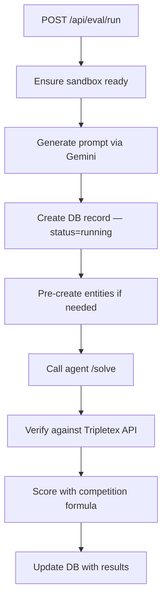

# Dashboard — React + FastAPI Eval Runner

A web dashboard for running evaluations, tracking scores, viewing API logs, and managing the sandbox. React frontend with FastAPI backend and SQLite storage.

---

## Architecture

---

## Panels (10 total)

| Panel | Purpose |
|---|---|
| **Run** | Start single or batch evaluations, select task + language |
| **Results** | Display scores, field-by-field check results |
| **Logs** | View tool calls and raw API log per run |
| **Auto-Fix** | Trigger auto_fixer.py on real competition failures |
| **Auto-Test** | Run all 137 tool tests, stream results |
| **Coverage** | Task type coverage map (which types have been tested) |
| **Errors** | Error summary across all runs |
| **Replay** | Replay saved competition payloads |
| **Report** | Generate evaluation reports |
| **Score Overview** | Leaderboard-style score breakdown |

---

## Eval Runner

- **Concurrency limit**: Semaphore(3) — max 3 evals in parallel
- **Async**: Non-blocking, multiple evals can run simultaneously
- **Pre-create**: Delete/reverse tasks need entities to exist first

---

## Database Schema (SQLite)

### eval_runs
Stores every evaluation run with full scoring:
- `task_name`, `tier`, `language`, `prompt`, `expected_json`
- `status` (running/completed/error)
- `api_calls`, `api_errors`, `elapsed_seconds`
- `correctness`, `base_score`, `efficiency_bonus`, `final_score`, `max_possible`
- `checks_json` (field-by-field results)

### solve_logs
Stores every /solve request for analysis:
- `prompt`, `base_url`, `task_type`, `tool_count`
- `api_calls`, `api_errors`, `elapsed_seconds`
- `agent_response`, `tool_calls_json`, `api_log_json`
- `source` (eval/competition/debug)

### score_snapshots
Periodic snapshots of competition scores for trend analysis.

---

## Tech Stack

- **Backend**: FastAPI + SQLite + uvicorn (port 8001)
- **Frontend**: React 18 + TypeScript + Vite + Shadcn UI + TailwindCSS
- **Styling**: Dark cyberpunk theme

---

## Files

| File | Purpose |
|------|---------|
| `dashboard/app.py` | FastAPI endpoints |
| `dashboard/db.py` | SQLite schema + queries |
| `dashboard/runner.py` | Async eval runner (Semaphore 3) |
| `dashboard/tool_tester.py` | Test all 137 tools |
| `dashboard/sandbox.py` | Sandbox health + seeding |
| `dashboard/frontend/` | React SPA |
