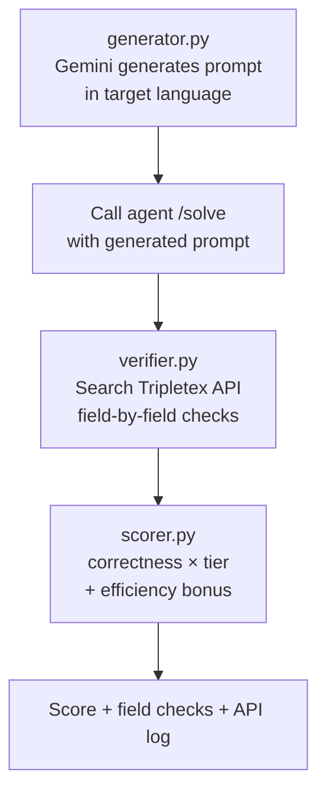
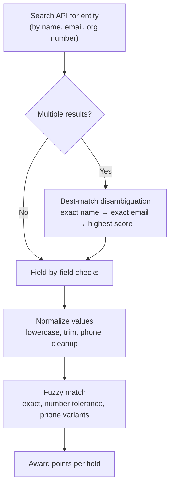

# Simulator — Full Competition Simulation

Generate realistic task prompts, execute them through the agent, verify results field-by-field against the Tripletex API, and score using the exact competition formula. A complete offline competition simulator.

---

## Pipeline



### Prompt Generation (generator.py)

Uses Gemini (temperature=1.0 for variety) to generate realistic accounting prompts:
- Scandinavian names and companies
- March 2026 dates
- NOK amounts
- Target language (7 supported)
- Returns: `{prompt, expected: {field1, field2, ...}}`

### Verification (verifier.py, 929 lines)

For each task type, searches the Tripletex API for the created entity and checks fields:



**Field matching**:
- Exact string match (case-insensitive)
- Number tolerance (±0.01)
- Phone normalization (strip +47, spaces, dashes)
- Boolean handling
- Best-match disambiguation when multiple entities found

### Scoring (scorer.py)

Exact competition formula:

```python
correctness = total_points / max_points
base_score = correctness * tier
if correctness == 1.0:
    efficiency_bonus = min(baseline_calls / actual_calls, 1.0) * tier
    efficiency_bonus -= api_errors * 0.15
final_score = base_score + efficiency_bonus
```

---

## CLI Usage

```bash
# List all 30 task types
python simulator.py --list

# Run specific task
python simulator.py --task create_employee --lang no

# Batch run (5 random tasks)
python simulator.py --batch 5

# Dry run (generate prompts only)
python simulator.py --dry-run

# Custom agent URL
python simulator.py --agent-url http://localhost:8005/solve
```

---

## Task Definitions (sim/task_definitions.py)

Each task type is defined as a `TaskDef` with:

| Field | Purpose |
|------|---------|
| `name` | Task identifier |
| `tier` | 1, 2, or 3 |
| `field_checks` | List of (field_name, points) pairs |
| `baseline_calls` | Minimum API calls needed |
| `search_fields` | How to find the entity in API |
| `extra_verifications` | Additional checks (linked entities, etc.) |

Example — `CREATE_CUSTOMER`:
- tier=1, baseline_calls=1
- field_checks: `_found` (2 pts), name (1), email (1), organizationNumber (1), phoneNumber (1), addressLine1 (1), postalCode (1), city (1)
- Max points: 9

---

## Files

| File | Purpose |
|------|---------|
| `sim/task_definitions.py` | 21 task type definitions with field checks |
| `sim/generator.py` | Gemini prompt generation (7 languages) |
| `sim/verifier.py` | 929-line verification with fuzzy matching |
| `sim/scorer.py` | Competition scoring formula |
| `simulator.py` | CLI runner |
