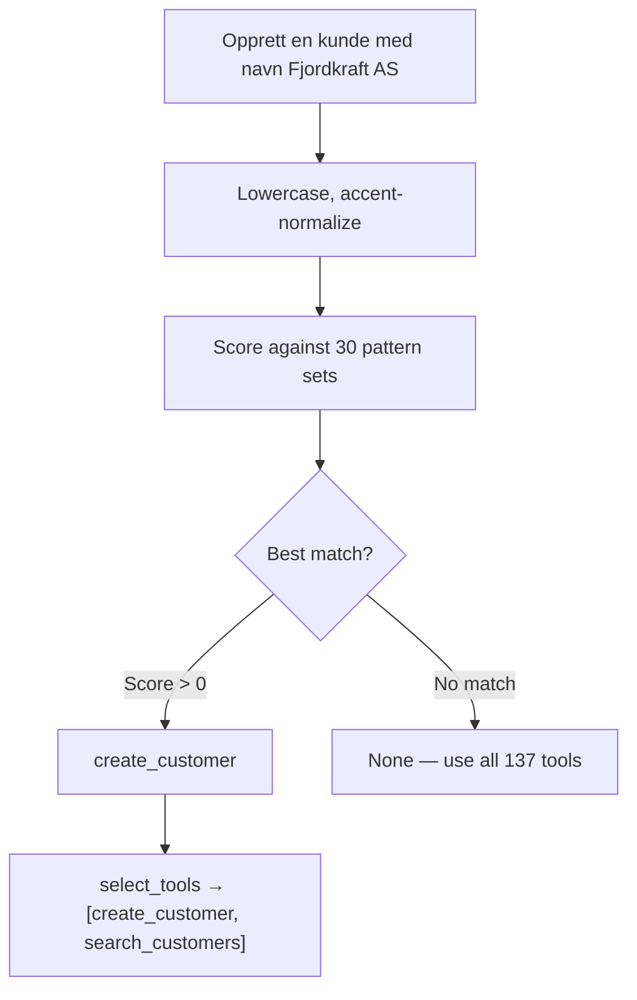

# Task Router — Deterministic 30-Type Classifier

A keyword-based task classifier that maps natural language prompts in 7 languages to one of 30 known task types, then selects the minimal set of tools the agent needs. Zero latency, zero external dependencies.

---

## How It Works



### Pattern Matching

Each task type has:
- **Positive patterns**: Keywords that indicate this task type (multi-word checked first)
- **Negative patterns**: Keywords that rule OUT this task type
- **Bonus score**: Higher = stronger match

```python
("create_customer",
  ["opprett kunde", "create customer", "crear cliente", "kunde opprettes", ...],
  ["slett kunde", "delete customer"],  # negatives
  10  # bonus
)
```

### Scoring

```
score = sum(positive_matches) × bonus - sum(negative_matches) × penalty
```

Multi-word patterns (`"opprett kunde"`) are checked before single-word patterns (`"kunde"`). This prevents "slett kunde" (delete customer) from matching on the word "kunde" and being classified as "create_customer."

### Language Support

All 7 languages have keyword patterns:

| Language | "Create employee" | "Delete customer" |
|----------|-------------------|-------------------|
| Norwegian | "opprett ansatt" | "slett kunde" |
| English | "create employee" | "delete customer" |
| Spanish | "crear empleado" | "eliminar cliente" |
| Portuguese | "criar funcionario" | "excluir cliente" |
| Nynorsk | "opprett tilsett" | "slett kunde" |
| German | "mitarbeiter erstellen" | "kunde loschen" |
| French | "creer employe" | "supprimer client" |

Accent-insensitive matching: `é→e`, `ü→u`, `ñ→n`, but Norwegian `ø/æ` are preserved.

---

## Tool Selection

Once the task type is known, `select_tools()` maps it to the minimal tool set:

| Task Type | Tools Selected | Count |
|---|---|---|
| create_employee | create_employee | 1 |
| create_customer | create_customer | 1 |
| create_invoice | process_invoice, create_order, create_invoice, ... | 6 |
| create_project | create_customer, create_employee, create_project | 5 |
| create_ledger_voucher | create_voucher, get_ledger_accounts | 2 |
| delete_customer | search_customers, delete_customer | 2 |

`get_entity_by_id` is always included as a universal safety net.

### Impact

- **Without filtering**: 137 tools → ~5,000 tokens wasted, frequent wrong tool calls
- **With filtering**: 2-10 tools → 77% token savings, dramatically better accuracy

---

## LLM Fallback

For ambiguous prompts where keyword matching returns `None`, an optional LLM classifier (`llm_classify_task()`) uses Gemini to classify the task. This is slower but handles edge cases like unusual phrasing or mixed-language prompts.

---

## Files

| File | Purpose |
|------|---------|
| `tool_router.py` | classify_task(), select_tools(), pattern definitions |
