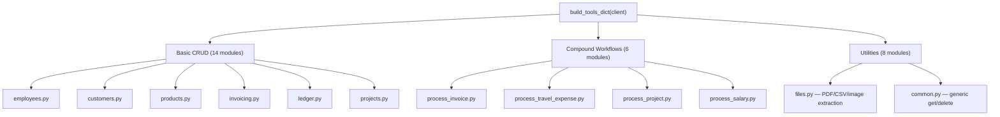
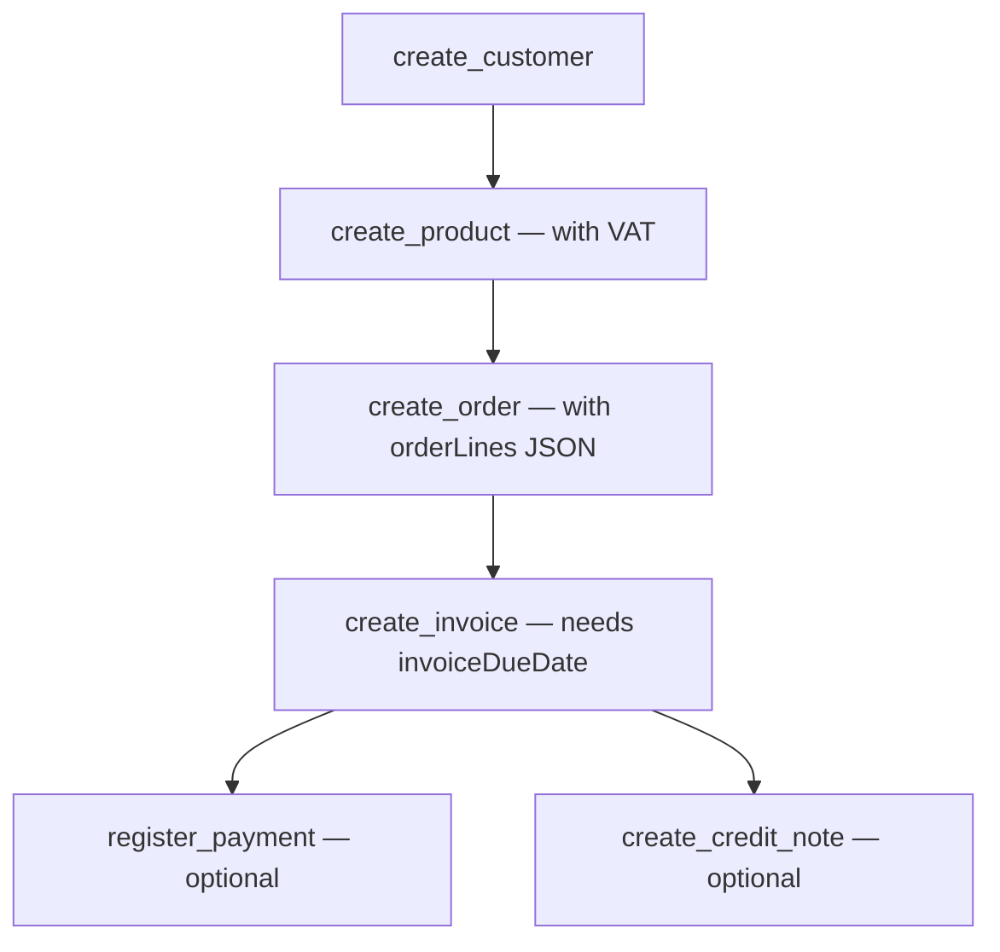
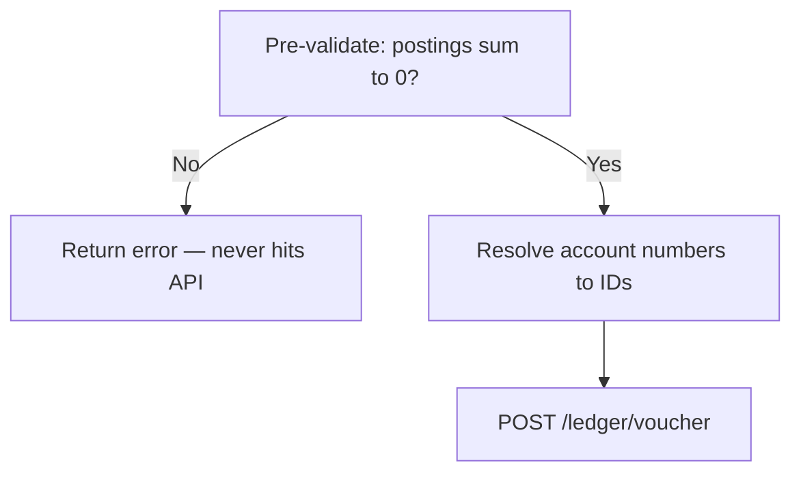
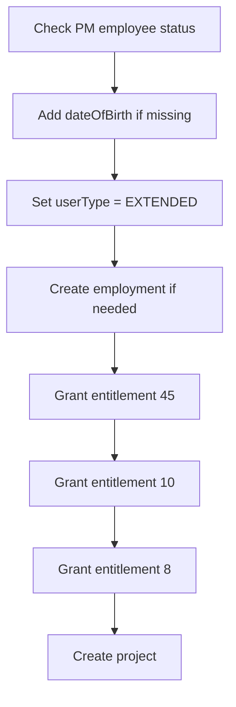

# Tool System — 28 Modules, 137 Functions

The complete Tripletex API surface area wrapped as callable tool functions. Organized into basic CRUD modules and compound workflow modules.

---

## Architecture



---

## Key Tool Modules

### invoicing.py — The 4-Step Invoice Workflow



**Critical details**:
- `orderLines`: JSON string `[{product_id, count, unitPriceExcludingVat?}]` — pre-validated before POST
- `invoiceDueDate`: MANDATORY — if not in prompt, set = invoiceDate
- Bank account 1920 must have `bankAccountNumber` set (auto-ensured)
- `priceExcludingVatCurrency` ONLY — never send both excl + incl

### ledger.py — Balanced Voucher Postings



- Positive amounts = debit, negative = credit
- Postings MUST balance (abs diff < 0.01)
- Account numbers resolved via cache or GET
- Optional dimensions: customerId (1500-1599), supplierId (2400-2499)

### projects.py — PM Entitlements Chain



The `_ensure_employee_ready()` function handles the full PM setup chain. Result is cached (`pm_ready_{id}`) to avoid redundant checks.

### employees.py — Auto-Recovery

```python
def create_employee(firstName, lastName, email, ...):
    try:
        response = client.post("/employee", body)
    except EmailCollision:
        # Search for existing employee with this email
        existing = search_employees(email=email)
        return existing  # saves a retry + error penalty
```

---

## Compound Workflow Tools

These handle multi-step tasks in a single tool call:

| Tool | Steps | API Calls |
|------|-------|-----------|
| `process_invoice` | customer -> products -> order -> invoice [-> credit note] | 4-6 |
| `process_travel_expense` | employee -> travel -> costs/mileage/per_diem | 2-4 |
| `process_project` | customer -> employees -> project + PM setup | 3-7 |
| `process_salary` | salary types -> transactions | 3-4 |
| `process_supplier_invoice` | supplier -> incoming invoice | 2-3 |
| `process_order_invoice_payment` | order -> invoice -> payment | 5 |

---

## VAT Handling

| Rate | Code | Use |
|------|------|-----|
| 25% | Standard | Default for most products |
| 15% | Food | Groceries, food items |
| 12% | Transport | Transport services |
| 0% | Exempt | Tax-exempt goods/services |

Products use `priceExcludingVatCurrency` exclusively. Tripletex auto-calculates the inclusive price from the VAT type.

---

## Files

| Module | Functions | Purpose |
|--------|-----------|---------|
| `employees.py` | 3 | create/update/search with email collision recovery |
| `customers.py` | 4 | CRUD with isCustomer=True |
| `products.py` | 4 | CRUD with VAT handling |
| `invoicing.py` | 4 | order -> invoice -> payment -> credit note |
| `ledger.py` | 7 | voucher, accounts, postings, opening balance |
| `projects.py` | 2 | project + PM entitlement chain |
| `travel.py` | 3 | create/search/delete travel expense |
| `travel_extras.py` | 3 | costs, mileage, per diem |
| `employment.py` | 4 | employment, details, leave, hours |
| `contacts.py` | 4 | customer contact persons |
| `supplier.py` | 4 | CRUD with isSupplier=True |
| `incoming_invoice.py` | 1 | supplier invoices with VAT postings |
| `files.py` | 1 | PDF/CSV/image content extraction |
| `common.py` | 2 | generic get_entity_by_id, delete_entity |
| `process_*.py` | 6 | compound workflow tools |
| + 8 more modules | ~20 | bank, salary, year_end, address, etc. |
