# Grocery Bot GPU — Training, Replay & Strategy Guide

## Table of Contents

1. [Overview](#overview)
2. [The Core Loop](#the-core-loop)
3. [Order Discovery](#order-discovery)
4. [GPU DP Training (Offline)](#gpu-dp-training-offline)
5. [Sequential Per-Bot DP](#sequential-per-bot-dp)
6. [Multi-Bot Coordination](#multi-bot-coordination)
7. [Live Replay](#live-replay)
8. [Production Pipeline](#production-pipeline)
9. [Tuning Parameters](#tuning-parameters)
10. [Strategies & Findings](#strategies--findings)
11. [Current Scores & Targets](#current-scores--targets)
12. [Known Limitations](#known-limitations)
13. [Command Reference](#command-reference)

---

## Overview

The grocery bot competition (NM i AI, March 19, 2026) is a WebSocket-based game where bots navigate a grid, pick up items from shelves, and deliver them to complete orders. The score = items delivered + 5 per completed order.

**Key insight**: Games are **fully deterministic per day**. Same day + same difficulty = same map, same items, same order sequence. This means we can:
1. Play a game to discover orders
2. Train offline on those orders (unlimited time)
3. Replay the optimal solution on a new token for the same deterministic game

**Hardware**: RTX 5090 (32 GB VRAM), running CUDA via PyTorch 2.10+cu128 with torch.compile/Triton 3.6.0.

---

## The Core Loop

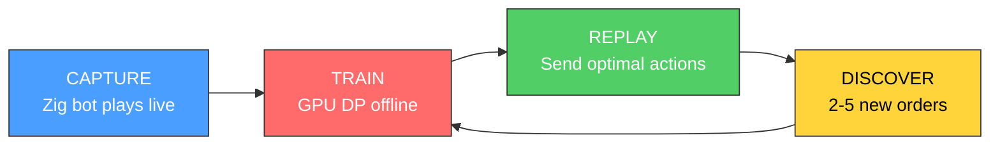

> Each cycle discovers 2-5 new orders. More orders + better plans = higher scores.
> Repeat until score plateaus or token expires.

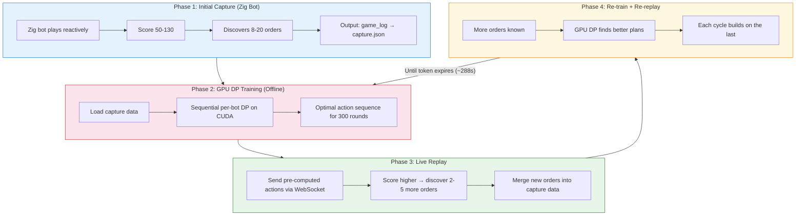

---

## Order Discovery

Orders are revealed 2 at a time: 1 active + 1 preview. New orders only appear when the active order is completed (all items delivered). You can only discover new orders by **completing more orders than your previous best run**.

### Order Accumulation

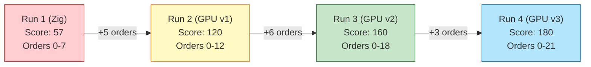

### Storage
- `solutions/<diff>/capture.json` — capture data with all known orders
- `order_lists/<diff>_orders.json` — persistent order list (survives re-captures)
- Orders from different runs are MERGED — never lose previously discovered orders
- `extract_orders_from_logs.py` — scans all game_log files for missed orders

### Staleness
Orders change daily. Captures from March 5 do NOT work on March 6. Always re-capture on game day or same-day as competition.

---

## GPU DP Training (Offline)

### How It Works

The GPU DP solver (`gpu_beam_search.py`) does **exhaustive BFS with deduplication** on CUDA. For each bot:

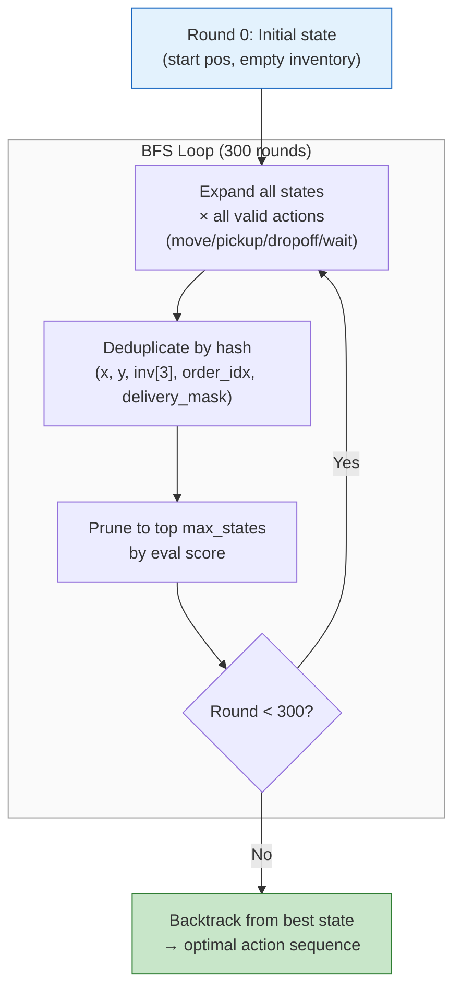

### State Representation
- Position: (x, y) on the grid
- Inventory: 3 slots, each holding an item type or empty
- Order progress: which active order index, which items delivered
- Packed into int64 hash for GPU-efficient dedup

### Evaluation Heuristic (`_eval`)

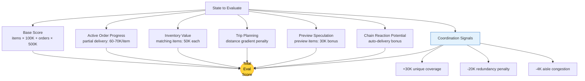

The heuristic scores states with 100K eval units per game point:
- **Base score**: items_delivered * 100K + orders_completed * 500K
- **Active order progress**: partial delivery value (60K-70K per item)
- **Inventory value**: items matching active order (50K each)
- **Trip planning**: distance to next pickup/dropoff (gradient penalty)
- **Preview speculation**: bonus for holding preview order items (30K)
- **Chain reaction potential**: bonus for items that auto-deliver on order completion
- **Coordination signals** (multi-bot):
  - Unique coverage bonus: +30K for types not held by any locked bot
  - Redundancy penalty: -20K for duplicating locked bot's active items
  - Aisle congestion penalty: -4K per locked bot in same narrow aisle

### torch.compile
- Enabled by default for offline training (3.5x speedup)
- Mode: `default` (not `reduce-overhead`, blocked by tensor lifetime bug)
- Must be DISABLED (`no_compile=True`) for live/threaded contexts

---

## Sequential Per-Bot DP

The multi-bot solver (`gpu_sequential_solver.py`) can't do joint state-space search (exponential in bot count). Instead:

### Pass 1: Sequential Planning

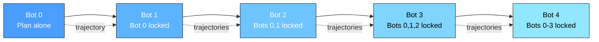

Multiple orderings are tried (forward, reverse, random) to find the best initial plan. Each "pass1 ordering" produces a different solution, and the best is kept.

### Pass 2+: Iterative Refinement

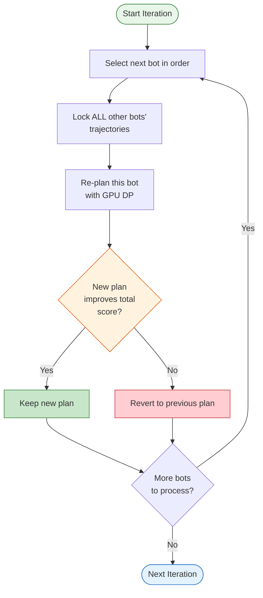

### Refinement Bot Order
- Iteration 0: forward (bot 0, 1, 2, ...)
- Iteration 1: backward (bot N, N-1, ..., 0)
- Iteration 2+: **weakest-first** — compute marginal contribution of each bot, re-plan the weakest first

### Marginal Contribution
For each bot, simulate the game WITHOUT that bot (replace with wait actions). The contribution = total_score - score_without_bot. Bots with 0 or low contribution are re-planned first since they have the most room to improve.

### Perturbation Escape

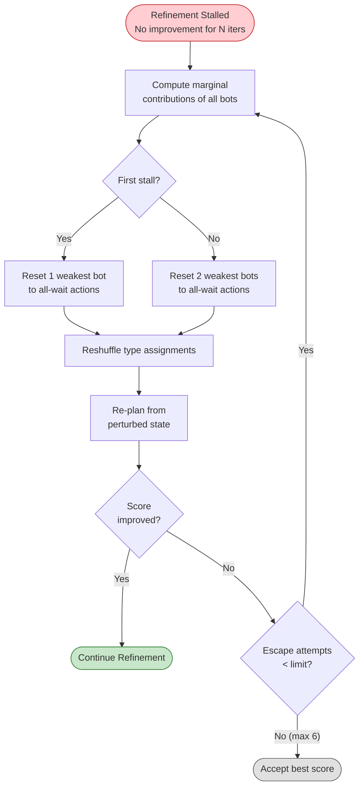

### Locked Bot Simulation
When planning bot K, all other bots' trajectories are "locked":
- Pre-simulated to extract per-round positions
- Fed to GPU as collision obstacles
- Bot K's DP accounts for collisions with locked bots
- Zig FFI DLL does this 2.7x faster than Python

---

## Multi-Bot Coordination

### Current Approach (Sequential DP)

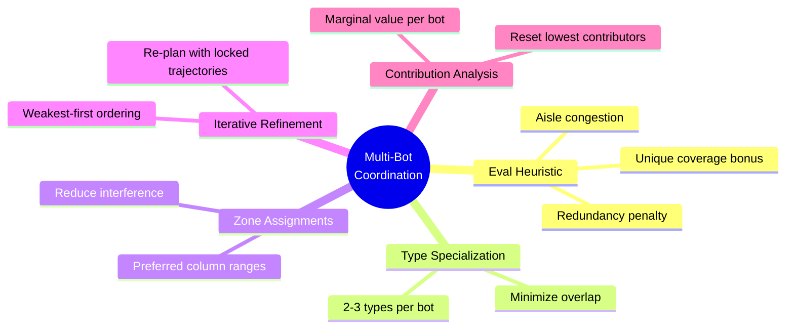

Each bot is planned independently with others locked. Coordination happens through:
- **Eval heuristic**: unique coverage bonus, redundancy penalty, aisle congestion
- **Type specialization**: each bot is assigned 2-3 item types to focus on
- **Zone assignments**: bots given preferred column ranges to reduce physical interference
- **Iterative refinement**: re-planning each bot with updated locked trajectories
- **Contribution analysis**: weakest-first refinement ordering

### Why Sequential DP Has a Ceiling
- Bot 0 plans optimally for itself, but may block Bot 1's best path
- Refinement can fix some conflicts but can't find globally optimal multi-bot plans
- Joint 2-bot DP was attempted but state budget spreads too thin (49x action expansion)
- At 50K states, joint DP scored 72 vs 182 for sequential (on Hard)

### Coordination Signals in Eval
The heuristic tries to compensate for sequential planning:
- **Unique coverage bonus** (+30K + 3K * num_locked_bots per unique type):
  Reward picking up item types not held by any locked bot
- **Redundancy penalty** (-20K - 2K * num_locked_bots):
  Penalize duplicating active order items already in locked bots' inventory
- **Aisle congestion** (-4K per locked bot in same narrow aisle column):
  Avoid physical interference in tight spaces
- **Pipeline mode**: earlier bots get more state budget (depth-based)

### Type Specialization
Each bot is assigned 2-3 item types. The assignment is computed by analyzing order frequency and distributing types across bots to minimize overlap. During perturbation escape, assignments are reshuffled with a different random seed.

### LNS Order Assignment (EXPERIMENTAL — default OFF)
Round-robin order-to-bot assignment via `order_modulo`/`order_slot` on `GPUBeamSearcher`.
Dampens `active_inv_value` for non-assigned orders.

**Result: Hurts score.** Hard seed 42: 155 (LNS) vs 174 (baseline). The rigid modulo assignment
doesn't work with sequential DP — when bot 0 is planned first with no locked bots, it can't
defer delivery to not-yet-planned bots. Existing coordination signals (unique coverage, redundancy
penalty) handle work distribution better because they dynamically analyze locked bot state.

Enable with `use_order_assignment=True` in SolveConfig. May work better with joint optimization.

### Sparse 2-Bot Joint DP (NEW)

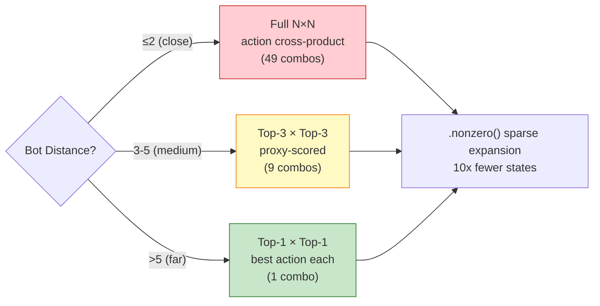

Distance-adaptive 2-bot DP for refinement (`GPUBeamSearcher2Bot`):
- Runs every 3 refinement iterations on the 2 weakest bots
- Uses `.nonzero()` sparse expansion → 10x fewer expanded states than dense grid

### What Would Help (Future Work)
- **Joint state-space search** with 200K+ states (needs more VRAM efficiency)
- **Communication between bot DPs** (share order completion timing)
- **Post-planning MAPF** (resolve collisions after DP instead of during)

---

## Live Replay

### `replay_solution.py` — Adaptive Replay

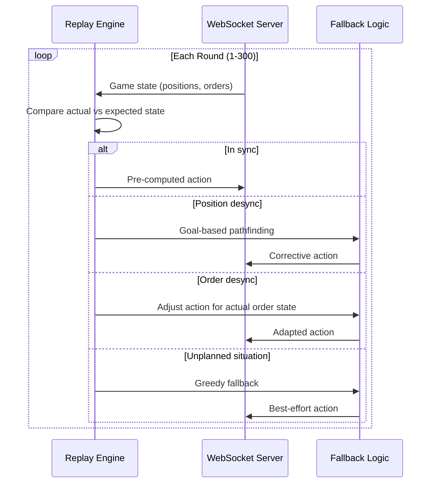

### `live_gpu_stream.py` — Anytime Online Solver

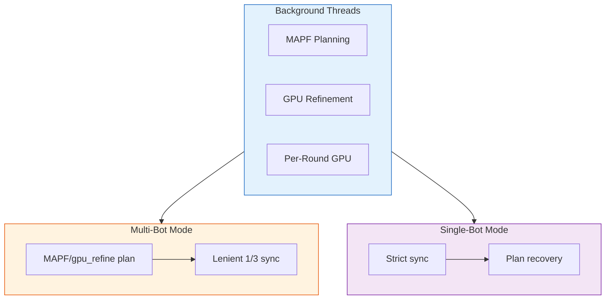

GPU-powered per-round decisions (not pre-computed). Used for live play when no pre-computed solution exists.

### Desync Handling

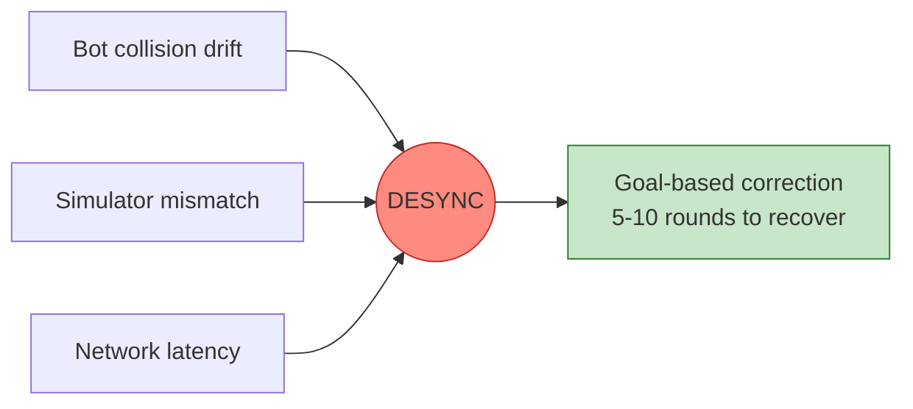

---

## Production Pipeline

### `production_run.py` — Full Automated Pipeline

Within a single 288s token:

```mermaid
gantt
    title Production Pipeline (~288s token window)
    dateFormat s
    axisFormat %S s

    section Cycle 1
    Zig Capture (score ~50-130, 8-20 orders)    :c1, 0, 30s
    GPU Optimize (50K states, 3 orderings)       :g1, after c1, 25s
    Replay + Discover (2-5 new orders)           :r1, after g1, 15s

    section Cycle 2
    GPU Re-optimize (expanded order set)         :g2, after r1, 18s
    Replay + Discover (more orders)              :r2, after g2, 15s

    section Cycle 3+
    GPU Optimize (warm-start)                    :g3, after r2, 18s
    Replay + Discover                            :r3, after g3, 15s
    ... repeat until ~275s ...                   :done, after r3, 15s
```

### Key Flags
- `--no-filler`: CRITICAL — never add fake filler orders (wastes DP capacity)
- `--max-states 50000`: sweet spot for iteration speed vs quality
- `--speed-bonus 100`: reward finishing orders faster (enables more discovery)
- `--time-budget 275`: leave 13s margin before token expires

### `optimize_and_save.py` — Offline Deep Training

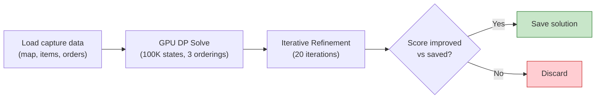

For unlimited-time offline optimization:
```bash
python optimize_and_save.py hard \
  --max-time 600 \
  --max-states 100000 \
  --speed-bonus 150 \
  --orderings 3 \
  --refine-iters 20
```

Loads capture data, runs GPU DP, saves only if score improves.

---

## Tuning Parameters

### State Budget (`max_states`)
| Value | Use Case | Notes |
|-------|----------|-------|
| 50K | Pipeline iterations | Best for 288s window (15-30s per bot) |
| 100K | Deep offline training | 7s per bot, diminishing returns above this |
| 200K | Single bot (Easy) | Provably optimal, too slow for multi-bot |

### Order Count
- **Fewer orders = less state fragmentation**
- 20 orders + 50K states > 40 orders + 50K states (proven on Hard)
- `order_cap` per bot limits visible orders (default: 8)

### Speed Bonus
- Rewards completing orders earlier in the game
- Higher = more aggressive early completion = more order discovery
- `speed_bonus=100, speed_decay=0.5` is default
- `speed_bonus=150-200` for offline training

### Refinement Iterations
- Default: easy=0, medium=3, hard=10, expert=10
- Deep training: 20-30 iterations
- Returns diminish sharply after 5-10 for most maps

### Escape Limit
- Pipeline (<60s): 2 escape attempts
- Normal (60-300s): 4 escapes
- Deep (>300s): 6 escapes

---

## Strategies & Findings

### What Works
1. **Iterative order discovery**: Each replay cycle discovers 2-5 new orders
2. **50K states, many iterations**: Better than 100K states, few iterations
3. **3 pass1 orderings**: Forward, reverse, random — essential for Hard/Expert
4. **Type specialization**: Assigning item types to bots reduces interference
5. **Weakest-first refinement**: Contribution analysis identifies which bots need replanning
6. **Chain reactions**: Pre-fetching preview items for 0-round order completions
7. **Aisle congestion penalty**: -4K per locked bot in same aisle column (+7% on Hard)
8. **Zig FFI**: 4.5x faster verification, 2.7x faster presim

### What Doesn't Work
1. **2-bot joint DP**: 49x action expansion starves state budget (72 vs 182)
2. **100K+ states**: Slower iterations, no score improvement over 50K
3. **More orders than needed**: 40 orders fragments state space (172 vs 182)
4. **1200s+ training budgets**: Sequential DP ceiling hit at ~180 regardless of time
5. **10 DP bots at 25K (Expert)**: Better to do 7 DP at 50K + 3 greedy
6. **Greedy bots touching active orders**: Catastrophic interference with DP plans
7. **Pair perturbation**: Resets 2 bots, but they converge to same local optimum
8. **LNS order assignment**: Rigid round-robin dampening (-12 to -19 points on Hard)
9. **Eval annealing**: Weakening coordination penalties in early iterations hurts scores

### Expert-Specific
- 7 DP bots + 3 greedy bots
- Greedy bots: ONLY fetch preview + high-frequency non-active types
- NEVER touch active order items (DP interference)
- Greedy ceiling: ~+18 points over DP-only

### Determinism Exploit ("Time Millionaire" Strategy)

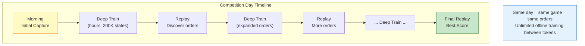

- Same day = same game = same orders
- Capture once, train for hours offline, replay next day (if same seed)
- Competition day: capture early, train all day, replay for final score
- **Stepladder discovery**: play → discover orders → deep train → replay → discover more → repeat
- Between tokens: unlimited offline training time (200K+ states, 50+ refine iters)
- Use `competition_day.py` for automated stepladder cycles
- 12 hours of stepladder cycles can discover 30-50+ orders per difficulty

---

## Current Scores & Targets

### As of 2026-03-06

```mermaid
%%{init: {'theme': 'base', 'themeVariables': {'primaryColor': '#4a9eff'}}}%%
xychart-beta
    title "Our Score vs Leader (2026-03-06)"
    x-axis ["Easy", "Medium", "Hard", "Expert"]
    y-axis "Score" 0 --> 320
    bar [142, 188, 196, 139]
    bar [142, 214, 252, 303]
```

| Difficulty | Our Score | Source | Leader | Gap | Orders Known |
|-----------|-----------|--------|--------|-----|-------------|
| Easy | 142 | GPU DP | ~142 | 0 | 17 |
| Medium | 188 | GPU DP | 214 | -26 | 22 |
| Hard | **196** | **Live solver** | 252 | -56 | 21 |
| Expert | 139 | GPU DP | 303 | -164 | 15 |

Note: Hard 196 came from `live_gpu_stream.py` (reactive per-round), NOT offline GPU DP (max 180). The offline GPU DP solver has never beaten 180 on Hard.

### Bottlenecks
- **Hard**: Live solver produced 196 but offline DP caps at 180. Need to either improve live solver consistency or break the sequential DP ceiling.
- **Medium**: Sequential DP ceiling. Need better multi-bot coordination.
- **Expert**: Not enough orders + too many bots for current coordination quality.
- **All**: Order counts may be stale (orders change daily). Need fresh captures on competition day.

---

## Known Limitations

### The 196 Hard Deadlock — Live Solver vs Offline GPU DP

**Critical finding (2026-03-06):** Our best Hard score (196 points) was NOT produced by the offline GPU DP solver. It came from `live_gpu_stream.py` — the **anytime online solver** that makes per-round reactive GPU decisions. The offline sequential DP solver (`gpu_sequential_solver.py`) has never beaten 180 on Hard.

This is evident from `solutions/hard/meta.json` showing `optimizations_run: 0` — the solution was saved directly from a live game, never refined by offline DP.

**Why the live solver can beat offline DP**: The live solver makes per-round decisions with full knowledge of the current game state. It doesn't commit to a 300-round plan upfront, so it naturally adapts to congestion, order transitions, and bot interactions in real time. The offline DP, by contrast, locks trajectories sequentially — bot 0's plan is fixed before bot 1 is even considered.

**The idle bot problem**: In the 196 solution, bot 2 performs zero useful work for all 300 rounds. It executes 19 pickup actions, but ALL target items that are 4-20 tiles away (pickup requires Manhattan distance 1). Even in complete isolation, only 3 of those pickups would succeed, scoring 0 points. This happened because the live solver's per-round heuristic sent bot 2 chasing items it could never reach in time.

### Sequential DP Ceiling (the "Local Optimum Deadlock")

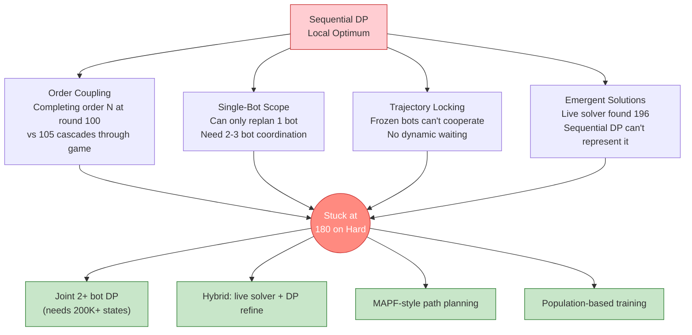

The fundamental limitation: each bot is planned independently with others locked. When the team is collectively near-optimal, **no single bot can improve** because:

1. The other 4 bots already complete all available orders (~21 orders = ~180-196 points)
2. Re-planning any single bot can only redistribute work, not create new capacity
3. Any change to one bot's timing shifts order completion boundaries, breaking the locked bots' plans

**Concrete evidence (Hard, 196 solution, refine attempt):**

| Bot Re-planned | DP Score (isolated) | Total Score (with others) | Delta |
|----------------|--------------------|-----------------------------|-------|
| Bot 0 | 196 | 196 | +0 |
| Bot 1 | 124 | 196 | +0 |
| Bot 2 | 94 | 196 | +0 |
| Bot 3 | 196 | 196 | +0 |
| Bot 4 | 179 | 196 | +0 |

Every bot's DP plan either matches the existing plan exactly (bots 0, 3) or produces a worse isolated score that can't improve the team total (bots 1, 2, 4).

**Bot 2's paradox**: Bot 2 can achieve DP score 94 in isolation (with others locked), but inserting that plan drops the team total from 196 to 88. Bot 2's pickups alter the order state progression — items it delivers shift when orders complete, breaking the timing assumptions embedded in the locked bots' pre-computed trajectories.

**Fresh solve also can't reach 196**: A clean `solve_sequential` run (no warm-start) scores only 162. The 196 solution occupies a region of the solution space that sequential DP cannot reach from scratch — it was found by the live solver's reactive exploration.

**Additional evidence of the ceiling:**
- 600s+ training with 100K states, 20 refine iters, pair perturbation, type reshuffling — all converge to ≤180
- Exhaustive orderings (43/120 tried on Hard) — best pass1 = 143
- 200K states per bot in refinement — reaches 178-179, never 180+
- 1200s budget with 22 orders, 5 orderings, 30 refine — scores 165

### Why Breaking Past the Deadlock Is Hard

The deadlock exists because sequential DP is trapped between two constraints:

1. **Order coupling**: Orders are sequential. Completing order N reveals order N+1. Bot A delivering item X at round 100 means order N completes at round 100, not round 105. Every other bot's plan depends on this exact timing. Moving one delivery by 1 round can cascade through the entire remaining game.

2. **Single-bot replanning scope**: Refinement can only change ONE bot at a time. To escape the local optimum, you'd need to simultaneously reassign work across 2-3 bots — "bot 0 stops picking up yogurt so bot 2 can pick it up faster from a closer shelf, while bot 3 shifts to pasta to compensate." Sequential DP cannot express this kind of coordinated reassignment.

3. **Trajectory locking is lossy**: When bot K is planned, other bots are frozen trajectories. But in reality, bots interact dynamically — bot 0 might wait 1 round for bot 1 to clear a doorway, then both benefit. The locked model can't represent these cooperative waits.

4. **The live solver found a solution that sequential DP can't represent**: The 196 solution emerged from 300 rounds of reactive per-round decisions where all 5 bots adapted to each other simultaneously. Translating this into "plan bot 0, then bot 1, then..." loses the emergent coordination.

**What might break through:**
- **True joint optimization**: Joint 2+ bot DP with enough state budget (needs 200K+ states per pair, currently impractical)
- **Hybrid approach**: Use live solver to generate candidate solutions, then refine with DP per-bot
- **MAPF-style coordination**: Plan collision-free paths first, then assign orders to paths
- **Population-based training**: Maintain multiple diverse solutions, crossover the best parts

### State Budget vs Bot Count
More bots = more sequential DP passes = less time per bot. With 10 Expert bots at 50K states, each bot gets ~6s. Joint optimization would need exponential state space.

### Order Staleness
Orders are deterministic PER DAY. Captures from March 5 are useless on March 6. Must re-capture each day.

### Token Expiry
JWT tokens expire after ~288s. All pipeline operations must complete within this window. Fetch new tokens for additional cycles.

### Known Bug: `verify_against_cpu` for Non-Zero Bot IDs
`gpu_beam_search.py` `verify_against_cpu()` always uses `cpu_state.bot_positions[0]` and puts the action at index 0, regardless of `candidate_bot_id`. This means verification is broken for bot IDs > 0. The GPU `_step()` function itself is correct (verified via round-by-round comparison) — only the verification helper is buggy.

---

## Command Reference

### Token Fetching
```bash
# First-time setup (Google OAuth login)
python fetch_token.py hard --setup

# Headless token fetch (after login)
python fetch_token.py hard

# With JSON output
python fetch_token.py hard --json
```

### Zig Capture
```bash
# Run Zig bot on live game to capture orders
python zig_capture.py "wss://game.ainm.no/ws?token=..." --difficulty hard
```

### GPU Training (Offline)
```bash
# Quick training (pipeline-speed)
python optimize_and_save.py hard --max-time 60 --max-states 50000

# Deep training
python optimize_and_save.py hard --max-time 600 --max-states 100000 \
  --speed-bonus 150 --orderings 3 --refine-iters 20

# Warm-start from existing solution
python optimize_and_save.py hard --max-time 300 --warm-only --refine-iters 10
```

### Live Replay
```bash
# Replay pre-computed solution
python replay_solution.py "wss://..." --difficulty hard

# Live GPU solver (anytime per-round)
python live_gpu_stream.py "wss://..." --save --max-states 50000
```

### Full Pipeline
```bash
# Automated: zig capture -> GPU optimize -> replay -> iterate (within 288s)
python production_run.py hard --ws-url "wss://..." \
  --time-budget 275 --max-states 50000
```

### Local Simulation
```bash
# Offline iterate loop (sim server, no token needed)
python iterate_local.py hard --seed 42 --max-states 50000 --time-budget 280
```

### Competition Day (Stepladder)
```bash
# Interactive: prompts for WS URLs between training cycles
python competition_day.py hard --deep-states 200000 --deep-refine 50

# Auto-token: fetches tokens automatically
python competition_day.py expert --auto-token --deep-states 100000

# With time limit per training pass
python competition_day.py hard --deep-time 600 --max-cycles 20
```

### Utilities
```bash
# Extract orders from game logs
python extract_orders_from_logs.py

# Check solution scores
python -c "import json; print(json.load(open('solutions/hard/meta.json')))"
```
