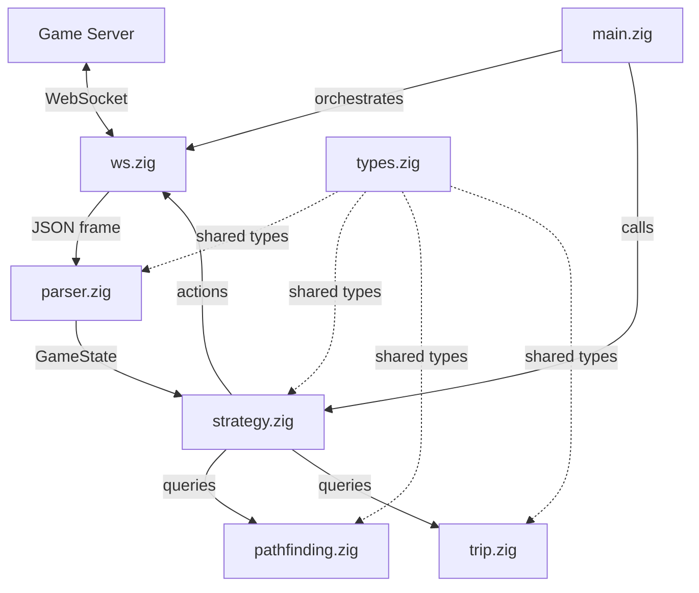
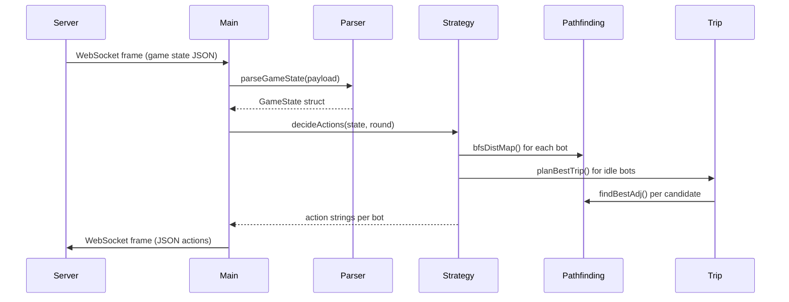

# Architecture

High-level architecture of the grocery-bot-zig game client.

---

## System Overview

---

## Data Flow Per Round

---

## Memory Model

All allocations are fixed at compile time:

| Buffer | Size | Purpose |
|--------|------|---------|
| Grid | 32x20 cells | Map layout |
| Distance maps | 32x20 x u16 per bot | BFS results |
| Bot state | 10 bots | Persistent state across rounds |
| Item list | 512 items | All shelf items |
| JSON buffer | 1 MB | Incoming frame parsing |
| Candidate list | 64 entries | Trip planning candidates |

No heap allocations occur during the game loop.

---

## Key Design Decisions

1. **Fixed buffers over dynamic allocation**: Predictable memory, no GC pauses, suitable for real-time response
2. **BFS over A-star**: Grid is small enough (max 28x18) that BFS is fast and guarantees optimal paths
3. **Greedy trip planning**: Full TSP is NP-hard; capped to 10 candidates with all permutations (max 6 for 3-item trips)
4. **Centralized orchestrator**: Single `decideActions()` call coordinates all bots, preventing duplicate item assignments
5. **Offset detection**: Position mismatch tracking compensates for server's 1-round action delay
