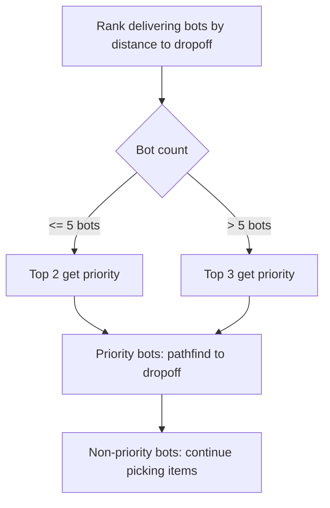

# Multi-Bot Coordination - Technical Design

Orchestrator logic that prevents bots from duplicating work and manages dropoff congestion.

---

## Orchestrator: Item Assignment

Centralized in `decideActions()` (strategy.zig, lines 631-743).

### Active Item Assignment
1. Build list of remaining active item types needed
2. For each (bot, item-type) pair, compute BFS distance
3. Assign closest bot per item type
4. Mark assigned types with `MAX_BOTS` sentinel to prevent double-assignment
5. Bots only pick items they are assigned

### Preview Item Assignment
- Only idle bots with empty inventory can pick preview items
- Preview carrier limits (to prevent dead inventory):

| Bot Count | Max Preview Carriers |
|-----------|---------------------|
| 1-2 | 1 (only if no active order) |
| 3-4 | 1 |
| 5+ | 0 |

- Single-bot mode: preview picking only when `!has_active_order`

---

## Dropoff Priority System

Prevents congestion at the single drop-off point.

- Only bots with `delivering = true` and active items are ranked
- Priority bots navigate directly to dropoff
- Non-priority bots continue their trips or pick nearby items
- At dropoff: bots without matching items flee to avoid blocking

---

## Collision Avoidance

- **First-step collision check**: BFS excludes first moves that land on other bots
- **Greedy fallback**: When BFS blocked, `safeGreedyDir()` validates no bot overlap
- **Dropoff flee**: Bots at dropoff without deliverable items move away

---

## Dead Inventory Handling

Dead inventory occurs when a bot holds preview items after the order changes.

**Detection**: Bot has items in inventory that don't match any active/preview need.

**Response**:
- Bot navigates to dropoff (within distance 2) and waits
- `drop_off` action removes matching items only; non-matching stay
- Eventually the held items may match a future order

**Prevention**:
- Strict preview carrier limits (see table above)
- Preview trips blocked when active items still needed

---

## Files

- `src/strategy.zig` - Orchestrator (lines 631-743), dropoff priority, dead inventory
- `src/pathfinding.zig` - Collision-aware BFS
