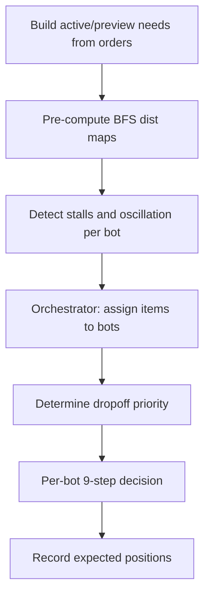

# Strategy Engine - Technical Design

The central decision engine that produces one action per bot per round.

---

## Persistent Bot State

Each bot maintains state across rounds:

| Field | Purpose |
|-------|---------|
| `trip_ids[3]` | Item IDs in current trip |
| `trip_adjs[3]` | Pickup positions per trip item |
| `trip_count` / `trip_pos` | Trip size and progress (0-3) |
| `has_trip` / `delivering` | Current phase flags |
| `stall_count` | Rounds at same position |
| `pos_hist[24]` | Last 24 positions for oscillation detection |
| `osc_count` | Oscillation counter |
| `escape_rounds` | Forced escape movement remaining |
| `rounds_on_order` | Rounds spent on current order |

---

## Decision Pipeline



### Per-Bot Decision Priority (9 steps)

1. **At dropoff + has active items** -> `drop_off`
2. **At dropoff + no active items** -> Flee dropoff (avoid blocking)
3. **Escape active** -> Pick nearby active items or move away
4. **Adjacent to needed item** -> `pickup` (active pass first, then preview)
5. **Should deliver?** -> Check if delivery is warranted
6. **Delivering + has priority** -> Pathfind to dropoff
7. **Has active trip** -> Follow trip (pathfind to next adj, pick item)
8. **No trip** -> Plan new trip via `planBestTrip()`
9. **Fallback** -> Deliver if holding active items, pre-position near needs, or wait

---

## Stall and Oscillation Detection

- **Stall**: Same position for 8+ rounds -> reset trip, attempt escape
- **Oscillation**: Same position appears 4+ times in 24-round history -> 4-round escape
- **Escape**: Forced random movement away from current position
- **Order stuck**: 30+ rounds on same order -> force trip reset every 15 rounds

---

## Offset Adaptation

Compensates for 1-round server action delay:

```
if offset_detected and bot had pending move:
    effective_pos = current_pos + pending_direction
else:
    effective_pos = current_pos
```

Strategy uses effective positions for all distance calculations when offset mode is active.

---

## Files

- `src/strategy.zig` - Decision engine (~1213 lines)
- `src/trip.zig` - Trip planning (called by strategy)
- `src/pathfinding.zig` - BFS (called by strategy)
