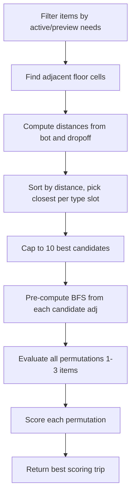

# Trip Planning - Technical Design

Optimizes which items a bot should pick up and in what order (mini-TSP with scoring).

---

## Data Structures

```zig
Candidate {
    item_idx: u16,        // Index into GameState.items
    adj: Pos,             // Floor cell adjacent to item for pickup
    is_active: bool,      // Active order item vs preview
    dist_from_bot: u16,   // BFS distance from bot
    dist_from_drop: u16   // BFS distance from dropoff
}

TripPlan {
    items: [3]u16,        // Item indices (1-3 items)
    adjs: [3]Pos,         // Adjacent pickup positions
    item_count: u8,
    total_cost: u32,      // Estimated round cost
    active_count: u8,
    preview_count: u8,
    completes_order: bool
}
```

---

## Algorithm (`planBestTrip`)



### Candidate Generation
1. For each item on map, check if it matches active remaining needs or preview needs
2. Track filled slots per item type (avoid duplicates)
3. Find walkable adjacent cell via `findBestAdj()`
4. Compute `dist_from_bot` and `dist_from_drop`
5. Cap to 64 candidates, then reduce to 10 best (closest per type)

### Permutation Evaluation
- 1-item trip: 1 permutation
- 2-item trip: 2 permutations
- 3-item trip: 6 permutations
- Cost = sum of inter-item distances + final item to dropoff distance
- Skip trips exceeding `rounds_left`

### Scoring Function

```
value = active_count * 20 + preview_count * 3 + item_count * 2
        + (completes_order ? 80 : 0)
score = value * 10000 / cost
```

Active items heavily favored (20 pts vs 3 for preview). Order completion bonus (80 pts) encourages finishing orders for the +5 score bonus.

---

## Files

- `src/trip.zig` - Trip planning, candidate selection, scoring
- `src/pathfinding.zig` - `findBestAdj()`, `bfsDistMap()`
