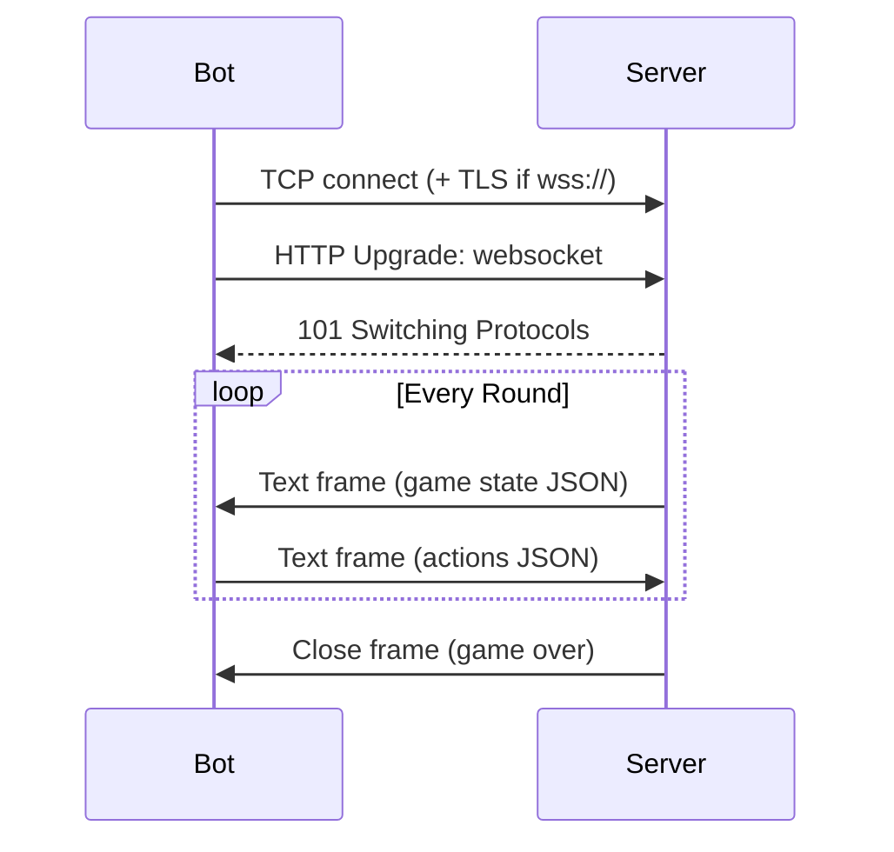

# WebSocket Client - Technical Design

Handles network communication with the game server, including frame encoding/decoding, TLS, and the main game loop.

---

## Components

### ws.zig

Full WebSocket client implementation over TCP with optional TLS.

**Frame Format**:
```
[1B header: FIN|RSV|opcode] [1B: MASK|len] [0-8B extended len] [4B mask] [payload]
```

**Opcodes Handled**:

| Opcode | Type | Behavior |
|--------|------|----------|
| 0x1 | Text | Parse as game state JSON |
| 0x2 | Binary | Parse as game state JSON |
| 0x8 | Close | Return connection closed error |
| 0x9 | Ping | Respond with pong |
| 0xA | Pong | Ignore |

**Optimizations**:
- TCP_NODELAY set on socket for minimal latency
- Client frames always masked per RFC 6455

### main.zig - Game Loop

Two modes of operation:

1. **Live mode** (`runLive`): WebSocket connection, receive state, decide, send actions
2. **Replay mode** (`runReplay`): Process saved JSONL logs for analysis

**Desync Detection** (lines 172-204):
- Tracks `expected_next_pos` per bot from strategy module
- If actual positions mismatch expected for 3+ consecutive rounds, activates offset mode
- Offset mode adjusts effective positions by applying pending actions

---

## Connection Flow



---

## Files

- `src/ws.zig` - WebSocket protocol, TLS, frame handling
- `src/main.zig` - Game loop, desync detection, logging
- `src/parser.zig` - JSON game state deserialization
