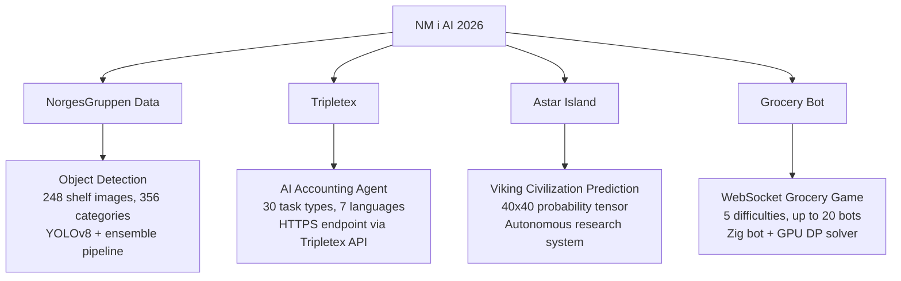
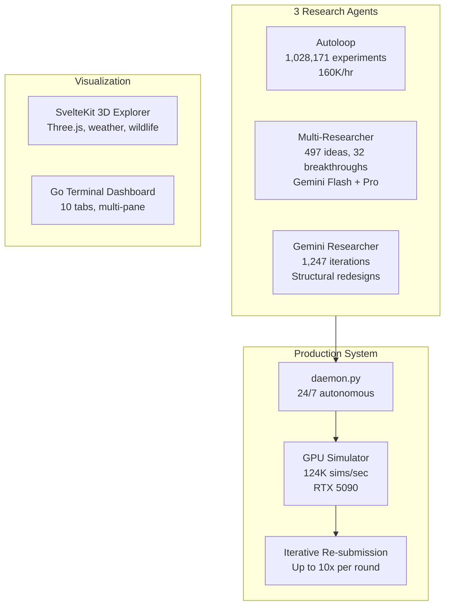
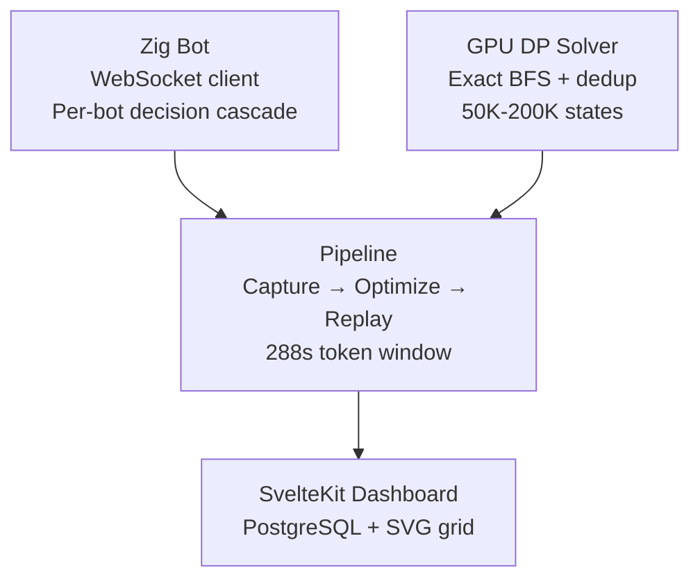

# NM i AI 2026 — Team Synthetic Synapses

Competition code for [NM i AI](https://app.ainm.no) (Norges Mesterskap i Kunstig Intelligens / Norwegian AI Championship 2026).

---

## The Competition

NM i AI is Norway's national AI championship with four scored challenges:



| Challenge | What | Our Approach | Key Tech |
|---|---|---|---|
| **NorgesGruppen Data** | Detect grocery products on store shelves | YOLOv8 ensemble, multi-model fusion | Python, ultralytics, CUDA |
| **Tripletex** | AI accounting agent via API | LLM-powered task router + Tripletex API | Python, FastAPI, LLM agents |
| **Astar Island** | Predict Norse civilization simulator | Autonomous research + GPU Monte Carlo | Python, PyTorch, Google ADK, Three.js |
| **Grocery Bot** | WebSocket grocery store game | Zig bot + GPU DP solver + pipeline | Zig, Python, CUDA, SvelteKit |

---

## Repository Structure

```
.
├── DAGTHOMAS/                     # Dag Thomas's solutions
│   ├── astar-island-solution/     # Astar Island — autonomous research system
│   │   ├── docs/                  # Full documentation (see below)
│   │   ├── research_agent/        # Google ADK + Gemini autonomous agent
│   │   ├── web/                   # SvelteKit 3D island explorer
│   │   ├── tui/                   # Go Bubble Tea terminal dashboard
│   │   ├── daemon.py              # 24/7 autonomous competition system
│   │   ├── predict_gemini.py      # Production prediction pipeline
│   │   ├── sim_model_gpu.py       # PyTorch CUDA Monte Carlo simulator
│   │   ├── autoloop_fast.py       # Parameter optimization (160K experiments/hr)
│   │   └── README.md              # Full project documentation
│   ├── norgesgruppen-solution/    # Object detection solution
│   └── docs/                      # Competition challenge documentation
│
├── LARS/                          # Lars's solutions
│   └── Tripletex/                 # AI accounting agent
│       ├── agent.py               # LLM-powered task router
│       ├── dashboard/             # Monitoring dashboard
│       └── CLAUDE.md              # Agent instructions
│
├── PRE/                           # Shared / Grocery Bot workspace
│   ├── grocery-bot-zig/           # Zig WebSocket bot (5 difficulties)
│   ├── grocery-bot-gpu/           # GPU DP solver (CUDA, RTX 5090)
│   ├── grocery-bot-b200/          # B200-tier deep optimization
│   ├── replay/                    # SvelteKit replay dashboard + PostgreSQL
│   └── sand/                      # Sandbox / experiments
│
└── SANDEEP/                       # Sandeep's workspace
```

---

## Highlights

### Astar Island — Autonomous AI Research



A fully autonomous system that competes 24/7 with zero human intervention. Three AI research agents optimize the prediction model while a daemon detects rounds, explores, predicts, submits, and iteratively re-submits throughout the 165-minute round window. Best score: **93.0** (R17). [Full docs](DAGTHOMAS/astar-island-solution/README.md)

### Grocery Bot — Zig + GPU DP Solver



A Zig WebSocket bot plays live, captures order data, then a GPU DP solver (CUDA, RTX 5090) computes optimal paths offline. Solutions are replayed to discover more orders, creating a virtuous cycle within each 5-minute token window. Scores: Easy **142** (optimal), Hard **196**, Nightmare **299**. [Full docs](PRE/grocery-bot-zig/CLAUDE.md)

### Tripletex — AI Accounting Agent

An LLM-powered agent that processes 30 accounting task types in 7 languages via the Tripletex API. Task router classifies incoming prompts, specialized workflows execute each task type (invoices, salary, project billing), and a monitoring dashboard tracks accuracy. [Full docs](LARS/Tripletex/CLAUDE.md)

### NorgesGruppen Data — Object Detection

YOLOv8 ensemble pipeline for detecting grocery products on store shelves. 356 product categories, trained on 248 annotated shelf images. Submission runs in a Docker sandbox (Python 3.11, L4 GPU, 300s timeout). [Full docs](DAGTHOMAS/CLAUDE.md)

---

## Team

**Synthetic Synapses** — NM i AI 2026

| Member | Focus |
|---|---|
| Dag Thomas | Astar Island, NorgesGruppen, Grocery Bot |
| Lars | Tripletex |

---

## Tech Stack

| Technology | Used For |
|---|---|
| **Python** | All ML/AI, prediction pipelines, competition APIs |
| **Zig** | High-performance WebSocket bot (grocery) |
| **Go** | Terminal UI dashboard (Bubble Tea) |
| **PyTorch + CUDA** | GPU DP solver, Monte Carlo simulator |
| **SvelteKit** | Web dashboards (3D explorer, replay viewer) |
| **Three.js** | 3D island visualization with weather/wildlife |
| **PostgreSQL** | Game replay storage |
| **Google ADK + Gemini** | Autonomous research agent |
| **Docker** | Deployment, PostgreSQL, submission sandboxing |

---

## Quick Start

```bash
# Astar Island — autonomous mode
cd DAGTHOMAS/astar-island-solution
pip install -r requirements.txt
python daemon.py

# Grocery Bot — build and sweep
cd PRE/grocery-bot-zig
C:\Users\dagth\zig15\zig-x86_64-windows-0.15.2\zig.exe build -Doptimize=ReleaseFast
python sweep_hard.py

# Tripletex — start agent
cd LARS/Tripletex
python agent.py
```

---

*MIT License*
