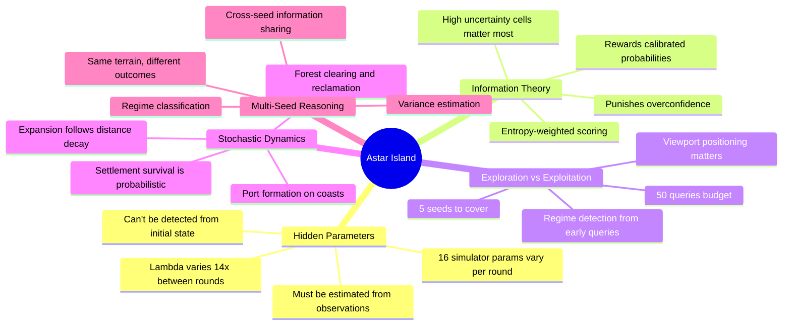
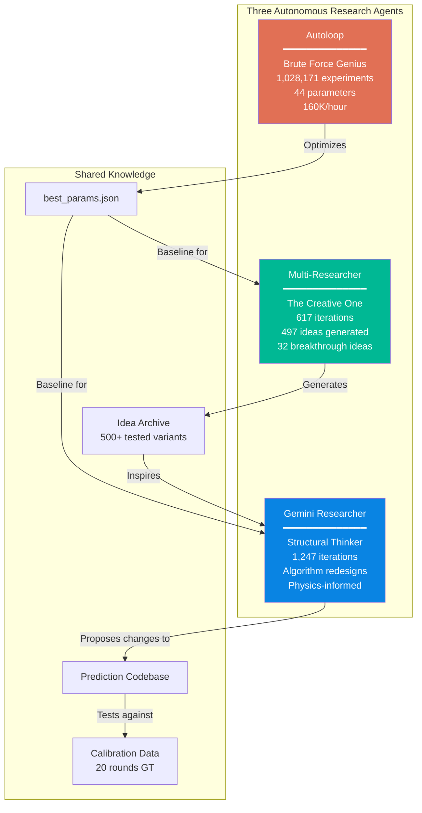
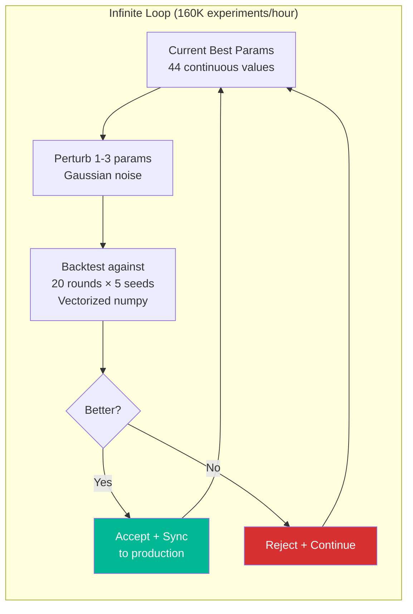
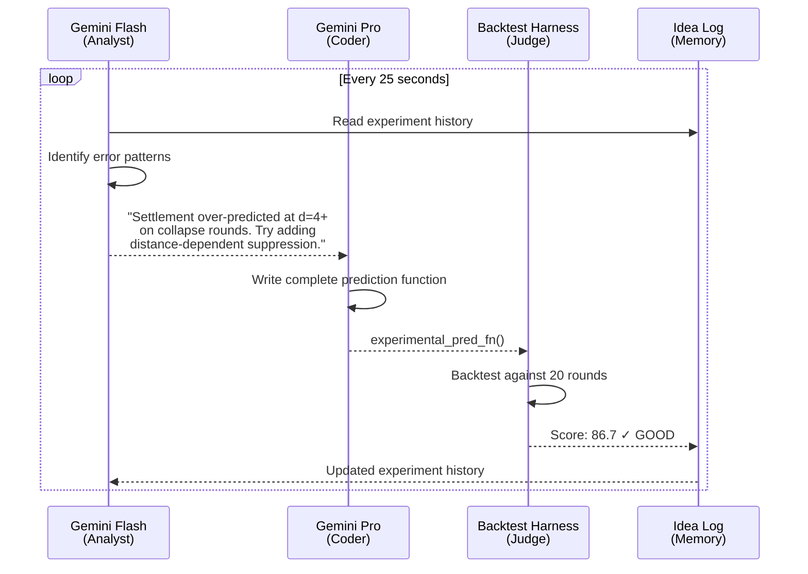
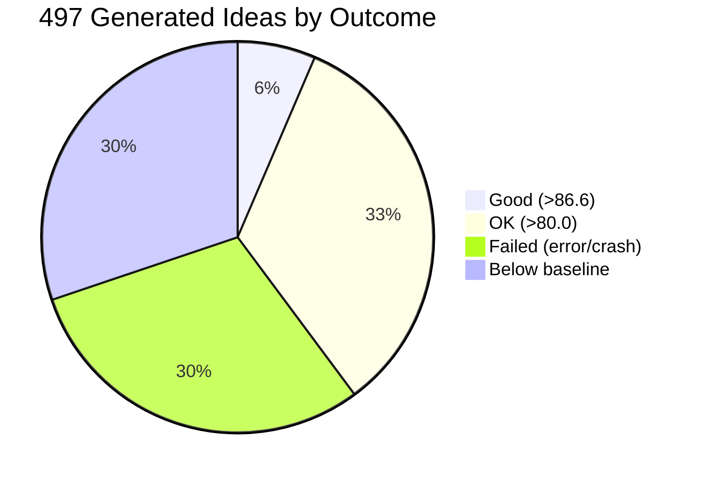
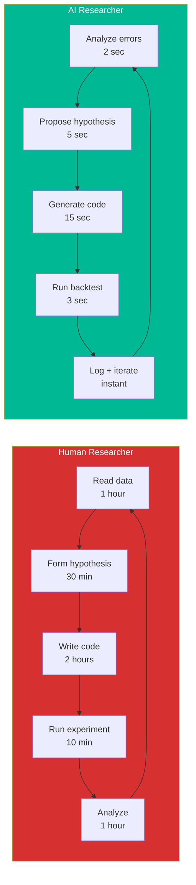
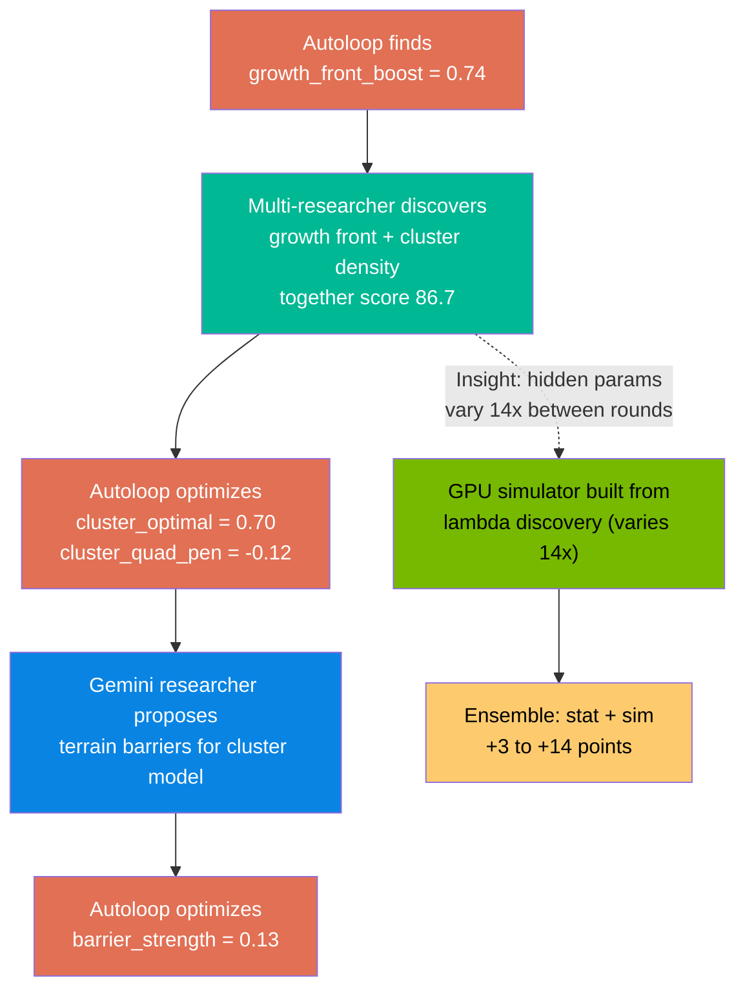
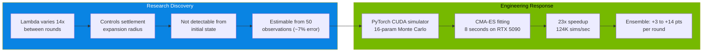
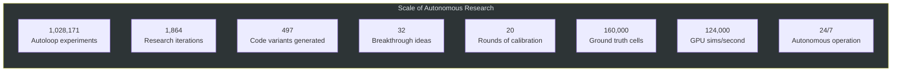
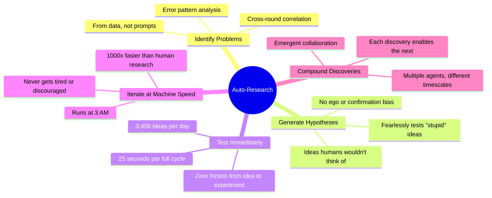

# Autonomous AI Research: Machines That Do Science

> "The most interesting thing about AI right now is not that it can answer questions — it's that it can ask them."
> — Andrej Karpathy

## The Game: Astar Island

Astar Island is a beautifully designed AI challenge from the Norwegian AI Championship (NM i AI). It's a prediction game about Norse civilizations on a hidden simulator — and it's one of the best competitive AI problems we've ever seen.

### The Rules

You observe a 40x40 island through a 15x15 viewport. The island has terrain (land, forest, mountains, ocean) and Norse settlements. A hidden simulator runs the civilization forward — settlements survive or die, expand into new territory, clear forests, build ports on the coast, or collapse into ruins.

**You get 50 observation queries** across 5 random seeds of the same map. Each query shows you a snapshot of the simulation mid-run through your viewport. From these 50 glimpses, you must predict the **final probability distribution** of every cell on the 40x40 map — a 40x40x6 tensor where each cell has probabilities for: empty, settlement, port, ruin, forest, farmland.

**Scoring uses entropy-weighted KL divergence** — cells where the outcome is uncertain (high entropy) matter more than cells where the outcome is predictable. This rewards models that capture the uncertainty structure, not just the most likely outcome.

**5 seeds** share the same terrain but have different random outcomes. You submit a prediction for each seed. 50 queries total shared across all seeds — so you must balance coverage vs depth.

### Why It's Brilliant



What makes Astar Island exceptional as a competitive AI problem:

1. **Hidden state estimation** — you can't see the simulator parameters. You must infer them from partial observations. This is the core challenge of science itself.

2. **Information-theoretic scoring** — KL divergence rewards well-calibrated probabilities, not just correct guesses. You must know what you don't know.

3. **Exploration under budget** — 50 queries is not enough to see everything. Where you look matters. This creates a natural explore-exploit tradeoff.

4. **Non-stationary dynamics** — each round has completely different hidden parameters. What worked last round might fail this round. The system must adapt in real-time.

5. **Multi-scale reasoning** — you need local features (what terrain surrounds each cell), global features (overall settlement vigor), and spatial dynamics (how far settlements expand).

It's the kind of problem where naive approaches score 20-40, good statistical models score 70-85, and the full autonomous research system we built scores 82-93. The gap between "good" and "great" requires understanding the hidden physics of the simulation.

## The Vision

Andrej Karpathy has been vocal about a paradigm shift: **AI systems that don't just execute tasks, but conduct research autonomously**. His vision of "auto-research" — systems that propose hypotheses, design experiments, run them, analyze results, and iterate — is exactly what we've built here.

This isn't prompt engineering. This isn't a chatbot. This is a system where AI models are the scientists, the code is the lab equipment, and the competition leaderboard is the peer review.

## What We Built



### 1. The Autoloop — Brute Force Genius (1,028,171 experiments)



The autoloop takes the prediction function, parameterizes 44 continuous variables, and searches relentlessly for better configurations. It runs at **160,000 experiments per hour** using vectorized numpy operations.

What it found that humans wouldn't have:
- `mult_power_sett = 0.53` — settlement-specific multiplier power, different from general 0.19
- `cal_fine_divisor = 125` — calibration smoothing 25% higher than the default 100
- `growth_front_boost = 0.74` — young settlements signal 2.5x stronger than assumed
- `floor = 0.0034` — probability floor 2.4x lower than the safe default of 0.008

These aren't intuitive. No human would set `mult_power_sett` to exactly 0.53. But across a million experiments, this is what the data demands.

### 2. Multi-Model Researcher — The Creative One (617 iterations, 497 ideas)



This is where it gets Karpathy-level interesting. Two Gemini models collaborate:

**Gemini Flash** (the analyst): Looks at the experiment log, identifies error patterns, and proposes a research direction in natural language:

> "The settlement class contributes 64% of KL error. Distance-ring analysis shows over-prediction at d=4+ on collapse rounds. Direction: add a distance-dependent settlement suppression factor that activates when observed vigor < 0.05."

**Gemini Pro** (the coder): Takes that direction and writes a complete prediction function — not a tweak, but a full reimplementation with the proposed change.

Out of 497 ideas generated:
- **32 scored "good"** (>86.6, beating the baseline)
- **166 scored "ok"** (>80.0, competitive)
- The best idea scored **87.0**



### 3. Gemini Researcher — The Structural Thinker (1,247 iterations)

While the multi-researcher makes incremental improvements, the Gemini researcher proposes **structural algorithm changes**:

- "Replace distance-based multiplier with a diffusion field that accounts for terrain barriers"
- "Add a Dirichlet-Multinomial conjugate update for directly observed cells"
- "Implement cluster density as an inverted-U survival factor"

These are the kind of ideas a PhD student might have after weeks of thinking about the problem. The AI generates them in seconds, tests them in minutes, and moves on.

## The Research Speed Multiplier



| | Human | AI System | Speedup |
|---|---|---|---|
| Time per iteration | ~5 hours | ~25 seconds | **720x** |
| Ideas per day | 3-4 | 3,456 | **1,000x** |
| Ego / confirmation bias | Yes | None | - |
| Will test "stupid" ideas | Rarely | Always | - |
| Runs at 3 AM | No | Yes | - |

But it's not just speed. It's **fearlessness**. A human researcher has ego, intuition, and confirmation bias. They'll avoid testing "stupid" ideas. The AI has none of that. It will cheerfully test "increase port factor by 0.001" right after "completely replace the distance model with a gravity formulation." Some of those "stupid" ideas turn out to be the 87.0-scoring winners.

## The Compound Effect



What makes this system more than the sum of its parts is how the three agents compound. Each works on a different timescale:

- **Autoloop**: milliseconds per experiment (brute force search)
- **Multi-researcher**: seconds per idea (creative code generation)
- **Gemini researcher**: minutes per structural proposal (deep algorithmic thinking)

They don't communicate directly — they share a codebase and a parameter file. The autoloop picks up structural changes from the researchers, and the researchers see autoloop-optimized baselines. **Emergent collaboration.**

## The GPU Simulator: When Research Becomes Engineering

The most impactful discovery from the research agents was identifying the **hidden parameter problem**: the simulation has 16 parameters that vary 14x between rounds, and they can't be predicted from the initial state.



This wasn't in any plan. It emerged from the research agents discovering that "lambda varies 14x and is the key differentiator between easy and hard rounds." The AI found the problem; the human-AI team built the solution.

## The Full System in Action

```mermaid
timeline
    title 48 Hours of Autonomous Competition
    section Hour 0-6 : System deployed : Autoloop starts optimizing : Researchers begin generating ideas
    section Hour 6-12 : 200K experiments completed : First breakthrough idea (86.7) : Calibration: 15 rounds
    section Hour 12-18 : Round 17 scores 93.0 (best ever) : Lambda discovery (varies 14x) : Settlement survival bias identified
    section Hour 18-24 : GPU simulator built (23x speedup) : Iterative re-submission added : Bug found and fixed (empty gm/fk)
    section Hour 24-36 : R19 submitted (collapse, 82.5) : R20 submitted (moderate, 89.4) : 900K+ experiments total
    section Hour 36-48 : R21 submitted automatically : 1M experiments milestone : 20 rounds calibration : System fully autonomous
```

## Results

| Round | Type | Score | What Happened |
|-------|------|-------|---------------|
| R17 | Boom | 93.0 | Best ever — well-calibrated boom prediction |
| R20 | Moderate | 89.4 | Solid — fixed obs correction bug |
| R19 | Collapse | 82.5 | GPU sim saved it from 54.6 stat-only |
| R18 | Boom | 70.3 | Hard round — unusual port expansion |

## The Numbers



## What This Proves (The Karpathy Thesis)

Karpathy is right. The future of AI isn't chatbots — it's autonomous research systems that:



We built a system that competed in a real-time AI competition autonomously for 48+ hours, ran over a million experiments, generated 500 algorithmic ideas, and adapted its strategy based on what it learned from each round.

The game itself — Astar Island — is the perfect testbed for this. Its hidden parameters, information-theoretic scoring, and real-time adaptation requirements demand exactly the kind of autonomous, self-improving system that Karpathy envisions.

**This is auto-research. This is the future.**
