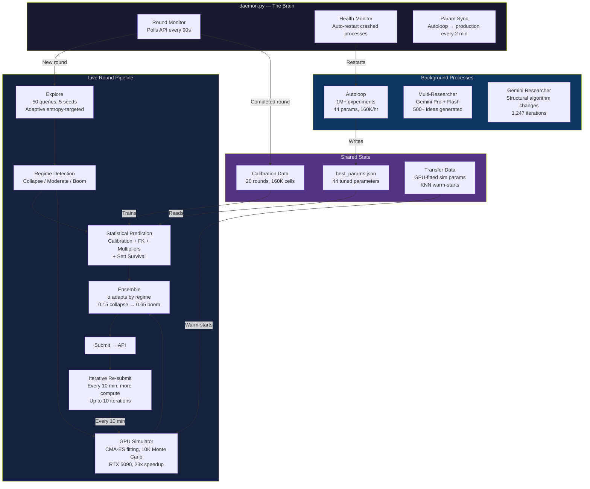
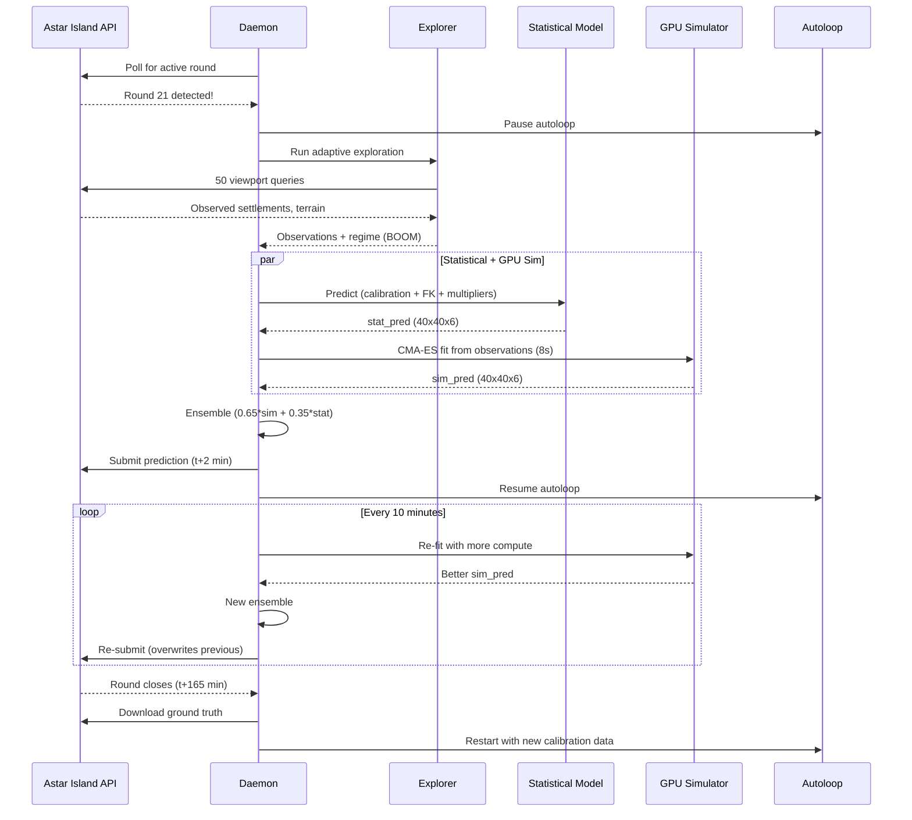
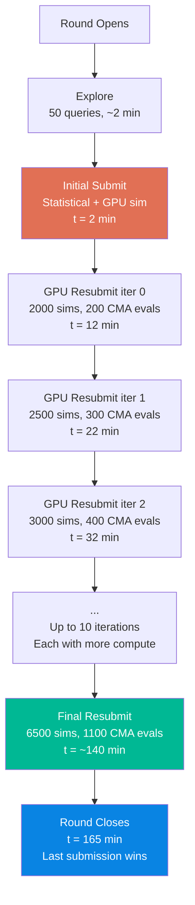
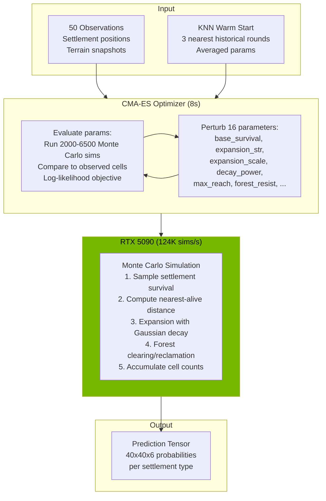
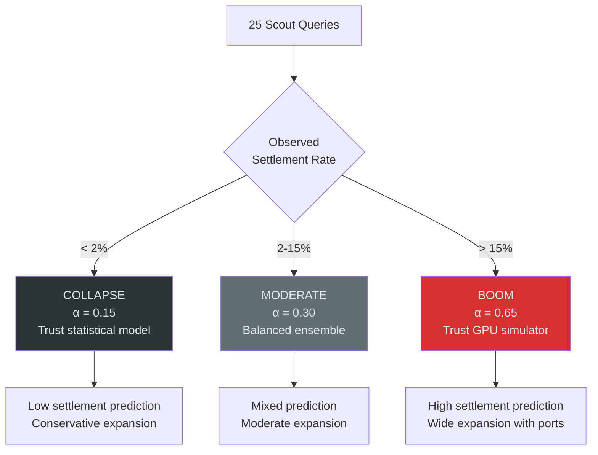
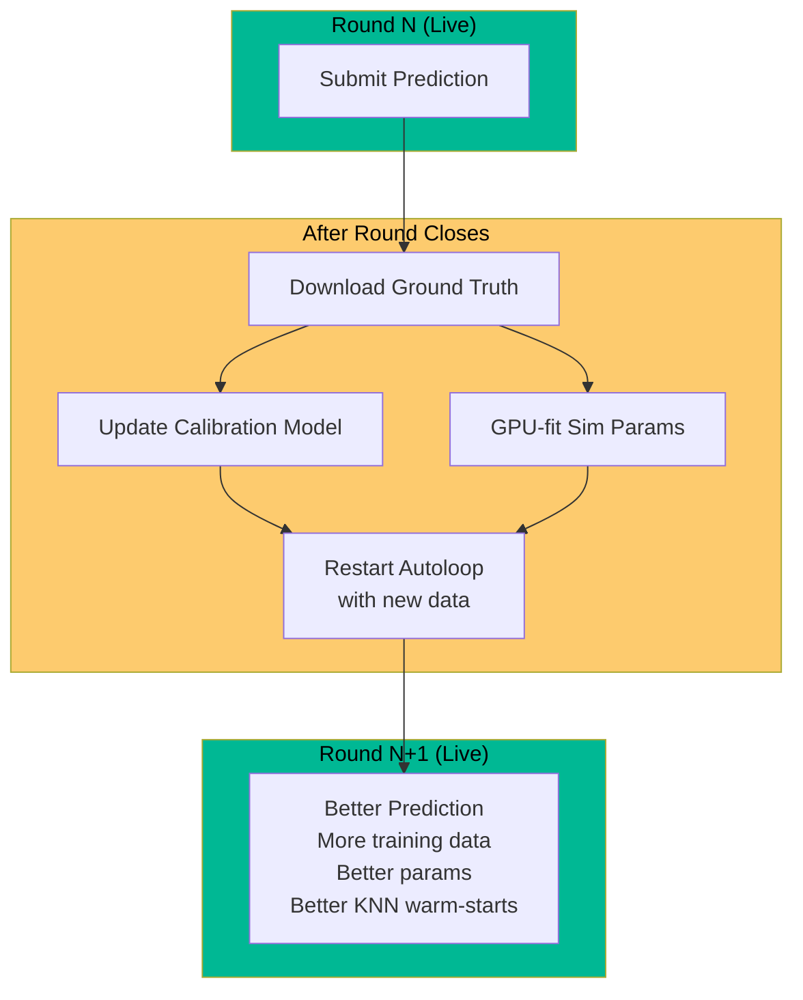

# The Daemon: Autonomous AI Competition System

## What It Does

The daemon is a fully autonomous system that competes in the Astar Island challenge — a real-time prediction competition where Norse civilization simulators run on hidden parameters and you have to predict the outcome from limited observations.

It runs 24/7 with zero human intervention. It detects new rounds, explores the simulation, fits a GPU-accelerated Monte Carlo simulator, generates predictions, submits them, and then **keeps improving and re-submitting** for the entire 165-minute round window.

While it does this, it simultaneously runs a continuous parameter optimization loop that has executed over **1 million experiments**, and two AI research agents that have generated **500+ algorithmic ideas**.

## System Architecture

## The Round Pipeline

## The Iterative Re-submission Innovation

Most competition systems submit once and hope for the best. This system exploits the fact that predictions can be overwritten while a round is active:

Each iteration uses a different random seed and more compute, gradually converging on better simulator parameters. The system never regresses because each iteration also carries forward all the observation-corrected statistical model features.

## GPU Simulator

The heart of the system is a PyTorch CUDA Monte Carlo simulator that models the Norse civilization dynamics:

- **16 hidden parameters** per round: survival rates, expansion strength, decay power, max reach, coastal modifiers, forest resistance, ruin rates
- **Gaussian-power distance decay**: `P(expand|d) = str * exp(-(d/scale)^power)` with hard cutoff
- **5000-10000 Monte Carlo samples** per evaluation
- **23x speedup** over CPU (5000 sims in 40ms on RTX 5090)
- **CMA-ES fitting** from 50 viewport observations in ~8 seconds

The simulator captures spatial dynamics that the statistical model cannot — particularly the sharp settlement cutoff at distance boundaries that varies 14x between rounds.

## Regime Detection

This classification happens within the first 25 queries (~1 minute) and shapes the entire prediction strategy.

## Self-Improvement Loop

Every completed round makes the next round better. Ground truth is downloaded, calibration model is updated (now 20 rounds, 160K cells), simulator parameters are fitted for KNN warm-starts, and the autoloop restarts with the expanded dataset.

## Numbers

| Metric | Value |
|--------|-------|
| Autoloop experiments | 1,028,171 |
| Parameters optimized | 44 (continuous) |
| Calibration rounds | 20 |
| Ground truth cells | 160,000 |
| GPU sim speed | 124,000 sims/sec |
| CMA-ES fitting time | ~8 seconds |
| Round processing time | ~2 min (initial), then iterative |
| Re-submissions per round | Up to 10 |
| Uptime | 24/7 autonomous |

## What Makes This Special

1. **Fully autonomous** — no human touches the system during competition. It detects, explores, predicts, submits, and improves on its own.

2. **Self-improving** — the autoloop continuously finds better parameters. Each new round's ground truth is automatically downloaded and used to improve future predictions.

3. **GPU-accelerated** — the RTX 5090 runs a full Monte Carlo simulator 23x faster than CPU, enabling real-time parameter fitting during live rounds.

4. **Iterative** — instead of submit-and-pray, it keeps improving predictions for the entire round window. More compute = better predictions.

5. **Ensemble architecture** — combines a fast statistical model (milliseconds) with a physics-informed simulator (seconds), getting the best of both worlds.
