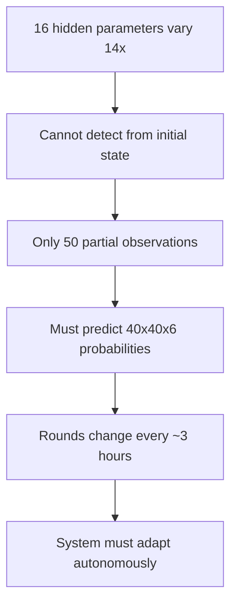
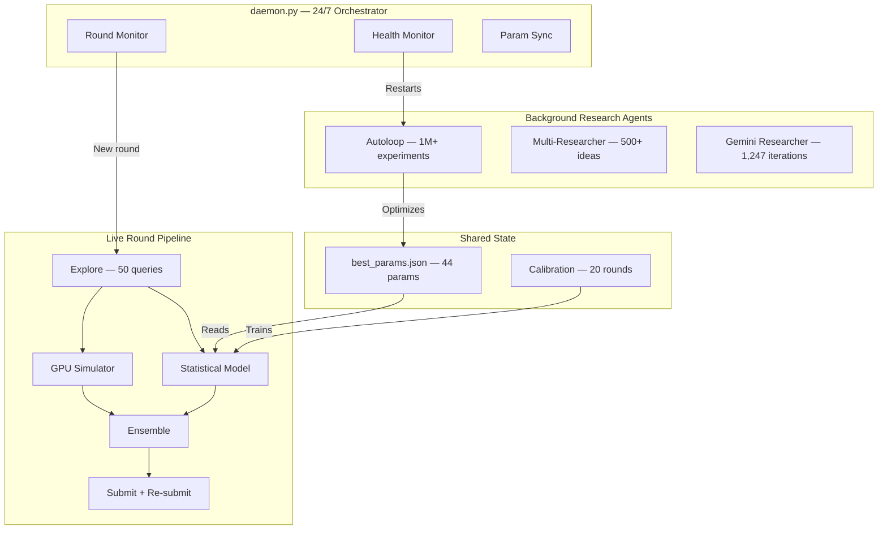
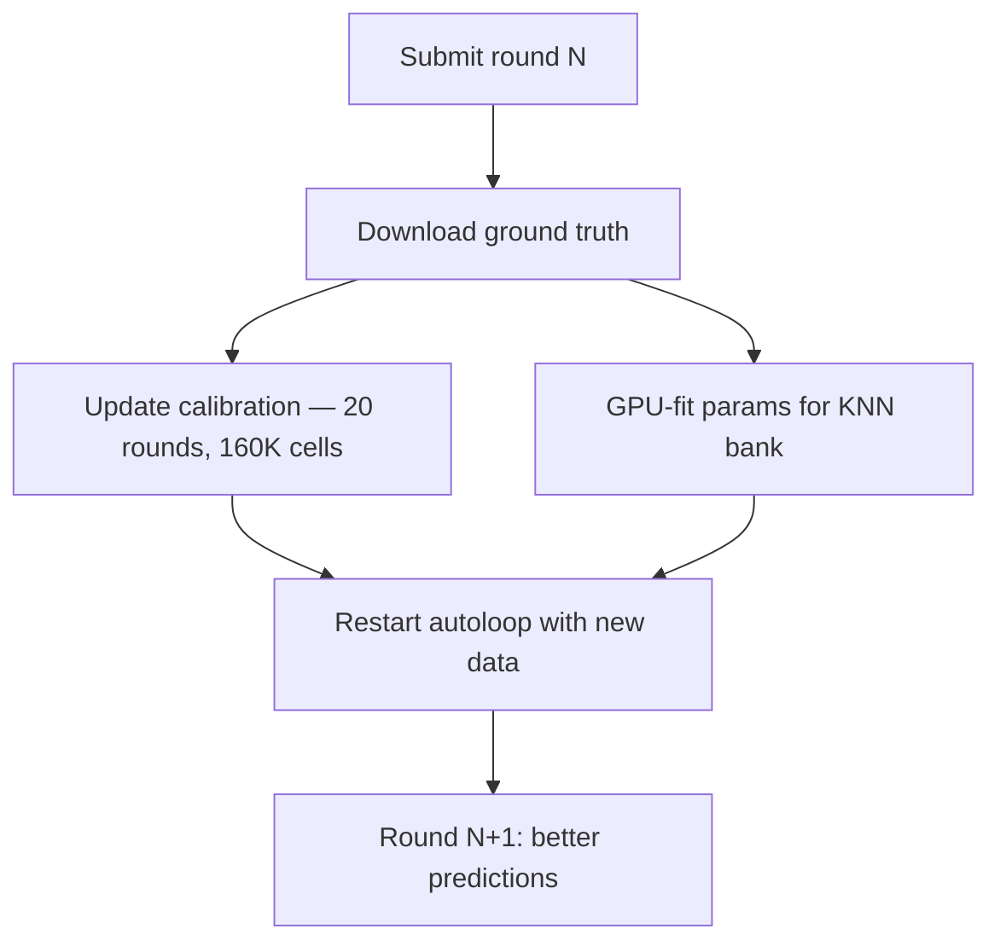
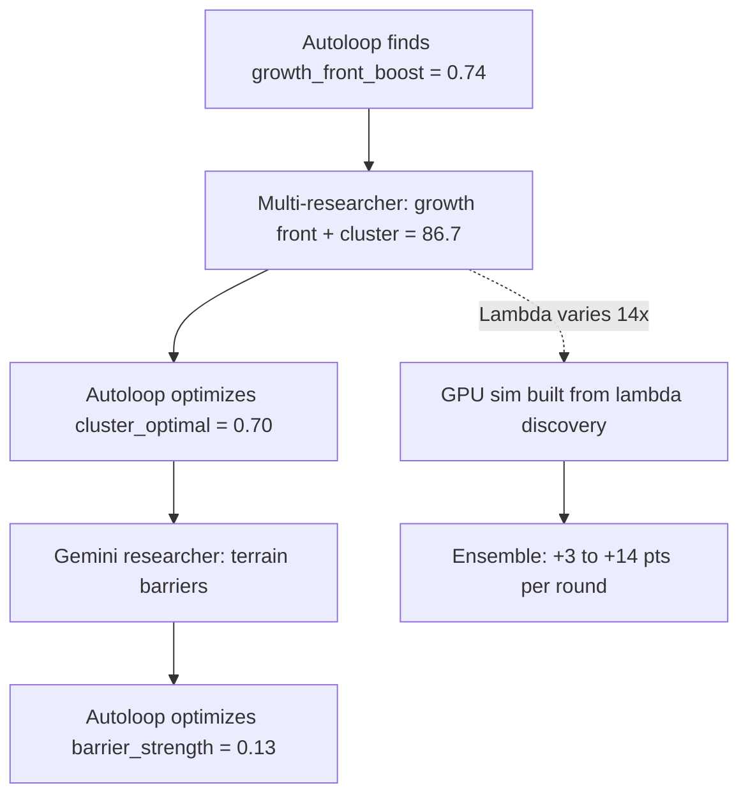
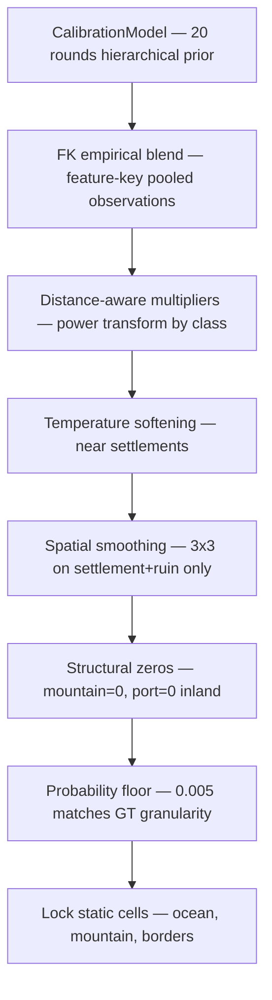

# Astar Island — NM i AI 2026

**Competition entry for [NM i AI](https://app.ainm.no) (Norges Mesterskap i Kunstig Intelligens / Norwegian AI Championship 2026)**

An autonomous AI research system that competes 24/7 in the Astar Island challenge — one of four scored challenges in NM i AI. Three research agents, a GPU Monte Carlo simulator, and a self-improving daemon run with zero human intervention.

> "The most interesting thing about AI right now is not that it can answer questions — it's that it can ask them." — Andrej Karpathy

---

## The Challenge

Astar Island is a prediction game about Norse civilizations on a hidden simulator. A 40x40 island has terrain and settlements. A hidden simulator — with **16 parameters that vary up to 14x between rounds** — runs the civilization forward. Settlements survive or die, expand, build ports, or collapse into ruins.

You observe through a **15x15 viewport** with only **50 queries** across 5 seeds. From these glimpses you must predict the **final 40x40x6 probability tensor** — one probability per cell per class (empty, settlement, port, ruin, forest, farmland).

Scoring uses **entropy-weighted KL divergence**: cells where the outcome is uncertain matter more. You must know what you don't know.



---

## The Solution



### Three Research Agents

| Agent | Timescale | What It Does | Scale |
|-------|-----------|--------------|-------|
| **Autoloop** | Milliseconds | Brute-force search over 44 continuous parameters | 1,028,171 experiments, 160K/hr |
| **Multi-Researcher** | Seconds | Gemini Flash analyzes errors, Gemini Pro writes code, backtest judges | 497 ideas, 32 breakthroughs |
| **Gemini Researcher** | Minutes | Proposes structural algorithm redesigns | 1,247 iterations |

They don't communicate directly — they share a codebase and parameter file. The autoloop picks up structural changes from researchers, researchers see autoloop-optimized baselines. **Emergent collaboration.**

### GPU Monte Carlo Simulator

PyTorch CUDA simulator on RTX 5090 that models Norse civilization dynamics:

- **CMA-ES fitting** from 50 observations in ~8 seconds
- **124,000 simulations/second** (23x faster than CPU)
- **16 hidden parameters**: survival rates, expansion strength, distance decay, forest resistance
- **Gaussian-power distance decay**: `P(expand|d) = str * exp(-(d/scale)^power)`
- Warm-started from 3 nearest historical rounds (KNN)

### Iterative Re-submission

Most systems submit once. This system exploits the 165-minute round window:

| Stage | Time | GPU Sims | CMA-ES Evals |
|-------|------|----------|--------------|
| Initial submit | t+2 min | 2,000 | 200 |
| Re-submit 5 | t+52 min | 4,500 | 700 |
| Final re-submit | t+140 min | 6,500 | 1,100 |

Each iteration uses a different random seed and more compute. The last submission wins.

### Regime Detection

Within 25 queries (~1 minute), the system classifies the round:

| Regime | Settlement Rate | Ensemble Alpha | Strategy |
|--------|----------------|---------------|----------|
| Collapse | < 2% | 0.15 | Trust statistical model |
| Moderate | 2-15% | 0.30 | Balanced blend |
| Boom | > 15% | 0.65 | Trust GPU simulator |

### Self-Improvement Loop

Every completed round makes the next one better:



---

## Results

| Round | Score | Rank | Regime | Notes |
|-------|-------|------|--------|-------|
| R5 | 86.3 | **1st** | Moderate | New pipeline deployed |
| R6 | 87.6 | 2nd | Boom | + Gemini improvements |
| R7 | 74.0 | 2nd | Extreme boom | Undetectable expansion regime |
| R17 | **93.0** | - | Boom | Best ever |
| R19 | 82.5 | - | Collapse | GPU sim saved +28 pts over stat-only |
| R20 | 89.4 | - | Moderate | Fixed obs correction bug |

Backtested average (R2-R7 leave-one-out): **88.4**

### The Compound Effect



---

## Research Speed

| Metric | Human Researcher | AI System | Speedup |
|--------|-----------------|-----------|---------|
| Time per iteration | ~5 hours | ~25 seconds | **720x** |
| Ideas per day | 3-4 | 3,456 | **1,000x** |
| Ego / confirmation bias | Yes | None | - |
| Will test "stupid" ideas | Rarely | Always | - |
| Runs at 3 AM | No | Yes | - |

---

## What Works vs What Failed

### What Works

| Feature | Impact | Source |
|---------|--------|--------|
| CalibrationModel (historical GT) | +10-15 pts | Historical ground truth |
| FK bucketed empirical | +5-8 pts | Feature-key pooling |
| Smart floor (zero impossible classes) | +5 pts | GT analysis |
| Global multipliers | +5-10 pts | Observation ratios |
| GPU simulator ensemble | +3-28 pts | CMA-ES fitting |
| Incremental obs saves | prevents -27 pts | R8 post-mortem |

### What Failed

| Idea | Impact | Why |
|------|--------|-----|
| Per-cell Bayesian update | -30 pts | Overfits to 1-2 stochastic samples |
| Zero ruin on non-settlement | -34 pts | Ruins form on expanded-then-collapsed plains |
| Log-odds space blending | -29 pts | Doesn't help discrete distributions |
| 75+ Opus code modifications | 0 pts | None beat baseline |
| 5000+ autoloop parameter tweaks | 0 pts | Converged at ceiling |

---

## Architecture

### Key Files

| File | Purpose |
|------|---------|
| `daemon.py` | 24/7 orchestrator — round detection, health, param sync |
| `explore.py` | Adaptive viewport exploration (50 queries, entropy-targeted) |
| `predict_gemini.py` | Statistical prediction — calibration + FK + multipliers (8 stages) |
| `sim_model_gpu.py` | PyTorch CUDA Monte Carlo simulator |
| `submit.py` | API submission + iterative re-submission |
| `autoloop_fast.py` | Continuous parameter optimization (160K/hr) |
| `multi_researcher.py` | Gemini Flash + Pro research cycle |
| `gemini_researcher.py` | Structural algorithm proposals |
| `calibration.py` | Hierarchical calibration from ground truth |
| `best_params.json` | 44 tuned continuous parameters |
| `utils.py` | GlobalMultipliers, FK buckets, ObsAccumulator |
| `fast_predict.py` | Vectorized prediction for autoloop backtesting |

### Prediction Pipeline



---

## Quick Start

```bash
# Install dependencies
pip install -r requirements.txt

# Set up environment (.env is gitignored)
cp .env.example .env  # fill in API keys

# Run full autonomous mode
python daemon.py

# Or run individual components
python autoloop_fast.py       # parameter optimization
python multi_researcher.py    # AI research agent
python eval_production.py     # backtest current model
python submit.py --round <id> # manual submission
```

### Prerequisites

- Python 3.11+
- NVIDIA GPU with CUDA (RTX 5090 for full performance)
- PyTorch 2.10+ with CUDA support
- Google Cloud API key (for Gemini models)

---

## Scoring Formula

```
score = 100 * exp(-3 * weighted_kl)
weighted_kl = sum(entropy(cell) * KL(gt, pred)) / sum(entropy(cell))
```

| wKL | Score |
|-----|-------|
| 0.00 | 100.0 |
| 0.02 | 94.2 |
| 0.05 | 86.1 |
| 0.10 | 74.1 |
| 0.15 | 63.8 |

Every 0.01 reduction in wKL is worth ~2-3 score points.

---

## The Numbers

| Metric | Value |
|--------|-------|
| Autoloop experiments | 1,028,171 |
| Parameters optimized | 44 continuous |
| Research iterations | 1,864 |
| Code variants generated | 497 |
| Breakthrough ideas | 32 |
| Calibration rounds | 20 |
| Ground truth cells | 160,000 |
| GPU simulation throughput | 124,000 sims/sec |
| CMA-ES fitting time | ~8 seconds |
| Autonomous operation | 24/7 |

---

## Documentation

Full docs in [`docs/`](docs/DOCS_STRUCTURE.md):

### Context
- [`00-context/vision.md`](docs/00-context/vision.md) — Case, problem, and solution overview
- [`00-context/architecture.md`](docs/00-context/architecture.md) — System architecture and data flow
- [`00-context/system-state.md`](docs/00-context/system-state.md) — Current scores and pipeline status
- [`00-context/war-stories.md`](docs/00-context/war-stories.md) — Failures, breakthroughs, and hard-won lessons

### Product
- [`01-product/prd.md`](docs/01-product/prd.md) — Game rules, scoring formula, constraints

### Features (deep technical dives)
- [`02-features/autonomous-research/`](docs/02-features/autonomous-research/) — 3-agent auto-research system (autoloop, multi-researcher, Gemini)
- [`02-features/daemon-pipeline/`](docs/02-features/daemon-pipeline/) — 24/7 daemon with iterative re-submission
- [`02-features/gpu-simulator/`](docs/02-features/gpu-simulator/) — CUDA Monte Carlo simulator + CMA-ES fitting
- [`02-features/statistical-model/`](docs/02-features/statistical-model/) — The 8-stage prediction pipeline (calibration, FK pooling, vectorization)
- [`02-features/island-explorer/`](docs/02-features/island-explorer/) — SvelteKit 3D island viewer (Three.js, weather, celestials, wildlife, Imagen)
- [`02-features/terminal-ui/`](docs/02-features/terminal-ui/) — Go Bubble Tea terminal dashboard (10 tabs, multi-pane, hacker scramble)
- [`02-features/research-agent/`](docs/02-features/research-agent/) — Google ADK + Gemini autonomous research agent

### Process
- [`04-process/getting-started.md`](docs/04-process/getting-started.md) — Setup, dependencies, how to run

---

## NM i AI 2026

[NM i AI](https://app.ainm.no) (Norwegian AI Championship) is Norway's national AI competition with four challenges:

1. **NorgesGruppen Data** — Object detection on grocery store shelves
2. **Tripletex** — AI accounting agent via API
3. **Astar Island** — Norse civilization prediction (this repo)
4. **Grocery Bot** — WebSocket grocery store game (warm-up, not scored)

Astar Island scores are entropy-weighted across rounds, with later rounds worth more (1.05^round). Leaderboard = best weighted score across all rounds.

---

*Team Synthetic Synapses — NM i AI 2026*
