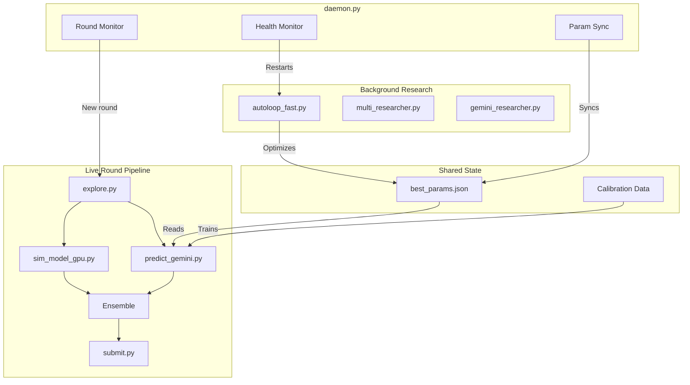
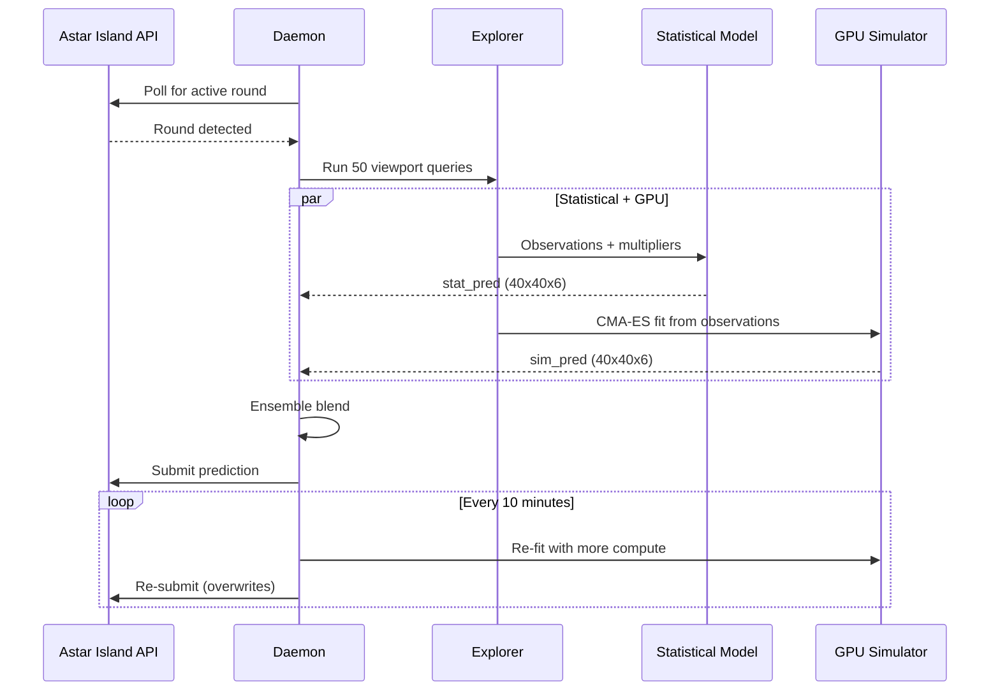

# Architecture

Full system architecture for the Astar Island autonomous competition system.

---

## System Overview

---

## Data Flow Per Round

---

## Key Files

| File | Purpose |
|------|---------|
| `daemon.py` | 24/7 orchestrator — round detection, health monitoring, param sync |
| `explore.py` | Adaptive viewport exploration (50 queries, entropy-targeted) |
| `predict_gemini.py` | Statistical prediction — calibration + FK buckets + multipliers |
| `sim_model_gpu.py` | PyTorch CUDA Monte Carlo simulator |
| `submit.py` | API submission with iterative re-submission |
| `autoloop_fast.py` | Continuous parameter optimization (160K experiments/hr) |
| `multi_researcher.py` | Gemini Flash + Pro research loop |
| `gemini_researcher.py` | Structural algorithm proposals |
| `calibration.py` | Hierarchical calibration from ground truth |
| `best_params.json` | 44 tuned continuous parameters |

---

## Memory Model

All shared state is file-based — no database, no message queue:

| File | Updated by | Read by |
|------|-----------|---------|
| `best_params.json` | Autoloop (every improvement) | Statistical model, researchers |
| `data/calibration_*.json` | Daemon (after round closes) | Statistical model |
| `data/sim_params_*.json` | GPU simulator | KNN warm-starts |
| `learnings/*.json` | Multi-researcher | Gemini researcher |

Processes coordinate through the filesystem. The daemon syncs autoloop parameters to production every 2 minutes.
