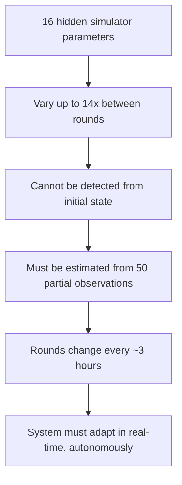

# Vision

Autonomous AI research system built for the Astar Island challenge in NM i AI (Norwegian AI Championship, 2026).

---

## The Case

Astar Island is a prediction game about Norse civilizations on a hidden simulator. A 40x40 island has terrain (land, forest, mountains, ocean) and Norse settlements. A hidden simulator runs the civilization forward — settlements survive or die, expand, clear forests, build ports, or collapse into ruins.

You observe the simulation through a 15x15 viewport. From 50 observation queries across 5 random seeds, you must predict the final probability distribution — a 40x40x6 tensor where each cell has probabilities for: empty, settlement, port, ruin, forest, farmland.

Scoring uses entropy-weighted KL divergence — cells where the outcome is uncertain matter more than cells where it is predictable.

---

## The Problem

1. **Hidden state estimation** — the simulator has 16 parameters that vary dramatically between rounds. You cannot see them. You must infer them from partial observations. This is the core challenge of science itself.

2. **Information-theoretic scoring** — KL divergence rewards well-calibrated probabilities, not just correct guesses. You must know what you don't know.

3. **Exploration under budget** — 50 queries is not enough to see everything. Where you look matters.

4. **Non-stationary dynamics** — each round has completely different hidden parameters. What worked last round might fail this round.

5. **Multi-scale reasoning** — you need local features (terrain around each cell), global features (overall settlement vigor), and spatial dynamics (expansion radius).

---

## The Solution

Build a fully autonomous system that competes 24/7 with zero human intervention: detect new rounds, explore, predict, submit, then keep improving and re-submitting — while simultaneously running continuous parameter optimization and AI-driven research.

Three autonomous research agents run in parallel across different timescales:

| Agent | Timescale | Role |
|-------|-----------|------|
| Autoloop | Milliseconds | Brute-force parameter search (1M+ experiments) |
| Multi-Researcher | Seconds | Creative algorithmic ideas (500+ variants) |
| Gemini Researcher | Minutes | Structural algorithm redesigns |

A GPU Monte Carlo simulator on RTX 5090 fits hidden parameters from observations in 8 seconds, and an ensemble model blends statistical and physics-informed predictions.

---

## Results

| Round | Score | Rank | Regime |
|-------|-------|------|--------|
| R5 | 86.3 | 1st | Moderate |
| R6 | 87.6 | 2nd | Boom |
| R7 | 74.0 | 2nd | Extreme boom |
| R17 | 93.0 | - | Boom (best ever) |
| R20 | 89.4 | - | Moderate |

Backtested average across R2-R7: **88.4** (leave-one-out).
