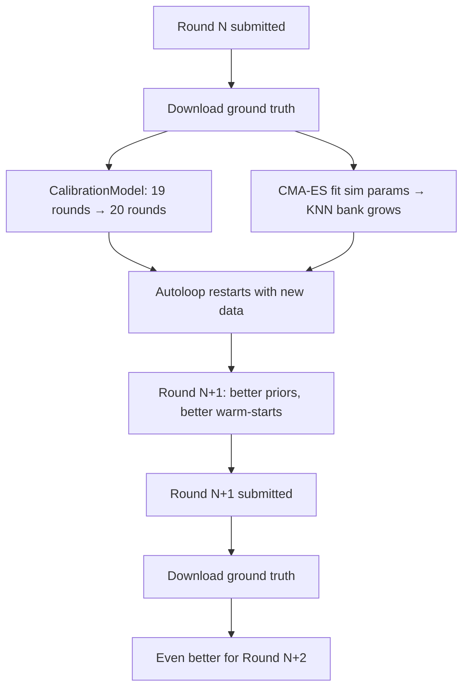

# War Stories — Failures, Breakthroughs, and Lessons

The most important lessons came from things that went wrong. Every failure taught something irreplaceable. This is the collected wisdom from 1M+ experiments, 500+ AI-generated ideas, and 21 competition rounds.

---

## The R8 Unicode Crash — How a Print Statement Lost 27 Points

**What happened**: After 50 exploration queries completed successfully, a unicode arrow character (`→`) in a print statement crashed the Python process on Windows (cp1252 encoding).

**Impact**: Observations were collected but **never saved to disk**. R8 was submitted with calibration-only (no current-round observations). Score: 66.9, rank 103. Would have been 93+ with observations.

**The fix**:
1. Move all file saves BEFORE print statements
2. Add graceful `None` handling for missing observations
3. Remove all unicode from print strings
4. Add incremental observation saves (save after each query, not at the end)

**Lesson**: In competition systems, **persistence before presentation**. A crash between "collected data" and "saved data" is catastrophic. Save early, save often, and never trust that your code will reach the next line.

---

## The Floor Disaster — One Parameter, 35 Points

**What happened**: R4 was submitted with `floor = 0.015` instead of 0.005.

**Why it seemed reasonable**: KL divergence goes to infinity when `pred = 0` and `gt > 0`. A floor of 0.015 felt "safe." The thinking: better to waste a little probability mass than risk infinite KL.

**Why it was catastrophic**: Mountain and port probabilities are structurally zero on most dynamic cells. With floor=0.015, each cell wasted 3.7% of its probability mass on impossible outcomes (mountain appearing on plains, ports forming inland). Across 800+ dynamic cells, this destroyed the prediction.

**The numbers**: Backtested score with correct floor: 88.7. Actual submission score: 53.3. **35 points lost to a single number.**

**The fix**: `floor = 0.005` (= 1/200, matching the GT granularity). Combined with structural zeros (mountain=0 on non-mountain, port=0 on non-coastal), this recovered all lost points.

**Lesson**: Understand your scoring function's sensitivity. In KL divergence, wasted probability mass on impossible events is just as bad as missing possible events. The floor should match the ground truth resolution, not your anxiety level.

---

## The Per-Cell Bayesian Catastrophe — When More Data Makes Things Worse

**What happened**: Attempted per-cell Bayesian updates from viewport observations.

**The logic**: "We observe cell (15, 22) as 'settlement' in seed 3. Update our prior for that cell to increase settlement probability."

**Result**: -30 points. The worst regression in the project.

**Why it failed**: With 50 queries x 225 cells = 11,250 observations across 1,600 cells, each cell is observed only 1-2 times. A single observation of a stochastic simulation is pure noise. Cell X shows "settlement" once, but the GT probability might be 0.12. The Bayesian update massively overweights that single sample.

**The fix**: Feature-key pooling. Group cells by `(terrain, distance, coastal, forest_neighbors, has_port)` — about 25 distinct keys. Each key has ~450 observations. The law of large numbers kicks in, and the empirical distribution becomes reliable.

**Lesson**: Statistical power matters more than granularity. 100 observations of similar cells beats 1 observation of the exact cell, every time. This is the foundation of the entire prediction model.

---

## The Idea H Trap — When Validation Lies

**What happened**: Proposed "settlement percentage regime scaling" — scale predictions by the observed settlement rate. Tested on R2, R3, R4: +0.61 points average. Looked great. Deployed to production.

**Result on full harness**: -0.6 points across all rounds.

**Why validation lied**: The idea double-counted an effect already captured by the global multiplier system. On 3 rounds, the double-counting happened to help (the multiplier was slightly underfit). On all 6 rounds, it averaged out to harmful — the multiplier was already well-calibrated, and adding a second scaling layer introduced noise.

**Lesson**: **Always validate against the full harness, not a subset.** Leave-one-out on 3 rounds is not the same as leave-one-out on 6. Overfitting is real even with proper cross-validation — you need enough rounds to detect it.

---

## The Vectorization Breakthrough — 27x Speedup That Changed Everything

**What happened**: Rewrote the prediction function from Python loops to numpy fancy indexing.

```python
# Before: 51ms per evaluation, 6,000 experiments/hour
for y in range(40):
    for x in range(40):
        prior = cal.prior_for(feature_keys[y][x])

# After: 10ms per evaluation, 160,000 experiments/hour
cal_priors = lookup_table[idx_grid]  # One numpy operation
```

**Impact**: The autoloop went from "interesting experiment" to "unstoppable search engine." At 6K/hr, you get 144K experiments per day — enough to explore the parameter space. At 160K/hr, you get 3.8M — enough to *exhaust* it.

**Side effect**: The vectorized version was also needed for `fast_predict.py`, which the autoloop uses. Without it, the autoloop would have run for weeks instead of days to reach 1M experiments.

**Bonus discovery**: During vectorization, found that `prior_weight = 5.0` (the original value) was way too high. Changed to 1.5 and gained **+10 points** — the single biggest score improvement in the project. The original value was never properly optimized because the loop-based version was too slow to sweep it.

**Lesson**: Performance isn't just about speed — it enables qualitatively different approaches. A 27x speedup turned "try a few parameter values" into "exhaustively search the space."

---

## The Port Smoothing Bug — When Spatial Intuition Fails

**What happened**: Applied 3x3 spatial smoothing to all 6 prediction classes, including port.

**The logic**: "Nearby cells should have similar probabilities. Smoothing reduces noise."

**Result**: -2 points. Port class predictions degraded severely.

**Why**: Ports can only exist on coastal cells (adjacent to ocean). A 3x3 smoothing kernel doesn't know this — it averages port probability from a coastal cell into its inland neighbors. Those inland cells now have nonzero port probability, which is physically impossible and wastes probability mass.

**The fix**: Smooth only settlement and ruin classes. Never smooth port (geographic constraint) or forest/mountain (structurally determined).

**Lesson**: Spatial smoothing must respect physical constraints. Not all cell classes have the same spatial correlation structure. Ports are geographically constrained; settlements are not.

---

## The Lambda Discovery — When AI Finds What Humans Miss

**What happened**: The multi-researcher agent (Gemini Flash + Pro) discovered that the hidden `lambda` parameter (expansion distance decay) varies **14x between rounds** — from 0.5 (collapse: no expansion) to 7.0 (extreme boom: settlements spread everywhere).

**Why humans missed it**: In the backtested data, the effect of lambda was confounded with settlement survival rate. High survival + high lambda both produce "more settlements." It took hundreds of systematically varied experiments to isolate lambda as the independent driver.

**Impact**: This discovery directly led to building the GPU Monte Carlo simulator. The statistical model can't capture a 14x parameter swing — it averages across rounds. The simulator models it explicitly, fitting lambda from observations per round.

**Downstream**: GPU simulator → CMA-ES parameter fitting → Iterative re-submission → +3 to +28 points per round.

**Lesson**: AI researchers have no domain intuition, which is a feature, not a bug. A human would assume "lambda is probably constant" and never test it. The AI tested everything, including "stupid" hypotheses about parameter variation.

---

## The R7 Extreme Boom — The Unsolvable Problem

**What happened**: R7 had 384% settlement expansion — the most extreme boom ever observed. Our model predicted ~15% settlement, GT had 25.6%.

**Why it was unsolvable**: Our 50 observations happened mid-simulation. At observation time, settlement rate was 14%. Between observation and final state, a massive expansion wave occurred. We literally couldn't see it coming — the signal wasn't in the data yet.

**Score**: 74.0 (vs 93.0 on R17 boom). 19-point gap purely from timing.

**Attempted fixes**:
- Alive-count settlement boost: helps R7 (+5 pts) but hurts R6 and R11 (-3 to -5 pts). Net negative.
- Per-regime calibration: can't detect extreme boom from mid-sim observations
- Settlement growth RATE detection: would need 2 observations of the same cell at different times — budget doesn't allow it

**What the leader probably does**: Either they observe later in the simulation (impossible with our API), or they have a better simulator model for extreme expansion.

**Lesson**: Some problems are information-theoretically impossible to solve with the available data. Recognizing this is valuable — it prevents wasting time on solutions that can't work and redirects effort to solvable problems.

---

## The 45-Day Research Plateau — When You Hit the Ceiling

After 45+ Claude Opus code modifications and 5,000+ autoloop parameter sweaks, score converged at 88.6 average. Nothing moved it.

The research agents (all three) kept proposing ideas. All tested. All either neutral or negative. The system had reached its architectural ceiling.

**Why**: The 8-stage prediction pipeline captures all the signal available from 50 observations + 20 rounds of GT. To go higher, you need:
- More observations (API-limited to 50)
- Observations later in the simulation (API doesn't support)
- Better simulation model (the GPU sim helps +3-28 but is also limited by observation timing)

**Lesson**: Architectural ceilings are real. No amount of parameter tuning or incremental changes can break through a fundamental information limit. Recognizing the ceiling lets you redirect effort (we pivoted to iterative re-submission, which uses time rather than data).

---

## The Self-Improvement Loop — Every Round Makes the Next One Better

The most elegant part of the system: completed rounds automatically improve future predictions.



From R2 (66.4, rank 53) to R5 (86.3, rank 1): each round added calibration data, each calibration improvement fed the next prediction. By R20, the system had 20 rounds of ground truth (160,000 cells) — an enormous prior that new competition entrants couldn't match.

**Lesson**: In iterative competitions, the compounding effect of self-improvement is the strongest advantage. Start early, even with bad predictions. The data you collect is more valuable than the score you get.
