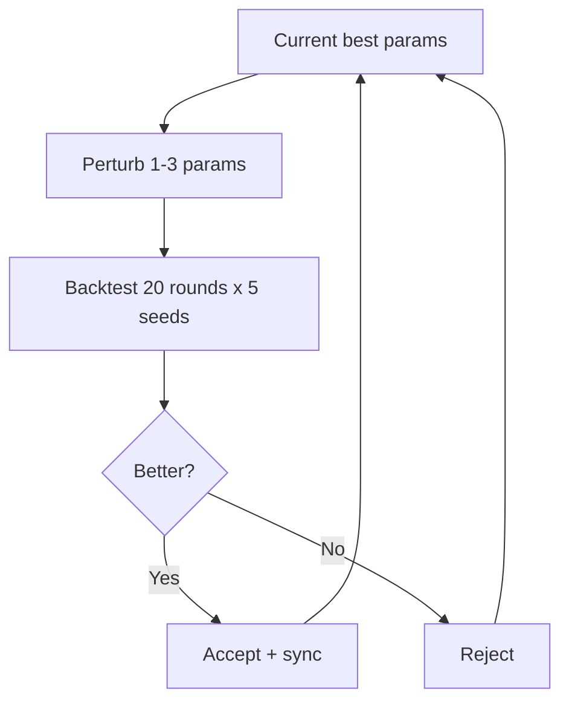
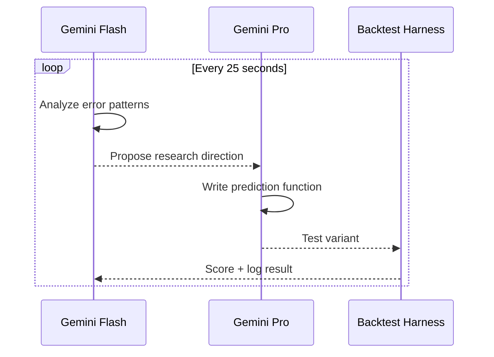
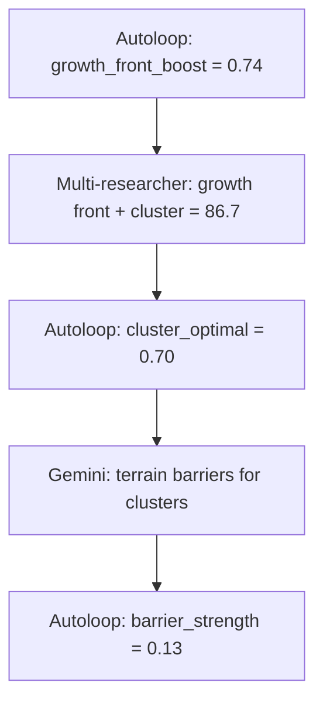

# Autonomous Research System

Three AI agents conduct continuous research in parallel, each operating at a different timescale and with a different strategy. They share a codebase and parameter file but do not communicate directly — collaboration emerges from shared state.

---

## Agents

### 1. Autoloop — Brute Force Parameter Search

- 44 continuous parameters, Gaussian perturbation
- 160,000 experiments/hour (vectorized numpy)
- 1,028,171 total experiments run
- Finds non-intuitive values no human would guess (e.g., `mult_power_sett = 0.53`)

### 2. Multi-Researcher — Creative Algorithmic Ideas

- Gemini Flash (analyst) identifies error patterns, proposes directions
- Gemini Pro (coder) writes complete prediction functions
- 497 ideas generated, 32 breakthroughs (>86.6), 166 competitive (>80.0)
- ~25 seconds per full idea-to-test cycle

### 3. Gemini Researcher — Structural Thinker

- Proposes deep algorithmic changes (diffusion fields, Dirichlet conjugates, cluster density models)
- 1,247 iterations
- PhD-level ideas generated in seconds, tested in minutes

---

## Compound Effect

The agents compound discoveries across timescales:

Each discovery enables the next. The autoloop picks up structural changes from researchers, and researchers see autoloop-optimized baselines.

---

## Research Speed

| Metric | Human | AI System | Speedup |
|--------|-------|-----------|---------|
| Time per iteration | ~5 hours | ~25 seconds | 720x |
| Ideas per day | 3-4 | 3,456 | 1,000x |
| Confirmation bias | Yes | None | - |
| Tests "stupid" ideas | Rarely | Always | - |

---

## Files

- `autoloop_fast.py` — Parameter optimization loop
- `multi_researcher.py` — Gemini Flash + Pro research cycle
- `gemini_researcher.py` — Structural algorithm proposals
- `best_params.json` — 44 tuned parameters (shared state)
- `learnings/` — Idea archive (500+ tested variants)
