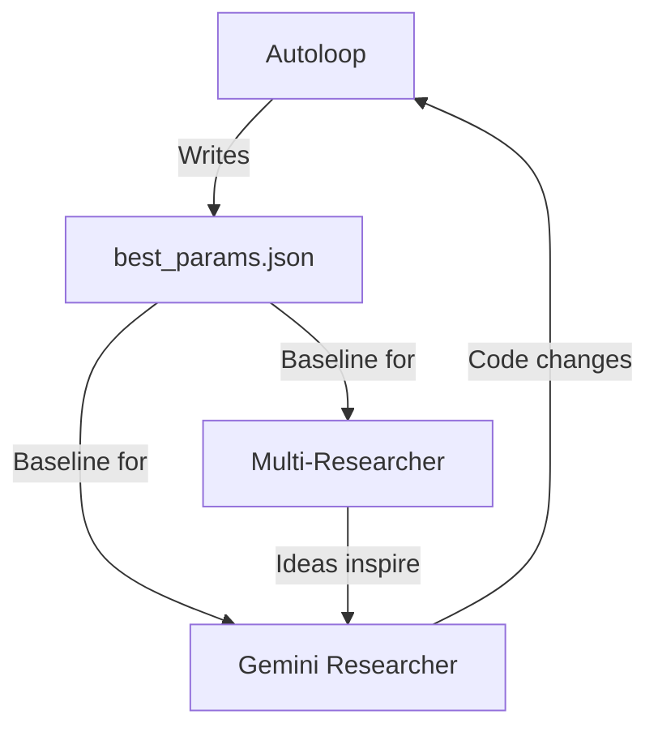

# Autonomous Research — Technical Design

How three AI agents conduct parallel research to improve prediction accuracy.

---

## Autoloop Architecture

### Parameter Space

44 continuous parameters in `best_params.json`:

| Category | Count | Examples |
|----------|-------|---------|
| Multiplier powers | 6 | `mult_power_sett=0.53`, `mult_power_empty=0.19` |
| Calibration | 4 | `cal_fine_divisor=125`, `global_weight=0.01` |
| FK empirical | 3 | `emp_max_weight`, `min_count=5` |
| Temperature | 3 | `T_max_scale=0.10`, `radius_base=2` |
| Floor/clamp | 4 | `floor=0.0034`, `sett_clamp=[0.15, 2.5]` |
| Growth/cluster | 6 | `growth_front_boost=0.74`, `cluster_optimal=0.70` |
| Distance decay | 6 | Powers per class, expansion radius |
| Other | 12 | Smoothing, structural zeros, port factors |

### Search Strategy

- **Perturbation**: Gaussian noise on 1-3 randomly selected parameters
- **Evaluation**: Full backtest against 20 rounds x 5 seeds (vectorized numpy)
- **Acceptance**: Strict improvement only — new score must beat current best
- **Sync**: Best params written to `best_params.json`, synced to production every 2 min

### Performance

- 160,000 experiments/hour
- Vectorized numpy backtest: ~22ms per full evaluation
- 1,028,171 total experiments

---

## Multi-Researcher Architecture

### Two-Model Collaboration

**Gemini Flash** (analyst):
- Reads experiment log (last N results, error decomposition)
- Identifies which cell class contributes most KL error
- Proposes a research direction in natural language

**Gemini Pro** (coder):
- Receives the direction + current prediction function
- Writes a complete `experimental_pred_fn()` — not a patch, a full reimplementation
- The function is loaded dynamically and backtested

### Evaluation Pipeline

```python
# Simplified flow
direction = flash.analyze(experiment_log)
code = pro.generate(direction, current_code)
exec(code)  # defines experimental_pred_fn
score = backtest(experimental_pred_fn, calibration_data)
log_result(direction, code, score)
```

### Idea Quality Distribution

| Quality | Count | Criteria |
|---------|-------|----------|
| Good | 32 | Score > 86.6 (beats baseline) |
| OK | 166 | Score > 80.0 |
| Failed | 149 | Error or crash |
| Below baseline | 150 | Score < 80.0 |

---

## Gemini Researcher Architecture

Single Gemini Pro model with deeper context:
- Reads full prediction codebase + recent experiment results
- Proposes structural algorithm changes (not parameter tweaks)
- Changes are applied to production code, backtested, kept or reverted

Example proposals:
- "Replace distance-based multiplier with diffusion field accounting for terrain barriers"
- "Add Dirichlet-Multinomial conjugate update for directly observed cells"
- "Implement cluster density as inverted-U survival factor"

---

## Coordination

No explicit communication between agents. Coordination via shared files:



The autoloop optimizes whatever parameters the researchers define. When a researcher adds a new parameter (e.g., `barrier_strength`), the autoloop automatically picks it up and optimizes it.

---

## Files

- `autoloop_fast.py` — Main optimization loop (160K/hr)
- `autoloop_cmaes.py` — CMA-ES variant of autoloop
- `multi_researcher.py` — Flash + Pro research cycle
- `gemini_researcher.py` — Structural proposals
- `experimental_pred_fn.py` — Dynamically loaded test variants
- `eval_production.py` — Backtest harness
