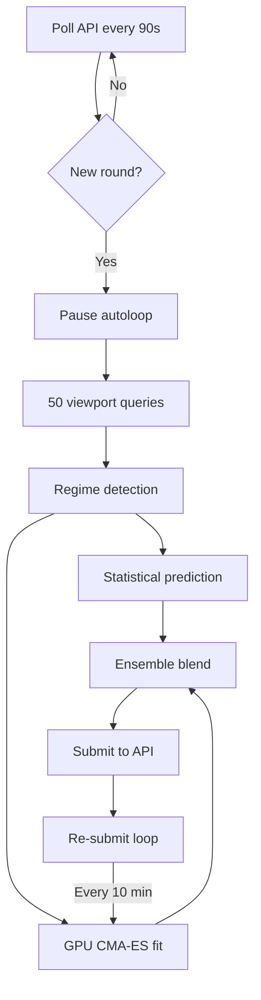
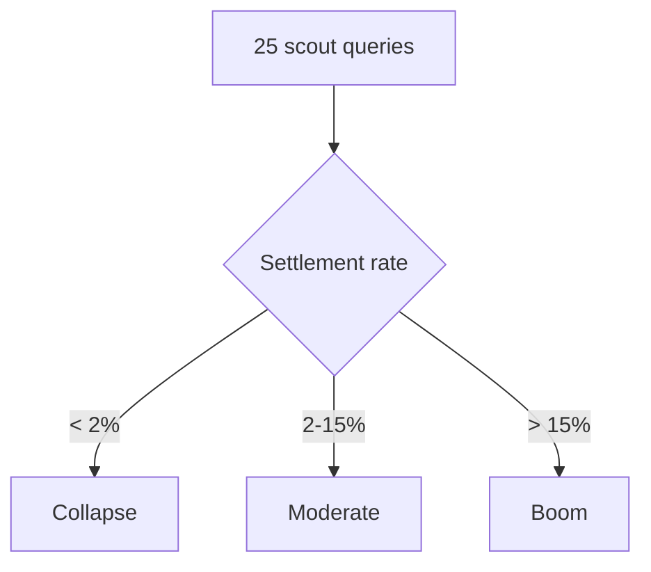
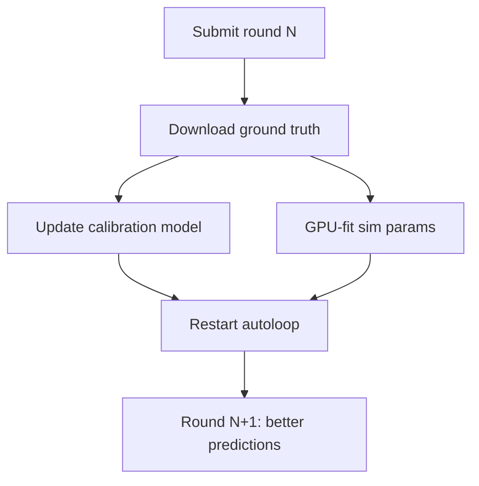

# Daemon Pipeline

Fully autonomous 24/7 competition system. Detects new rounds, explores the simulation, generates predictions, submits them, and iteratively improves for the entire round window — all with zero human intervention.

---

## Pipeline Flow

---

## Regime Detection

Happens within the first 25 queries (~1 minute):

| Regime | Ensemble alpha | Strategy |
|--------|---------------|----------|
| Collapse | 0.15 | Trust statistical model |
| Moderate | 0.30 | Balanced |
| Boom | 0.65 | Trust GPU simulator |

---

## Iterative Re-submission

Most systems submit once. This system exploits the 165-minute round window:

| Iteration | Time | GPU Sims | CMA-ES Evals |
|-----------|------|----------|--------------|
| Initial | t+2 min | 2,000 | 200 |
| Iter 0 | t+12 min | 2,000 | 200 |
| Iter 1 | t+22 min | 2,500 | 300 |
| Iter 2 | t+32 min | 3,000 | 400 |
| ... | ... | ... | ... |
| Final | t+140 min | 6,500 | 1,100 |

Each iteration uses a different random seed and more compute. The last submission wins.

---

## Self-Improvement Loop

Every completed round makes the next one better. Ground truth is downloaded automatically, calibration model is updated (20 rounds, 160K cells), and the autoloop restarts with expanded data.

---

## Health Monitoring

- Crashed processes auto-restart via health monitor
- Param sync: autoloop -> production every 2 minutes
- Observation data saved incrementally to disk (crash-proof)
- Unicode crash protection added after R8 incident

---

## Files

- `daemon.py` — Main orchestrator
- `explore.py` — Adaptive viewport exploration
- `submit.py` — API submission + iterative re-submission
- `predict_gemini.py` — Statistical prediction pipeline
