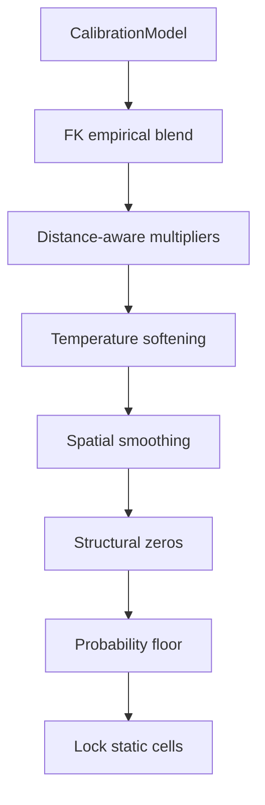

# Daemon Pipeline — Technical Design

How the 24/7 autonomous system orchestrates round detection, prediction, submission, and self-improvement.

---

## daemon.py Components

### Round Monitor
- Polls Astar Island API every 90 seconds
- Detects new active rounds by comparing round ID to last processed
- Triggers full pipeline on detection

### Health Monitor
- Checks autoloop, multi-researcher, gemini-researcher processes
- Auto-restarts crashed processes
- Logs uptime and restart events

### Param Sync
- Every 2 minutes: copies autoloop's `best_params.json` to production
- Atomic write (write to temp, rename) to prevent partial reads

---

## Exploration Strategy (explore.py)

50 queries distributed across 5 seeds:

| Phase | Queries | Strategy |
|-------|---------|----------|
| Coverage | 45 | Systematic grid coverage of 40x40 map |
| Adaptive | 5 | Entropy-targeted: revisit high-uncertainty regions |

Each observation captures:
- Cell types in 15x15 viewport
- Settlement positions and terrain context
- Saved incrementally to disk (crash-proof after R8 unicode incident)

Outputs:
- `GlobalMultipliers`: observed/expected ratios per class
- `FeatureKeyBuckets`: empirical distributions grouped by (terrain, dist, coastal, forest_neighbors, has_port)
- `GlobalTransitionMatrix`: class transition counts

---

## Statistical Model (predict_gemini.py)

Prediction pipeline with 8 stages:



1. **CalibrationModel**: Hierarchical prior from 20 rounds (fine key -> coarse -> base -> global)
2. **FK empirical blend**: `prior*5.0 + emp*sqrt(count) / (5.0 + sqrt(count))`
3. **Multipliers**: Distance-aware power transform, settlement clamp [0.15, 2.5]
4. **Temperature**: Softening near settlements, radius adapts to regime
5. **Smoothing**: 3x3 kernel on settlement + ruin only (not port)
6. **Structural zeros**: Mountain=0 on non-mountain, port=0 on non-coastal
7. **Floor**: 0.005 (matches GT granularity of 1/200)
8. **Static lock**: Ocean=[1,0,0,0,0,0], mountain=[0,0,0,0,0,1]

---

## Re-submission Strategy

```python
# Simplified re-submission loop
for i in range(10):
    n_sims = 2000 + i * 500
    n_evals = 200 + i * 100
    sim_pred = gpu_fit(observations, n_sims, n_evals, seed=i)
    ensemble = alpha * sim_pred + (1 - alpha) * stat_pred
    submit(ensemble)  # overwrites previous
    sleep(600)  # 10 minutes
```

Different random seed per iteration ensures exploration of parameter space. More compute per iteration enables finer fitting.

---

## Post-Round Processing

When a round closes:
1. Download ground truth from API
2. Add to calibration dataset (now 20 rounds, 160K cells)
3. GPU-fit simulator parameters for KNN warm-start bank
4. Restart autoloop with expanded dataset

---

## Files

- `daemon.py` — Main orchestrator (round detection, health, sync)
- `explore.py` — Adaptive viewport exploration
- `predict_gemini.py` — 8-stage statistical prediction
- `submit.py` — API submission + re-submission loop
- `calibration.py` — Hierarchical CalibrationModel
- `regime_calibration.py` — Regime-specific calibration
