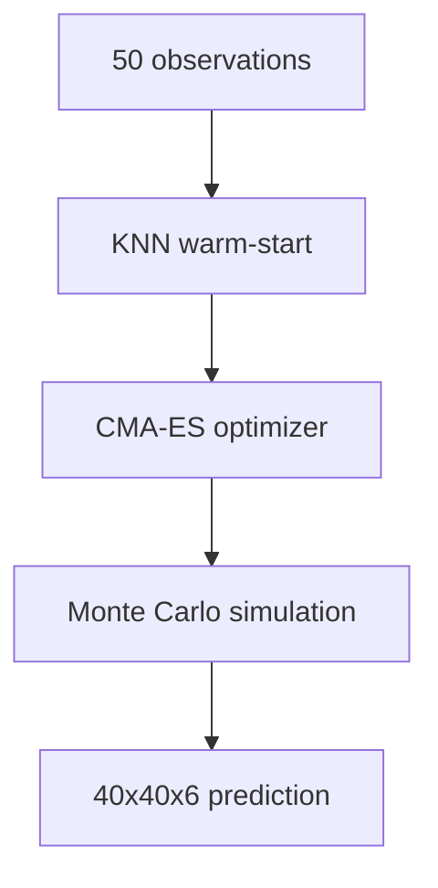

# GPU Monte Carlo Simulator

PyTorch CUDA simulator that models Norse civilization dynamics on RTX 5090. Fits 16 hidden parameters from 50 viewport observations using CMA-ES optimization, then runs thousands of Monte Carlo simulations to predict the final state.

---

## Why a Simulator?

The statistical model predicts from calibrated averages. But the simulator captures spatial dynamics — particularly the sharp settlement cutoff at distance boundaries that varies 14x between rounds. The key discovery: lambda (expansion radius) varies from 0.5 to 7.0 across rounds and cannot be predicted from initial state.

---

## Architecture



### CMA-ES Parameter Fitting (~8 seconds)

Fits 16 hidden parameters by maximizing log-likelihood against observed cells:

| Parameter | Range | Controls |
|-----------|-------|----------|
| `base_survival` | 0-1 | Settlement survival probability |
| `expansion_str` | 0-1 | Expansion probability strength |
| `expansion_scale` | 0.5-7.0 | Distance decay scale (lambda) |
| `decay_power` | 0.5-4.0 | Gaussian-power distance decay |
| `max_reach` | 1-10 | Hard cutoff for expansion |
| `forest_resist` | 0-1 | Forest resistance to clearing |
| ... | ... | 10 more parameters |

Warm-started from 3 nearest historical rounds (KNN on observation features).

### Monte Carlo Simulation (124K sims/sec)

For each evaluation:
1. Sample settlement survival (Bernoulli per cell)
2. Compute nearest-alive distance for each empty cell
3. Expansion with Gaussian-power decay: `P = str * exp(-(d/scale)^power)`
4. Forest clearing and reclamation
5. Accumulate cell class counts across 2,000-6,500 simulations

---

## Performance

| Metric | Value |
|--------|-------|
| GPU | NVIDIA RTX 5090 |
| Simulation throughput | 124,000 sims/sec |
| CMA-ES fitting | ~8 seconds |
| Speedup over CPU | 23x |
| Sims per evaluation | 2,000 (initial) to 6,500 (final) |

---

## Ensemble Integration

The simulator prediction is blended with the statistical model:

```
final = alpha * sim_pred + (1 - alpha) * stat_pred
```

Alpha adapts by regime:
- Collapse: 0.15 (simulator unreliable with no settlements)
- Moderate: 0.30
- Boom: 0.65 (simulator captures expansion dynamics)

On R19 (collapse), GPU sim saved 28 points (54.6 stat-only -> 82.5 ensemble).

---

## Files

- `sim_model_gpu.py` — PyTorch CUDA Monte Carlo simulator
- `sim_gpu.py` — GPU simulation kernels
- `sim_inference.py` — CMA-ES fitting and prediction
- `sim_precompute.py` — Distance maps and terrain features
- `sim_data.py` — KNN warm-start from historical rounds
