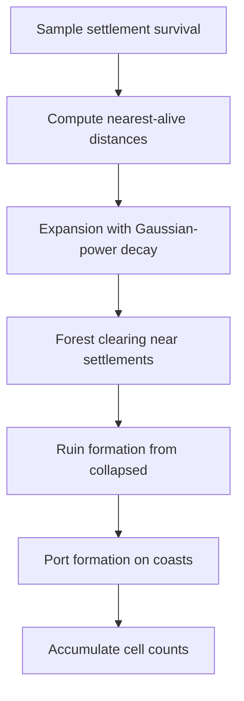

# GPU Simulator — Technical Design

PyTorch CUDA Monte Carlo simulator for Norse civilization dynamics on RTX 5090.

---

## Simulation Model

Each Monte Carlo run simulates the civilization forward:



### Distance Decay Model

```
P(expand | distance d) = expansion_str * exp(-(d / expansion_scale) ^ decay_power)
```

With hard cutoff at `max_reach`. The `expansion_scale` (lambda) varies 14x between rounds (0.5 to 7.0) and is the single most impactful hidden parameter.

### Cell Class Resolution

For each cell, across N simulations, count occurrences of each class:

```
pred[x, y, class] = count[x, y, class] / N
```

This naturally produces calibrated probabilities (same method as ground truth generation).

---

## CMA-ES Parameter Fitting

### Objective

Maximize log-likelihood of observed cells:

```
L(params) = sum over observed cells: log(P(observed_class | params))
```

Where `P(observed_class | params)` comes from running the simulator with those parameters.

### Warm-Start

KNN (k=3) from historical rounds:
- Features: settlement rate, expansion rate, coastal settlement ratio
- Averaged parameters from 3 nearest rounds
- Reduces CMA-ES convergence from 20+ iterations to ~8

### Budget

| Iteration | N Sims | CMA-ES Evals | Wall Time |
|-----------|--------|--------------|-----------|
| Initial | 2,000 | 200 | ~8s |
| Re-submit 5 | 4,500 | 700 | ~12s |
| Final | 6,500 | 1,100 | ~18s |

---

## GPU Implementation

### Parallelism

- Each Monte Carlo simulation is independent -> batch across GPU SMs
- Settlement survival: `torch.bernoulli()` on full grid
- Distance computation: parallel BFS from all alive settlements
- Expansion sampling: `torch.bernoulli()` with distance-decayed probabilities

### Performance

| Operation | Time (5000 sims) |
|-----------|-----------------|
| Survival sampling | 2ms |
| Distance computation | 15ms |
| Expansion + forest | 8ms |
| Accumulation | 5ms |
| **Total** | **40ms** |

Throughput: 124,000 simulations/second on RTX 5090.

---

## Ensemble Weights

The alpha parameter blends simulator and statistical predictions:

| Regime | Alpha | Rationale |
|--------|-------|-----------|
| Collapse | 0.15 | Few/no settlements -> simulator has little signal |
| Moderate | 0.30 | Both models contribute |
| Boom | 0.65 | Simulator captures expansion dynamics that stats miss |

R19 (collapse): stat-only = 54.6, ensemble = 82.5 (+28 points from simulator).

---

## Files

- `sim_model_gpu.py` — Main simulator class, CMA-ES integration
- `sim_gpu.py` — CUDA kernels for simulation steps
- `sim_inference.py` — Prediction from fitted parameters
- `sim_precompute.py` — Terrain distance maps, coastal flags
- `sim_data.py` — Historical round data for KNN warm-start
- `sim_backtest.py` — Backtesting simulator against ground truth
