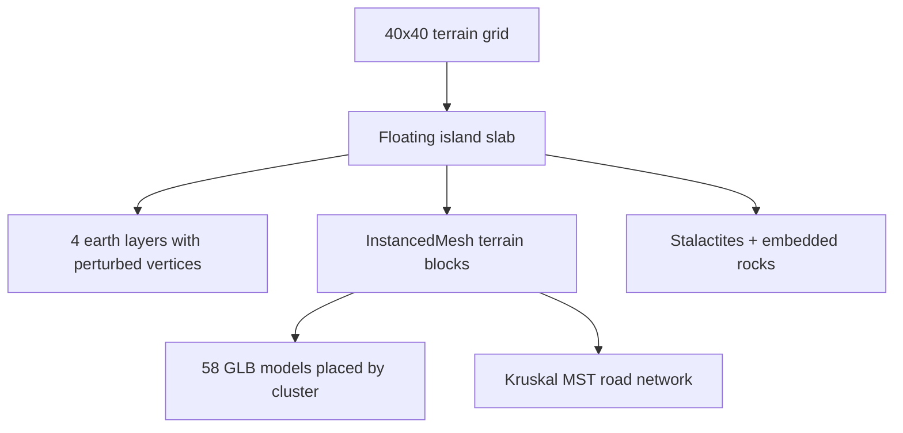
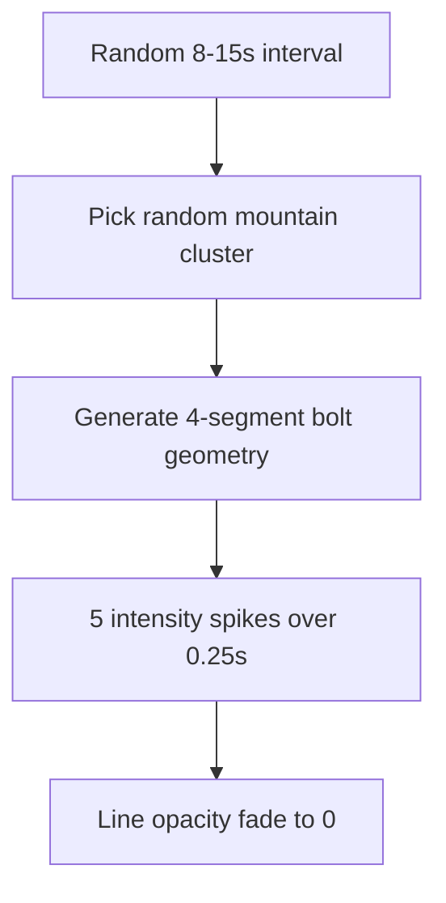
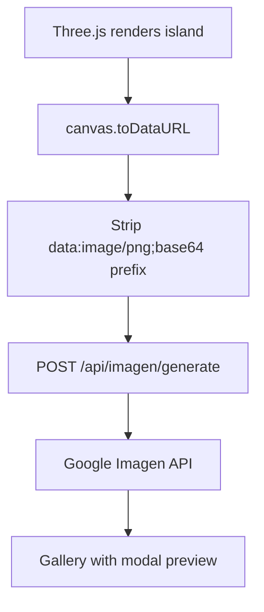

# Island Explorer — 3D Visualization & Image Generation

A SvelteKit web application with a full Three.js 3D renderer that brings the Astar Island simulation to life. Browse competition rounds as procedurally generated Norse islands with day/night cycles, weather systems, wildlife, and settlements — then capture screenshots for AI image generation.

---

## The Idea

The competition gives you a 40x40 grid of terrain codes. Numbers on a screen. We turned each grid into a living, breathing Norse island rendered in real-time 3D — complete with thatched-roof settlements, mountain fortresses, coastal ports, procedural roads, waterfalls, birds, fog, lightning, and a full day/night cycle with astronomically accurate moon phases.

It's not just pretty — it makes the competition data *tangible*. You can see at a glance where settlements cluster, where ports form on coasts, how ruins scatter from collapsed expansion. The 3D view reveals spatial patterns that heatmaps hide.

---

## 3D Island Renderer (IslandMap.svelte)

### Terrain System

The 40x40 grid becomes a floating island slab:

| Terrain Code | Color | Height | 3D Elements |
|---|---|---|---|
| Ocean | Deep blue | Transparent (0.65 opacity) | Brown earth underneath |
| Plains | Light green | 0.04 | Grass texture |
| Settlement | Warm tan | 0.12 | GLB houses, farms, town centers |
| Port | Blue | 0.10 | Docks, boats, trade goods |
| Ruin | Gray | 0.06 | Collapsed walls, rubble |
| Forest | Dark green | 0.20 | Instanced pine trees |
| Mountain | Gray | 0.15 | 5 model variants (0.4-0.7 scale) |



The island floats in space with **4 earth layers** underneath (grass rim, brown earth, deep dirt, bedrock), each with perturbed vertex normals for an organic rocky look. 12 stalactites hang from the bottom and 20 rocks jut from the sides.

### Settlement Models

**58 GLB models** across 2 art styles, loaded via an LRU cache with pending-request deduplication:

| Style | Models | Scale | Use |
|---|---|---|---|
| RTS | Hut, House, Town Center, Shack, Fortress, Watch Tower, Walls, Farm, Port, Dock | 0.25-0.40 | Settlement clusters |
| Playfield | 5 house variants, Farm, Crops, Market, Fortress | 0.22-0.28 | Smaller settlements |
| Nature | 5 mountain variants, Pine, Cut Tree, 3 rock types, Gold Rocks | 0.30-0.70 | Terrain decoration |

Models are placed per **cluster** (BFS flood-fill detects contiguous terrain regions). A settlement cluster of 8 cells gets a Town Center at its geometric center, houses around it, and farms at the edges.

### Road Network

Settlements are connected by roads using **Kruskal's minimum spanning tree** algorithm:

1. Compute distances between all settlement cluster centers
2. Sort edges by distance, greedily add (union-find)
3. Render as thin tan blocks (0.18 x 0.015) at 0.11y elevation
4. Place stone marker dodecahedra every ~0.5 units along each road

---

## Celestial System (celestials.ts)

### Astronomically Accurate Moon

The moon phase is calculated from a real astronomical reference:

```typescript
// Reference: Jan 6, 2000 = new moon
// Synodic month = 29.53 days
const daysSinceRef = (date - refDate) / 86400000;
const phase = ((daysSinceRef % 29.53) + 29.53) % 29.53 / 29.53;
```

The moon texture is **procedurally generated** on a canvas:
- Gray sphere with 7 hand-positioned craters (soft-shaded circles)
- **Terminator ellipse** that follows the actual phase — waxing vs waning determines which side is lit
- Phase-dependent brightness: new moon ~0.2x, full moon ~1.2x ambient light

A soft bluish glow halo (additive blending) surrounds the moon, with intensity tracking the phase.

### Sun

The sun follows an orbital arc (40u horizontal, 30u vertical):
- Rises at hour 6, sets at hour 18
- Bright additive-blend glow sprite (18x18 scale)
- Intensity ramps: 1.2x at noon, 0.6x at dawn/dusk, 0.2x at night
- Casts 2048x2048 shadow maps for all terrain

---

## Day/Night Cycle (daynight.ts)

A full 24-hour cycle with **8 color phases** and smooth interpolation:

| Hour | Phase | Sky Color | Sun Intensity | Ambient |
|---|---|---|---|---|
| 0-4 | Night | Dark blue | 0.2 | 0.35 |
| 4-6 | Dawn | Orange -> yellow | 0.6 | 0.45 |
| 6-10 | Morning | Light blue | 1.0 | 0.50 |
| 10-14 | Noon | Bright blue | 1.2 | 0.50 |
| 14-17 | Afternoon | Light blue | 1.0 | 0.50 |
| 17-19 | Dusk | Yellow -> orange | 0.6 | 0.45 |
| 19-20 | Twilight | Deep orange | 0.3 | 0.40 |
| 20-24 | Night | Dark blue | 0.2 | 0.35 |

Everything responds to time: fog density (thicker at night), hemisphere light colors (sky + ground), cloud tinting, and ambient sound (if added).

Controlled via **TimeSlider.svelte** — drag to scrub through the day.

---

## Weather System (weather.ts)

### Rain

Localized rain zones spawn **per mountain cluster**:
- ~300 particles per zone
- Fall velocity with slight wind drift
- Particles reset to top when they hit ground

### Lightning



Procedural bolt geometry with random jitter per segment creates realistic branching. The flash is a PointLight with 3 rapid intensity spikes (bright-dim-bright-dim-bright) over 250ms.

### Fog

3-5 fog sprites per lake/ocean cluster:
- Billboard sprites with Perlin-like oscillation
- Dawn/dusk: warm orange tint
- Night: cool blue tint
- Day: white with low opacity

---

## Wildlife System (wildlife.ts)

### Birds (20 total, 4 flocks)

Each flock orbits at a different altitude with variable radius:
- Circular path with sinusoidal vertical oscillation
- Wing phase animation: offset start per bird creates natural wave pattern
- Flocks spawn outside viewport, respawn on edges when they drift away

### Wanderers (15)

Tiny tan dots representing Norse traders/villagers:
- Move between settlements via shortest paths
- Path network built from settlement positions
- Slow walking speed with pause at destinations

### War Parties

Red warrior dots with smoke particle trails — attack routes between rival settlements. (Partially implemented.)

---

## Waterfall System (waterfalls.ts)

Edge cascade particles at ocean-facing cliff edges:
- **Edge detection**: BFS flood-fill finds island perimeter adjacent to ocean
- **12 waterfall sources** at widest cliff faces
- **~80 particles per source**: gravity + outward velocity, spiral distribution as they fall
- **Mist layer**: Separate low-opacity point cloud for diffusion effect at the base
- Particles respawn at source position when they fall below the island

---

## Procedural Generation (prng.ts, clusters.ts)

### Deterministic Randomness

**Mulberry32 PRNG** seeded per island ensures identical generation across renders:

```typescript
function mulberry32(seed: number) {
  return function() {
    seed |= 0; seed = seed + 0x6D2B79F5 | 0;
    let t = Math.imul(seed ^ seed >>> 15, 1 | seed);
    t = t + Math.imul(t ^ t >>> 7, 61 | t) ^ t;
    return ((t ^ t >>> 14) >>> 0) / 4294967296;
  }
}
```

`cellSeed(x, y, salt)` produces per-cell variation for model rotation, height jitter, tree placement.

### Cluster Detection

BFS flood-fill groups contiguous terrain into clusters:
- 4-connected (Manhattan distance 1) neighbors
- Returns cluster geometry, center coordinates, cell count
- Used for model placement, road endpoints, rain zones, fog sources

---

## Image Generation (Imagen Integration)

### Capture Flow



1. User navigates to desired view (time of day, camera angle, seed)
2. Clicks "Generate" — captures canvas as PNG
3. Base64-encoded image sent to server
4. Server calls Google Imagen API
5. Result stored in `data/imagen/` with metadata
6. Gallery refreshes with new entry

### Batch Mode ("Generate All")

Iterates through all sorted rounds:
- Renders each round's terrain grid
- Waits for 2x `requestAnimationFrame` (canvas sync)
- Captures and submits to Imagen
- Progress tracker: `{ current: i+1, total: roundCount }`
- Abortable mid-batch

---

## Dashboard Pages

| Route | Purpose | Key Visuals |
|---|---|---|
| `/` | Dashboard | Score cards, leaderboard (top 10 with medals), budget gauge, sparkline trends |
| `/explorer` | 3D island viewer | Full Three.js canvas, seed selector, time slider, Imagen capture |
| `/rounds` | Round listing | Table with drill-down per round |
| `/autoloop` | Optimization monitor | Experiment table, convergence sparkline, accepted/rejected stats |
| `/daemon` | Daemon control | Best params, round scores by regime, toggle autoloop |
| `/flow` | Pipeline visualization | Interactive pan/zoom canvas with 15+ nodes, 16-phase simulation |
| `/research` | Research agents | Tab between ADK/Gemini/Multi, experiment tables, hypothesis viewer |
| `/metrics` | Score analysis | Sparklines, parameter frequency heatmap |
| `/logs` | Real-time streaming | SSE connection, 5 log sources, auto-scroll, JSON pretty-print |

---

## Visual Design

### Cyberpunk Norse Aesthetic

- **Background**: Dark (#0a0a1a) with animated drifting cyan grid overlay (40px, 60s loop)
- **Scanline effect**: Thin horizontal stripes at 0.015 opacity
- **Neon palette**: Cyan (#00fff0), magenta (#ff00ff), gold (#ffd700), orange (#ff8a65)
- **Glass morphism panels**: Semi-transparent with blur backdrop
- **Corner glows**: Radial gradients — cyan top-left, magenta bottom-right, gold top-right
- **Navigation**: Elder Futhark runes as tab icons (ᛟ ᚱ ᛋ ᛏ ᚹ ᚠ ᚨ ᛁ ᛚ)
- **Logo**: "ᛟ ASTAR ISLAND EXPLORER" in monospace

---

## Flow Visualization

### 16-Phase Pipeline Simulation

The `/flow` page has a full animated simulation of the prediction pipeline:

| Phase | Time | What Activates |
|---|---|---|
| Boot | 0ms | API node |
| API up | 800ms | API online |
| Daemon | 1200ms | Daemon node |
| Round detected | 1800ms | Exploration |
| Exploration | 2400ms | 50 viewport queries |
| Calibration | 4000ms | Load calibration data |
| Stages 1-9 | 5000-8800ms | CalModel -> FK blend -> multipliers -> ... -> floor |
| Submission | 9400ms | Submit to API |
| Score reveal | 12000ms | 5 seed scores + average (95.14, 93.87, 94.62, 96.31, 93.28 = **94.64**) |
| Full system | 14000ms | All nodes active |

Nodes flash on activation, edges pulse with animated gradients, status text updates in real-time.

---

## Tech Stack

- **SvelteKit 2** with TypeScript
- **Three.js** (WebGL renderer, OrbitControls, InstancedMesh, shadow mapping)
- **Tailwind CSS 4** with custom cyberpunk theme
- **Vite** build system
- **SSE** (Server-Sent Events) for real-time log streaming

---

## Files

| File | Lines | Purpose |
|------|-------|---------|
| `IslandMap.svelte` | ~1600 | Core 3D renderer — terrain, models, roads, all systems |
| `celestials.ts` | 225 | Sun glow + moon phase with astronomical accuracy |
| `weather.ts` | 282 | Rain zones, procedural lightning, fog sprites |
| `wildlife.ts` | 200+ | Bird flocks, wanderer paths, war parties |
| `waterfalls.ts` | 200+ | Edge cascade particles with mist |
| `daynight.ts` | 106 | 24-hour color/lighting interpolation |
| `models.ts` | 122 | GLB model loading with LRU cache |
| `clusters.ts` | 78 | BFS flood-fill terrain grouping |
| `prng.ts` | 22 | Mulberry32 deterministic RNG |
| `FlowCanvas.svelte` | 200+ | Pan/zoom interactive pipeline canvas |
| `flow-data.ts` | 100+ | 15 node + 8 edge definitions |
| `Sparkline.svelte` | 77 | Animated SVG trend line with glow |
| `app.css` | 150+ | Cyberpunk theme, scanlines, grid animations |
