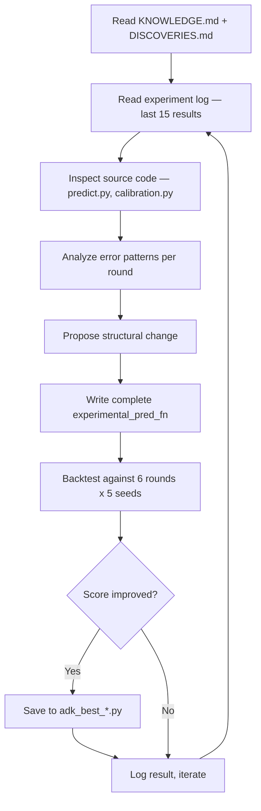

# Research Agent — Google ADK + Gemini

An autonomous research agent built on Google's Agent Development Kit (ADK) with Gemini 3.1 Pro. It reads domain knowledge, proposes structural algorithmic improvements, writes complete prediction functions, backtests them against ground truth, and iterates — all without human intervention.

---

## How It Works



The agent runs in an autonomous loop — no human prompts needed. Each iteration:
1. Reads knowledge base (KNOWLEDGE.md, DISCOVERIES.md, IMPROVEMENTS.md)
2. Reviews experiment log to see what worked and what failed
3. Inspects relevant source code
4. Identifies the highest-error component (e.g., "settlement class = 64% of KL error")
5. Proposes a structural change (not parameter tweaking — that's the autoloop's job)
6. Writes a complete `experimental_pred_fn()` implementing the change
7. Backtests against all available ground truth
8. Logs result, saves if improved, moves on

---

## The Prediction Function Contract

Every experiment must produce a function with this exact signature:

```python
def experimental_pred_fn(state: dict, global_mult, fk_buckets) -> np.ndarray:
    """
    state:       {'grid': 40x40 terrain codes, 'settlements': [...]}
    global_mult: GlobalMultipliers (observed/expected class ratios)
    fk_buckets:  FeatureKeyBuckets (empirical distributions per feature key)
    returns:     (40, 40, 6) probability tensor
    """
```

### Hard Rules (agent MUST NOT violate)

1. Mountain (class 5) = 0 on non-mountain cells
2. Port (class 2) = 0 on inland (non-coastal) cells
3. Ocean cells = `[1,0,0,0,0,0]`, Mountain cells = `[0,0,0,0,0,1]`
4. All rows sum to 1.0
5. Floor >= 0.005 for nonzero classes on dynamic cells
6. Deterministic (no randomness)

The backtest harness auto-validates these rules and auto-fixes minor violations (NaN, negative values, denormalized rows).

---

## Tools Available to the Agent

| Tool | Purpose |
|------|---------|
| `run_backtest(code, name, hypothesis)` | Compile + test against 6 rounds x 5 seeds |
| `read_knowledge()` | Read domain docs (6000 chars per file) |
| `read_experiment_log()` | Last 15 experiments + top 5 best |
| `get_round_analysis(round)` | GT stats: class distributions, entropy, KL decomposition |
| `write_prediction_code(name, hypothesis, code)` | Save code to timestamped file |
| `read_source_code(file, start, end)` | Read allowed source files with line numbers |
| `list_source_files()` | List all Python files with descriptions |

### Backtest Harness

The `BacktestHarness` is a singleton that:
- Loads 5 seeds per round from `data/rounds/` (observations) and `data/calibration/` (ground truth)
- Compiles the experimental function via `exec()` with safe globals
- Runs against all rounds with entropy-weighted KL divergence scoring
- Auto-fixes: NaN -> 0, enforces structural zeros, applies floor, renormalizes
- Logs everything to `data/adk_research_log.jsonl` (append-only)
- Saves best experiments to `data/adk_best_*.py`

---

## What the Agent Proposes

The agent focuses on **structural algorithmic changes**, not parameter tuning. Example proposals:

| Proposal | Category | Impact |
|---|---|---|
| "Replace distance multiplier with diffusion field accounting for terrain barriers" | Spatial model | Tested |
| "Add Dirichlet-Multinomial conjugate update for directly observed cells" | Bayesian | Tested |
| "Implement cluster density as inverted-U survival factor" | Feature engineering | +0.3 pts |
| "Distance-dependent settlement suppression when vigor < 0.05" | Regime adaptation | Tested |
| "Per-class blending weights (trust empirical more for forest)" | Blending strategy | Tested |
| "Gaussian kernel smoothing with coastal mask for port prediction" | Post-processing | -0.2 pts |

The agent generates complete functions — not patches. Each is a self-contained reimplementation of the prediction pipeline with the proposed change baked in.

---

## Execution Modes

```bash
# Autonomous loop (default) — runs until stopped
python -m research_agent.run

# Limited iterations
python -m research_agent.run --max-iters 20

# Interactive chat — talk to the agent
python -m research_agent.run --interactive

# Dry run — print prompts without executing
python -m research_agent.run --dry-run

# ADK CLI
adk run research_agent

# ADK Web UI
adk web --port 8000
```

---

## Why This Approach Works

### vs. Parameter Tuning (Autoloop)

The autoloop finds the best values for existing parameters. But it can't invent new features or change the algorithm structure. The research agent can propose:
- New feature keys (settlement count in radius, terrain diversity score)
- Different blending formulas (entropy-weighted vs count-weighted)
- Novel spatial models (diffusion fields, gravity models)
- Per-class specialization (different strategies for settlement vs forest)

### vs. Human Research

A human researcher:
- Takes 5 hours per idea (read data, form hypothesis, write code, test, analyze)
- Has confirmation bias (avoids "stupid" ideas)
- Gets tired, needs sleep

The agent:
- Tests an idea every 25 seconds
- Has zero ego — cheerfully tests bad ideas
- Runs 24/7
- Generates proposals humans wouldn't think of

---

## Files

| File | Purpose |
|------|---------|
| `research_agent/agent.py` | Agent definition with Gemini 3.1 Pro, system instructions |
| `research_agent/tools.py` | 7 tools: backtest, knowledge, logs, analysis, code I/O |
| `research_agent/run.py` | Entry point: autonomous loop, interactive, dry-run |
| `research_agent/__init__.py` | Package init |
| `research_agent/__main__.py` | CLI entry (`python -m research_agent`) |
