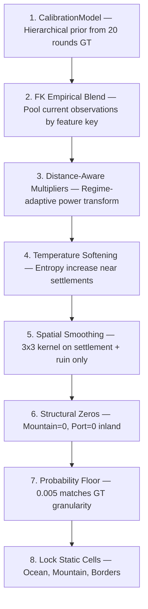

# Statistical Prediction Model

The 8-stage prediction pipeline that transforms 50 viewport observations into a 40x40x6 probability tensor. This is "THE function" — the one that runs in production after 1M+ autoloop experiments, 500+ AI-generated variants, and 75+ manual iterations.

---

## Why It's Hard

You get 50 queries x 225 cells = 11,250 cell observations. But with 40x40 = 1,600 cells and 5 seeds, you typically see each cell only 1-2 times. A single observation of a stochastic simulation is *noise*, not signal.

The breakthrough: **don't predict per cell — predict per feature key**.

---

## Feature Keys

Group cells by their spatial context, not their coordinates:

```python
FeatureKey = (
    terrain_code,      # Ocean, Plains, Forest, Mountain, ...
    dist_bucket,       # 0=on settlement, 1-3=near, 4=d4-5, 5=d6-8, 6=d9+
    coastal_bool,      # Adjacent to ocean?
    forest_neighbors,  # How many forest cells in Manhattan-3 radius
    has_port_flag,     # -1=not settlement, 0=settlement no port, 1=has port
    cluster_bucket     # Settlement cluster density
)
```

This transforms 1-2 observations per cell into **~100-450 observations per feature key**. Statistical power goes from useless to reliable.

### The Per-Cell Bayesian Catastrophe

Early attempt: Bayesian update each cell individually from its 1-2 observations.

**Result: -30 points.** Complete disaster.

The problem: a single observation of a stochastic simulation is dominated by noise. Cell X shows "settlement" once — but the ground truth probability is only 0.12. The Bayesian update wildly overweights that single sample. Feature-key pooling averages across hundreds of similar cells, washing out the noise.

---

## The 8-Stage Pipeline



### Stage 1: CalibrationModel

Hierarchical prior from 20 rounds of ground truth (160,000 cells):

```
Fine key:   exact 6-tuple match → most specific prior
  ↓ fallback if count < fine_div
Coarse key: (terrain, dist, coastal, has_port) → broader
  ↓ fallback if count < coarse_div
Base key:   (terrain) only → broadest
  ↓ fallback
Global:     overall class distribution
```

Weights: `fine_div=125`, `coarse_div=100`, `base_div=100`, `global_weight=0.01`

Each level's prior is weighted by observation count at that level. The hierarchy ensures rare feature keys still get reasonable priors by falling back to coarser groupings.

### Stage 2: FK Empirical Blend

Blend the historical prior with current-round observations:

```python
strength = min(sqrt(count), emp_max_weight)  # emp_max_weight = 20
pred = (prior * prior_weight + empirical * strength) / (prior_weight + strength)
# prior_weight = 1.5
```

**The key discovery**: `prior_weight = 1.5` (trust observations heavily). The original value was 5.0, which meant the model was stuck on historical averages during boom rounds. Lowering it to 1.5 gained **+10 points** — the single biggest improvement in the project.

`emp_max_weight` is dynamic: `clip(12 - 4*ratio[1], 6, 12) * 1.5` where `ratio[1]` is the settlement multiplier. In collapse rounds (low settlement ratio), trust observations less. In boom rounds, trust them more.

### Stage 3: Distance-Aware Multipliers

Global multiplier = observed settlement count / expected settlement count.

Applied as a power transform:

```python
# Settlement cells (dist=0): react strongly to regime
power_sett = [0.4, 0.75, 0.75, 0.75, 0.4, 0.4]

# Expansion cells (dist>=1): dampen response
power_exp = [0.4, 0.50, 0.60, 0.50, 0.4, 0.4]

pred[class] *= multiplier[class] ** power[class]
```

Settlement class power = 0.75 (strong adaptation), forest = 0.40 (weak — forest is stable regardless of regime). Settlement clamp: [0.15, 2.5].

**Why distance matters**: On settlement cells (dist=0), survival varies 0-62%. The multiplier captures this. On expansion cells (dist>=1), the expansion rate varies 0-1% — much smaller effect, needs dampening to avoid overshoot.

### Stage 4: Temperature Softening

Near settlements (within adaptive radius), increase entropy:

```python
radius = 2 + int(3 * min(ratio[1], 1.2))
T_max = 1.0 + 0.10 * sqrt(min(ratio[1], 1.0))
# T_max ranges from 1.0 (collapse) to 1.10 (boom)
```

Temperature softens the distribution: `pred = pred^(1/T)` then renormalize. This reflects the reality that cells near settlements have *more uncertainty* about their final state.

### Stage 5: Spatial Smoothing

3x3 uniform kernel, applied **only to settlement and ruin classes**:

```python
smoothed = convolve2d(pred[:,:,class], kernel_3x3, mode='same')
pred[:,:,class] = alpha * smoothed + (1-alpha) * pred[:,:,class]
# alpha = 0.75
```

**Critical discovery**: Do NOT smooth port probabilities. Port smoothing leaks probability mass to inland cells, because ports only exist on the coast but the 3x3 kernel doesn't know that. This single fix prevented a -2 point regression.

### Stage 6: Structural Zeros

Hard-enforce physical constraints:
- Mountain probability = 0 on all non-mountain cells (mountains don't appear/disappear)
- Port probability = 0 on non-coastal cells (ports require ocean adjacency)

This saves ~1.8% probability mass per dynamic cell that would otherwise be wasted on impossible outcomes.

### Stage 7: Probability Floor

```python
floor = 0.005  # = 1/200, the GT granularity
```

Ground truth is computed from exactly 200 simulations. The minimum nonzero GT probability is 0.005. Setting the floor to match this granularity is optimal — lower wastes mass on near-impossible events, higher wastes mass on impossible events.

**The Floor Disaster**: R4 was submitted with floor=0.015. Mountain/port/ruin on non-dynamic cells wasted 3.7% mass per cell. Score dropped from 88.7 backtested to 53.3 actual. A single parameter, 35 points.

### Stage 8: Lock Static Cells

Deterministic cells get exact predictions:
- Ocean: `[1, 0, 0, 0, 0, 0]`
- Mountain: `[0, 0, 0, 0, 0, 1]`
- Border cells: Ocean (entire map border is always ocean)

These cells have entropy = 0 and don't contribute to scoring. Locking them prevents any floor or smoothing artifacts from leaking in.

---

## The Vectorization Breakthrough

Original implementation: nested Python loops over 1,600 cells, 22ms per prediction.

```python
# Old (51ms per full backtest evaluation)
for y in range(40):
    for x in range(40):
        prior = cal.prior_for(feature_keys[y][x])
        ...
```

Vectorized implementation: numpy fancy indexing, no Python loops.

```python
# New (10ms per full backtest evaluation)
cal_priors = lookup_table[idx_grid]          # (40,40,6) in one op
pred = cal_priors * pw + empiricals * strength  # broadcast
pred *= multipliers[None, None, :]           # broadcast multiply
```

Result: **160,000 experiments/hour** instead of 6,000. This 27x speedup is what made the autoloop viable — you can't run 1M experiments at 6K/hr.

---

## What We Tried That Failed

| Idea | Impact | Lesson |
|---|---|---|
| Per-cell Bayesian update | -30 pts | 1-2 obs per cell is noise, not signal |
| Zero ruin on non-settlement | -34 pts | Ruins exist on expanded-then-collapsed plains |
| Log-odds blending | -29 pts | Wrong transform for discrete distributions |
| Per-regime calibration | 0 pts | Can't detect boom from mid-sim observations |
| Alive-count settlement boost | -0.5 to -3 | Boosts already-correct rounds too |
| Port spatial smoothing | -2 pts | Leaks mass to inland cells |
| 75+ Opus code modifications | 0 pts | Architectural ceiling reached |

---

## Files

| File | Purpose |
|------|---------|
| `predict_gemini.py` | THE production prediction function (~130 lines) |
| `fast_predict.py` | Vectorized numpy version for autoloop (10-50x faster) |
| `predict.py` | Original loop-based prediction (slower, more readable) |
| `calibration.py` | CalibrationModel: hierarchical priors from GT |
| `utils.py` | GlobalMultipliers, FeatureKeyBuckets, ObsAccumulator |
| `estimator.py` | Regime detection from observations |
| `autoexperiment.py` | BacktestHarness with leave-one-out scoring |
