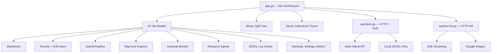

# Terminal UI — Go Bubble Tea Dashboard

A full-featured terminal dashboard built in Go with the Bubble Tea framework. 10 tabs, multi-pane split layout, hacker-style animations, and a cyberpunk Norse aesthetic — all running in a terminal.

---

## Why a TUI?

The SvelteKit web app is beautiful but needs a browser. The TUI runs anywhere — SSH into a server, tmux session, headless VPS. It provides the same monitoring capabilities in a terminal: live autoloop tracking, round analysis, map exploration, research agent control, and log streaming.

It also doubles as the **HTTP API server** for the web dashboard (`--web` mode), proxying competition API requests and serving local data.

---

## Architecture



Built on **bubbletea** (Elm architecture for terminals), **lipgloss** (styling), and **glamour** (markdown rendering).

---

## The Hacker Scramble Effect

The signature visual: every tab transition triggers a **sequential character decode animation**.

```
Phase 1: ░▓█ᛟᚨ#@!ᛋ%  (random glyphs, dim)
Phase 2: ᚱ█%ᛟA@#ᛋ!▓  (bright neon re-randomize)
Phase 3: ᚱu%ᛟAt#ᛋl▓  (some chars settle)
Phase 4: Autoloop Mo▓  (most decoded)
Phase 5: Autoloop Monitor  (complete)
```

- ~130 chars/sec decode speed
- Each char cycles through 5 scrambles before settling
- Glyph pools: Norse runes (ᛟᚨᛋ...) + cyberpunk (░▒▓█◈...) + ASCII (!@#$%)
- 15ms tick interval, cursor advances ~3 chars per tick

---

## Multi-Pane Layout System

Split your terminal into multiple panes, each showing a different tab:

```
┌─ᛟ Dashboard──────────────┬─ᚱ Rounds──────────────┐
│ Active Round: R12         │ R5  86.3  Rank 1       │
│ Status: Active            │ R6  87.6  Rank 2       │
│ Closes: 14:30 UTC         │ R7  74.0  Rank 2       │
│                           │ R9  93.6  Rank 4       │
│ Leaderboard               │                        │
│ 1. Team Alpha   130.2     ├─ᛋ Autoloop─────────────┤
│ 2. Synapses     117.4     │ Experiments: 1,028,171  │
│ 3. Team Bravo   112.1     │ Best: 88.23            │
│                           │ Rate: 160K/hr          │
│ ▁▂▃▄▅▆▇█▇▆▅▆▇█           │ ▁▂▃▅▆▇█▇▆▅▆▇           │
└───────────────────────────┴────────────────────────┘
```

- **Alt+V**: Vertical split (side by side)
- **Alt+S**: Horizontal split (stacked)
- **Alt+Arrows**: Navigate between panes
- **Alt+W**: Close focused pane
- **Alt+=/-**: Resize split ratio
- 9 accent colors cycle through panes (cyan, pink, purple, green, amber, red, teal, magenta, blue)
- Layout persists to `data/layout.json` across sessions

---

## Tabs

### 1. Dashboard

Three-panel home screen:
- **Round info**: Active round status, dates, grid dimensions
- **Leaderboard**: Top 10 teams (rank, name, weighted score, hot streak)
- **Score sparkline**: Block chart (▁▂▃▄▅▆▇█) of your scores over time
- Auto-refreshes every 10 seconds

### 2. Rounds (Table + Drill-Down)

Browse all submitted rounds with cursor navigation:
- Table: Round #, Score, Rank, Seeds submitted, Queries used
- Press Enter to drill into a round
- Drill-down: switch between 5 seeds with arrow keys
- Per-seed view: ground truth heatmap vs prediction, cell-level KL divergence
- Blindspot detection: highlights cells you missed
- Page Up/Down for scrolling detail views

### 3. Submit

Run the prediction pipeline from the terminal:
- 4 variants: Full Pipeline, Static Prior, Uniform (1/6 baseline), Dry Run
- Confirmation dialog before execution
- Live output capture with auto-scroll
- Cancel with `x` key
- Output buffer: last 200 lines

### 4. Explorer (Map Grid)

Interactive 40x40 terrain grid with viewport overlay:

```
     0    5   10   15   20   25   30   35  39
 0   ~~~~~···ᛋ··ᚱ····□□□□□□□□□□□□□□··░
 1   ~~~~~···ᛋ··ᚱ····□□□□□□□□□□□□□□··░
 2   ~~~~~···ᛋ··ᚱ····□□□□□□□□□□□□□□··░
 ...
```

- **Terrain glyphs**: ~ Ocean, · Plains, ᛋ Settlement, ⚓ Port, ♦ Ruin, ♠ Forest, ▲ Mountain
- **Viewport**: 15x15 amber border, movable with arrow keys
- **Overlay modes**: `v` toggle viewport, `o` load observations, `p` load predictions
- **Stats panel**: Terrain breakdown, observed vs predicted comparison, match %, blindspot alerts
- **Seeds**: Switch with keys 1-5

### 5. Autoloop Monitor

Live dashboard for the parameter optimization loop:
- Experiment table: ID, name, timestamp, per-round scores, accepted/rejected
- Best score convergence sparkline
- Running status indicator
- Start/stop process control (s/x keys)
- 2-second refresh interval

### 6. Research Agents

Control panel for 3 AI research agents:
- Tab between: Gemini Researcher (ᚷ), ADK Agent (ᚨ), Multi Researcher (ᚷ)
- Per-agent experiment table: hypothesis, status, score, improvement delta, elapsed time
- Detail view: shows generated code with **syntax highlighting** (via glamour/chroma)
- Per-round score sparklines (R2/R3/R4/R5)
- Start/stop process control
- Markdown rendering for agent documentation

### 7. Logs

JSONL log viewer with 5 sources:
- autoloop, adk_research, gemini_research, adk_history, multi_research
- **Tail mode**: Auto-scroll with 1s refresh
- **Browse mode**: Manual scrolling, Page Up/Down
- **Search**: Regex filter with `/` key
- **Jump to end**: `G` key
- **Switch source**: `f` key

### 8-10. Backtest, Settings, Metrics

- **Backtest**: Run harness evaluations (placeholder)
- **Settings**: Configure tokens (masked input), toggle options (auto-refresh, tail logs, notifications), save to .env
- **Metrics**: Performance dashboards (placeholder)

---

## Status Bar

```
▓▒░ ◈ ONLINE ᛫ ᚠ 15/50 ᛫ ᛞ R:5 ᛫ ⚙ 2 ᛫ ⊞ 3          q:quit ?:help 0-9:tabs ░▒▓
```

- **◈ ONLINE / ✕ OFFLINE**: API connection status (green/red)
- **ᚠ 15/50**: Query budget (red warning when <10 remaining)
- **ᛞ R:5**: Active round number
- **⚙ 2**: Running processes
- **⊞ 3**: Active panes

---

## Tab Bar

```
▓▒░ ᛟ │ ᛟ 1:Dashboard │ ᚱ 2:Rounds │ ᛏ 3:Submit │ ... │ ᛗ 0:Metrics │ ᛟ ░▒▓
```

- Elder Futhark runes per tab
- Cyan: active in focused pane
- Pink: active in other panes
- Dim: inactive
- Glitch edge decorations (▓▒░)

---

## Web API Server (--web mode)

The TUI doubles as an HTTP API server for the SvelteKit dashboard:

| Route | Source | Purpose |
|---|---|---|
| `GET /api/rounds` | Proxy | Competition rounds |
| `GET /api/budget` | Proxy | Query budget |
| `GET /api/leaderboard` | Proxy | Top teams |
| `GET /api/logs/{source}` | Local | JSONL log files |
| `GET /api/logs/{source}/stream` | SSE | Real-time log streaming |
| `GET /api/daemon/status` | Local | Daemon process states |
| `POST /api/processes/{name}/start` | Local | Start subprocess |
| `POST /api/imagen/generate` | Google | Imagen image generation |
| `GET /api/imagen/gallery` | Local | Generated image gallery |

CORS enabled for cross-origin requests from the SvelteKit dev server.

---

## Color Theme (theme.go)

28-color cyberpunk palette with Norse styling:

| Category | Colors |
|---|---|
| Primary | Cyan, Neon Green, Bright White |
| Accent | Pink, Purple, Amber, Gold |
| Terrain | Ocean Blue, Plains Green, Settlement Tan, Port Teal, Ruin Gray, Forest Dark Green, Mountain Stone |
| Score gradient | Red (< 60) -> Amber (60-75) -> Green (75-85) -> Cyan (85-95) -> Bright Cyan (95+) |
| UI | Border Dim, Border Bright, Bg Dark, Bg Panel |

---

## Tech Stack

- **Go 1.22+**
- **bubbletea** — Elm architecture for terminal UIs
- **lipgloss** — Declarative terminal styling
- **glamour** — Markdown rendering with syntax highlighting
- **chroma** — Code syntax highlighting

---

## Files

| File | Purpose |
|------|---------|
| `main.go` | Entry point, Viking banner, `--web` mode |
| `app.go` | Root Elm model, 10 tabs, keybindings |
| `layout.go` | Binary split tree for panes |
| `layout_persist.go` | Save/load layout to JSON |
| `theme.go` | 28-color palette + terrain styling |
| `api/client.go` | HTTP client with auth + retries |
| `api/types.go` | 15+ data structures |
| `components/scramble.go` | Hacker decode animation |
| `components/mapgrid.go` | 40x40 terrain renderer |
| `components/sparkline.go` | Block-chart sparklines |
| `components/tabbar.go` | Rune-decorated tab navigation |
| `components/statusbar.go` | Bottom status bar |
| `tabs/*.go` | 10 tab implementations |
| `web/server.go` | HTTP API server |
| `web/sse.go` | SSE log streaming |
| `web/imagen.go` | Google Imagen wrapper |
| `web/daemon.go` | Daemon status tracking |
