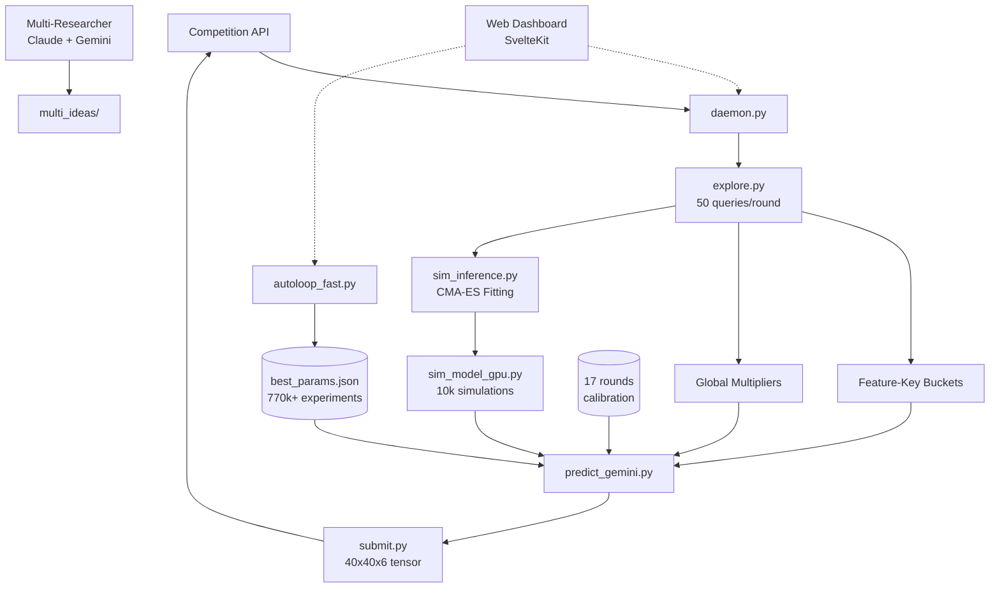
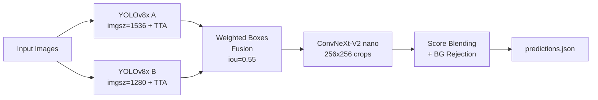

# Architecture Overview

High-level architecture of all systems in the NM i AI project.

---

## Repository Layout

```
AINMNO/
├── docs/                           # Challenge documentation & training data
│   ├── astar-island/               # Challenge spec, API reference, scoring
│   ├── norgesgruppen-data/         # COCO dataset (248 images, 357 categories)
│   └── tripletex/                  # Accounting agent spec
├── astar-island-solution/          # Viking prediction system (~50 Python files)
│   ├── web/                        # SvelteKit monitoring dashboard
│   └── data/                       # Calibration, caches, experiments, logs
├── norgesgruppen-solution/         # Object detection pipeline
│   ├── datasets/                   # YOLO-format training data
│   └── classifier_data/           # Classifier crops & references
└── submission_sub*/                # Archived NorgesGruppen submissions
```

---

## Astar Island System Architecture



---

## NorgesGruppen Detection Pipeline



---

## End-to-End Data Lifecycle

```mermaid
flowchart TB
    subgraph Astar["Astar Island Lifecycle"]
        API_ROUND["API: New Round"] --> DAEMON["Daemon detects"]
        DAEMON --> EXPLORE["Explore: 50 queries<br/>build FK buckets<br/>+ multipliers"]
        EXPLORE --> SIM_FIT["GPU Simulator<br/>CMA-ES fit<br/>(KNN warm start)"]
        SIM_FIT --> PREDICT_G["predict_gemini.py<br/>11-stage pipeline"]
        PREDICT_G --> SUBMIT["Submit 5 seeds"]
        SUBMIT --> RESUB["GPU Resubmit Loop<br/>(iterate while active)"]
        RESUB --> SUBMIT

        API_ROUND --> COMPLETE["Round Completes"]
        COMPLETE --> DOWNLOAD["Download GT<br/>to calibration/"]
        DOWNLOAD --> RECAL["Recalibrate<br/>CalibrationModel"]
        RECAL --> AUTOLOOP["Autoloop re-optimizes<br/>with new data"]
    end

    subgraph NG["NorgesGruppen Lifecycle"]
        COCO["COCO annotations"] --> PREPARE["prepare_data.py<br/>COCO → YOLO format"]
        PREPARE --> TRAIN_Y["Train YOLOv8x<br/>(2-phase)"]
        COCO --> CROPS["Crop extraction<br/>+ reference images"]
        CROPS --> TRAIN_C["Train ConvNeXt-V2<br/>(2-phase)"]
        TRAIN_Y --> EVAL_L["Local evaluation<br/>evaluate.py"]
        TRAIN_C --> EVAL_L
        EVAL_L --> BUILD["Build submission zip"]
        BUILD --> UPLOAD["Upload to<br/>app.ainm.no"]
        UPLOAD --> SCORE["Competition scoring"]
    end
```



## Technology Stack

| Layer | Astar Island | NorgesGruppen |
|-------|-------------|---------------|
| Language | Python 3.11 | Python 3.11 |
| ML Framework | NumPy, PyTorch (GPU sim) | PyTorch 2.6.0, ultralytics 8.1.0 |
| Models | Parametric simulator, calibration | YOLOv8x, ConvNeXt-V2 nano |
| Optimization | CMA-ES, Metropolis-Hastings | Grid sweep, manual tuning |
| Frontend | SvelteKit + TypeScript | -- |
| Serialization | JSON, JSONL | safetensors, .pt |
| Deployment | Local daemon + autoloop | Zip submission to Docker sandbox |
