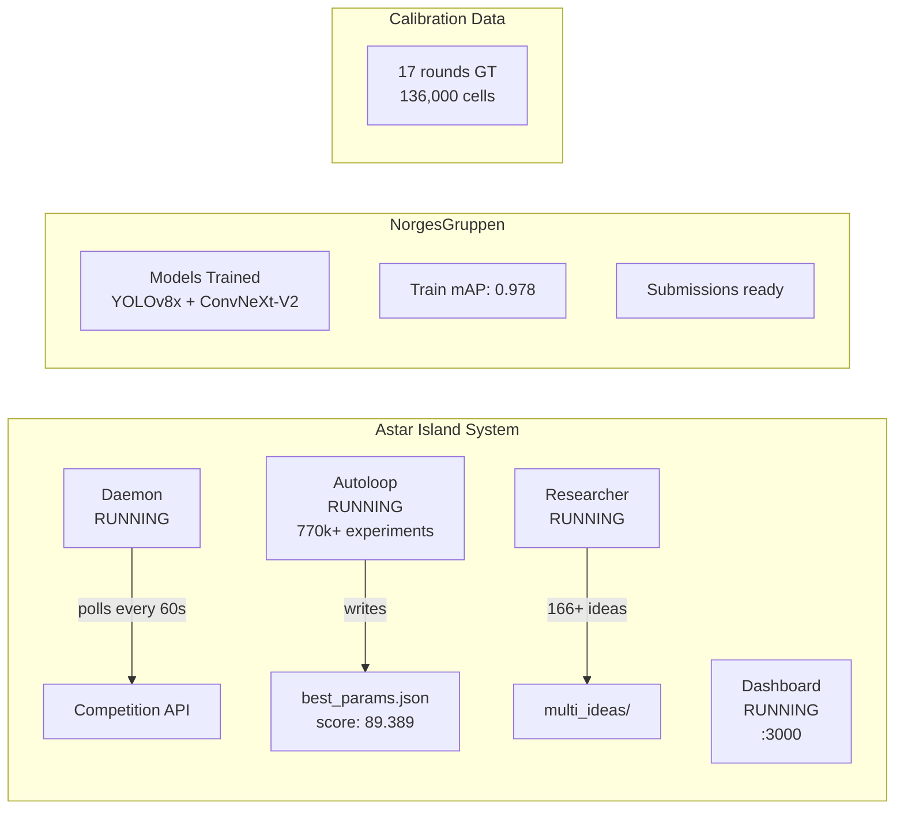

# System State

Current state of all running systems and infrastructure as of 2026-03-21.

---

## System Health Overview

---

## Running Processes

| Process | Script | Purpose | Flag |
|---------|--------|---------|------|
| Daemon | `astar-island-solution/daemon.py` | Monitors API for new rounds, auto-submits | `-u` (unbuffered) |
| Autoloop Fast | `astar-island-solution/autoloop_fast.py` | Continuous parameter optimization (~70ms/exp) | `-u` |
| Multi-Researcher | Various research agents | Structural algorithm improvements via LLMs | `-u` |
| Web Dashboard | `astar-island-solution/web/` | SvelteKit monitoring UI on localhost:3000 | -- |

All Python processes require `-u` flag for real-time log output.

---

## Data Volumes

| Directory | Contents | Size |
|-----------|----------|------|
| `astar-island-solution/data/calibration/` | 17 rounds of ground truth | ~50 MB |
| `astar-island-solution/data/multi_ideas/` | 165+ generated algorithm variants | ~15 MB |
| `astar-island-solution/data/sim_cache/` | Simulator state caches (15 rounds) | ~10 MB |
| `norgesgruppen-solution/runs/` | YOLO training checkpoints | ~2 GB |
| `norgesgruppen-solution/*.pt` | Trained model weights | ~530 MB |

---

## Key Scores

| Challenge | Metric | Current Best |
|-----------|--------|-------------|
| Astar Island | Entropy-weighted KL (0-100) | 89.4 avg (90.2 non-boom, 87.7 boom) |
| NorgesGruppen | 70% det mAP + 30% cls mAP | 0.978 (train set) |

---

## External Dependencies

| Service | URL | Purpose |
|---------|-----|---------|
| Competition API | `https://api.ainm.no/astar-island` | Astar Island simulation & submission |
| Competition App | `https://app.ainm.no` | Leaderboard, submission UI |
| MCP Docs Server | `https://mcp-docs.ainm.no/mcp` | Competition documentation |
