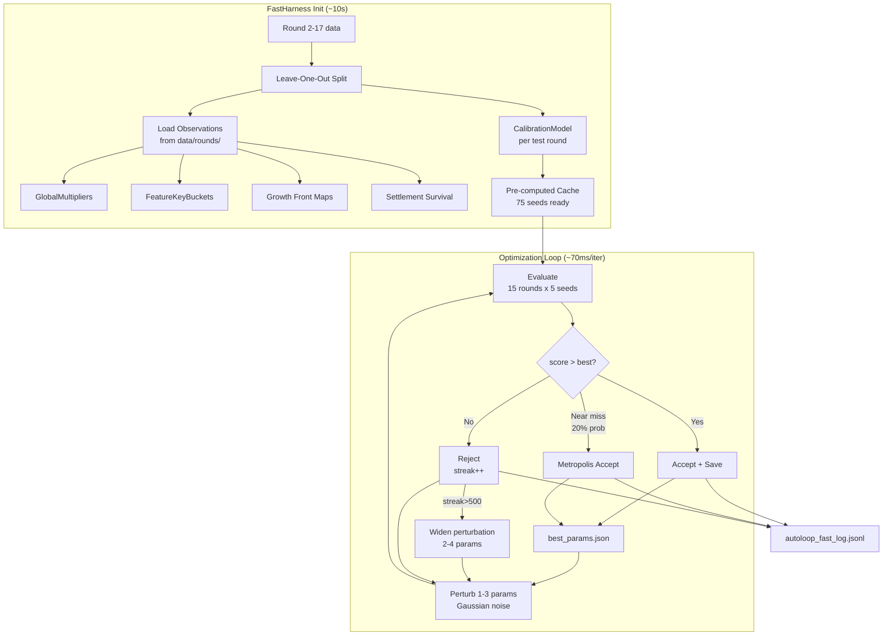
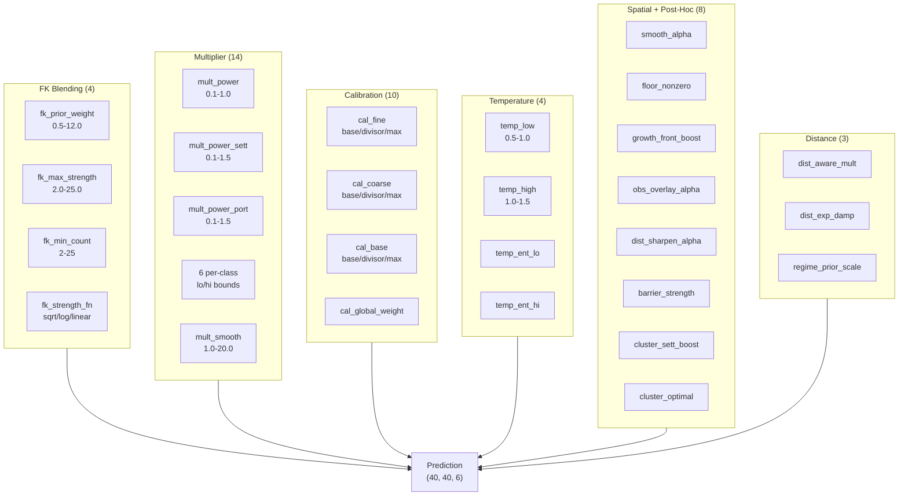
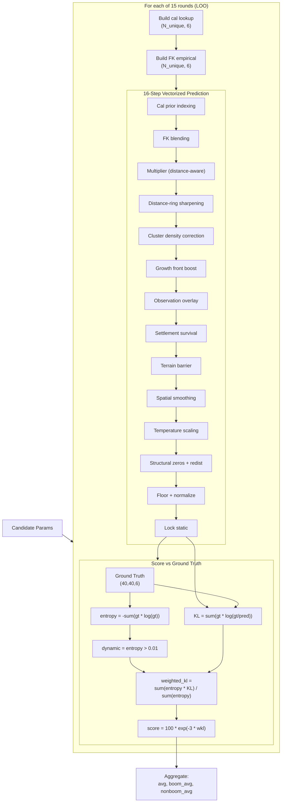

# Autoloop -- Deep Technical Reference

Continuous autonomous parameter optimization via Metropolis-Hastings random search with leave-one-out cross-validation backtesting.

---

## Architecture



Two implementations exist, sharing the same parameter space and experiment log:

| | `autoloop.py` | `autoloop_fast.py` |
|---|---|---|
| Engine | `autoexperiment.BacktestHarness` | `FastHarness` (inline) |
| Prediction | `make_pred_fn()` per-cell loops | Vectorized numpy (no Python loops) |
| Speed | ~1s per experiment | ~70ms per experiment |
| Throughput | ~3,600/hour | ~50,000/hour |
| Eval rounds | 8 rounds | 15 rounds (round2-round17, excluding round1/round8) |
| Seeds | Configurable (1-5) | 5 seeds per round |

---

## Parameter Space (44 dimensions)



Defined in `autoloop.py:PARAM_SPACE` dict. Each parameter has a type, bounds, and step size for perturbation.

### FK Blending (4 params)

| Parameter | Type | Range | Step | Default | Purpose |
|-----------|------|-------|------|---------|---------|
| `fk_prior_weight` | float | 0.5-12.0 | 0.25 | 1.5 | Weight of calibration prior in FK blend |
| `fk_max_strength` | float | 2.0-25.0 | 0.5 | 20.0 | Maximum empirical FK strength cap |
| `fk_min_count` | int | 2-25 | 1 | 5 | Minimum obs count before FK is used |
| `fk_strength_fn` | cat | sqrt/log/linear | -- | sqrt | Strength scaling function for FK count |

**Blending formula:**
```python
strength = min(fk_max_strength, fn(count))  # fn = sqrt, log1p*2, or count*0.1
blended = pred * fk_prior_weight + empirical * strength
blended /= blended.sum()  # renormalize
```

### Multiplier System (14 params)

Controls how observed-vs-expected class ratios adjust predictions.

| Parameter | Type | Range | Step | Default | Purpose |
|-----------|------|-------|------|---------|---------|
| `mult_power` | float | 0.1-1.0 | 0.02 | 0.3 | Base dampening power for ratio |
| `mult_power_sett` | float | 0.1-1.5 | 0.02 | 0.3 | Settlement-specific power override |
| `mult_power_port` | float | 0.1-1.5 | 0.02 | 0.3 | Port-specific power override |
| `mult_smooth` | float | 1.0-20.0 | 0.5 | 5.0 | Laplace smoothing constant |
| `mult_sett_lo/hi` | float | 0.02-5.0 | varies | 0.15/2.0 | Settlement multiplier clamp bounds |
| `mult_port_lo/hi` | float | 0.02-5.0 | varies | 0.15/2.0 | Port multiplier clamp bounds |
| `mult_forest_lo/hi` | float | 0.2-2.5 | varies | 0.5/1.8 | Forest multiplier clamp bounds |
| `mult_empty_lo/hi` | float | 0.5-1.5 | 0.02 | 0.75/1.25 | Empty multiplier clamp bounds |

**Multiplier formula:**
```python
ratio = (observed + smooth) / (expected + smooth)
mult = ratio^power                    # dampened ratio
mult[class] = clip(mult, lo, hi)      # per-class clamping
pred *= mult                          # apply
```

### Distance-Aware Multiplier (2 params)

| Parameter | Type | Range | Default | Purpose |
|-----------|------|-------|---------|---------|
| `dist_aware_mult` | bool | T/F | True | Enable distance-aware dampening |
| `dist_exp_damp` | float | 0.1-0.9 | 0.4 | How much to dampen multiplier at distance>0 |

```python
# Settlement cells (dist=0): full multiplier
# Expansion cells (dist>=1): dampened multiplier
mult_expansion[c] = 1.0 + (mult[c] - 1.0) * dist_exp_damp
```

### Calibration Weights (10 params)

Controls the hierarchical calibration model's weighting at each level.

| Parameter | Type | Range | Step | Default | Purpose |
|-----------|------|-------|------|---------|---------|
| `cal_fine_base` | float | 0.3-3.0 | 0.1 | 1.0 | Base weight for fine-level FK |
| `cal_fine_divisor` | float | 30-500 | 10 | 120.0 | Count divisor for fine weight scaling |
| `cal_fine_max` | float | 1.0-10.0 | 0.25 | 4.0 | Maximum fine weight cap |
| `cal_coarse_base` | float | 0.2-2.0 | 0.1 | 0.75 | Base weight for coarse-level FK |
| `cal_coarse_divisor` | float | 50-500 | 10 | 200.0 | Count divisor for coarse weight scaling |
| `cal_coarse_max` | float | 1.0-8.0 | 0.25 | 3.0 | Maximum coarse weight cap |
| `cal_base_base` | float | 0.1-2.0 | 0.05 | 0.5 | Base weight for terrain-only level |
| `cal_base_divisor` | float | 200-3000 | 50 | 1000.0 | Count divisor for base weight scaling |
| `cal_base_max` | float | 0.5-5.0 | 0.1 | 1.5 | Maximum base weight cap |
| `cal_global_weight` | float | 0.05-2.0 | 0.05 | 0.4 | Fixed weight for global fallback |

**Weight formula for each level:**
```python
weight = min(max_weight, base_weight + observation_count / divisor)
```

### Temperature Scaling (4 params)

Entropy-aware temperature applied to sharpen or soften predictions.

| Parameter | Type | Range | Default | Purpose |
|-----------|------|-------|---------|---------|
| `temp_low` | float | 0.5-1.0 | 1.0 | Temperature for low-entropy (certain) cells |
| `temp_high` | float | 1.0-1.5 | 1.15 | Temperature for high-entropy (uncertain) cells |
| `temp_ent_lo` | float | 0.1-0.5 | 0.2 | Entropy threshold for "low" classification |
| `temp_ent_hi` | float | 0.6-1.5 | 1.0 | Entropy threshold for "high" classification |

```python
T = T_low + clip((cell_entropy - ent_lo) / (ent_hi - ent_lo)) * (T_high - T_low)
pred = pred^(1/T)  # T<1 sharpens, T>1 softens
```

### Post-Hoc Corrections (8 params)

| Parameter | Type | Range | Default | Purpose |
|-----------|------|-------|---------|---------|
| `smooth_alpha` | float | 0.0-0.5 | 0.15 | Spatial smoothing blend (settlement/ruin only) |
| `floor_nonzero` | float | 0.001-0.015 | 0.008 | Probability floor for nonzero classes |
| `growth_front_boost` | float | 0.0-1.0 | 0.0 | Boost factor for young settlement expansion |
| `obs_overlay_alpha` | float | 0.0-100.0 | 0.0 | Dirichlet pseudo-count for obs overlay |
| `dist_sharpen_alpha` | float | 0.0-1.0 | 0.0 | Per-distance rate correction strength |
| `barrier_strength` | float | 0.0-1.0 | 0.0 | Terrain barrier penalty strength |
| `cluster_sett_boost` | float | 0.0-1.0 | 0.0 | Cluster density cooperative boost |
| `cluster_optimal` | float | 0.5-5.0 | 2.0 | Optimal cluster density (inverted-U peak) |

---

## FastHarness Pre-computation

`FastHarness.__init__()` runs once on startup (~5-10s) and caches everything that doesn't change with parameters:

### Per-Round (15 rounds):
1. Load `round_detail.json` and observations from `data/rounds/{uuid}/`
2. Build `GlobalMultipliers` and `FeatureKeyBuckets` from observations
3. Estimate vigor (settlement % on dynamic cells) for regime-conditional calibration
4. Build `CalibrationModel` from all rounds EXCEPT the test round (LOO)
5. If regime-conditional: weight each training round by Gaussian similarity to test vigor

### Per-Seed (5 per round, 75 total):
1. Load `analysis_seed_{i}.json` (ground truth)
2. Pre-compute `feature_keys` (6-tuple per cell)
3. Pre-compute `idx_grid` (integer index mapping FK -> unique key index)
4. Pre-compute `coastal` mask, `static_mask`, `dynamic_mask`
5. Pre-compute `cluster_density` (settlements within Manhattan r=5)
6. Pre-compute `openness` (diffusion-based terrain accessibility)
7. Pre-compute `growth_front` map from observation settlement populations
8. Pre-compute `obs_overlay` (Dirichlet observation counts per cell)
9. Pre-compute `sett_survival` (alive/dead counts per initial settlement)
10. Pre-compute `dist_map` (Manhattan distance to nearest initial settlement)

### Per-Round Shared:
- `dist_obs_rates`: pooled per-distance observation rates across all seeds
- `est_vigor`: estimated vigor for regime-conditional calibration
- `CalibrationModel`: regime-weighted or uniform-weighted from LOO training rounds

---

## Evaluation Pipeline (`FastHarness.evaluate()`)

Called for every candidate parameter set. Returns dict with per-round and aggregate scores.



### Steps per seed (inlined, no function calls):

```
1. Build calibration lookup table: (N_unique_keys, 6)
2. Build FK empirical lookup: (N_unique_keys, 6) + (N_unique_keys,) counts
3. Index into lookup tables via idx_grid -> (40, 40, 6) prediction
4. FK bucket blending (vectorized)
5. Global multiplier (distance-aware or uniform)
6. Distance-ring sharpening (per-distance rate correction)
7. Cluster density multiplier (inverted-U spatial correction)
8. Growth front boost (young settlement expansion)
9. Observation overlay (Dirichlet-Multinomial conjugate update)
10. Settlement survival constraints (per-initial-settlement)
11. Terrain barrier correction (diffusion-based openness)
12. Selective spatial smoothing (3x3 uniform filter on sett/ruin)
13. Entropy-weighted temperature scaling
14. Structural zeros + proportional redistribution
15. Floor + renormalize
16. Lock static cells (ocean/mountain)
17. Compute score vs ground truth
```

### Score Computation

```python
def compute_score(gt, pred):
    entropy = -sum(gt * log(gt))           # per-cell entropy
    dynamic = entropy > 0.01               # static cells excluded
    kl = sum(gt * log(gt / pred))          # per-cell KL divergence
    weighted_kl = sum(entropy[dynamic] * kl[dynamic]) / sum(entropy[dynamic])
    return 100 * exp(-3 * weighted_kl)     # 0-100 scale
```

### Aggregate Scoring

```python
results["avg"] = mean(all_round_scores)
results["boom_avg"] = mean(scores for boom rounds)      # round6,7,11,14,17
results["nonboom_avg"] = mean(scores for non-boom rounds)
```

---

## Optimization Loop (`main()`)

```python
harness = FastHarness(seeds_per_round=5, regime_conditional=True)
log = ExperimentLog(LOG_PATH)
best_score = log.best_score
best_params = log.best_params
reject_streak = 0

while True:
    # 1. Propose candidate
    n_changes = 1-3 (widened to 2-4 after 500 rejections)
    name, candidate = perturb_params(best_params, n_changes)

    # 2. Evaluate (LOO backtest)
    results = harness.evaluate(candidate)
    avg = results["avg"]

    # 3. Accept/reject
    if avg > best_score:
        # ACCEPT: strict improvement
        best_score = avg
        best_params = candidate
        reject_streak = 0
        save_best_params_json(candidate, avg)
    elif random() < 0.2 and avg > best_score - 0.05:
        # METROPOLIS ACCEPT: near-miss exploration (20% chance)
        best_params = candidate  # but don't update best_score
        reject_streak = 0
    else:
        # REJECT
        reject_streak += 1

    # 4. Log to JSONL
    log.append({id, name, params, scores, accepted, timestamp})

    # 5. Adaptive perturbation width
    if reject_streak > 500:
        n_changes = random.choices([2,3,4], weights=[0.4,0.4,0.2])
        # Wider exploration to escape local optimum
```

---

## Perturbation Strategy (`perturb_params()`)

```python
def perturb_params(base, n_changes=None):
    if n_changes is None:
        n_changes = random.choices([1, 2, 3], weights=[0.5, 0.35, 0.15])

    keys = random.sample(PARAM_SPACE.keys(), n_changes)

    for key in keys:
        spec = PARAM_SPACE[key]
        if spec.type == "float":
            delta = gauss(0, spec.step * 2)       # Normal perturbation
            new = clip(old + delta, spec.lo, spec.hi)
        elif spec.type == "int":
            delta = randint(-2, 2)
            new = clip(old + delta, spec.lo, spec.hi)
        elif spec.type == "cat":
            if random() < 0.3:                     # 30% chance to flip
                new = random.choice(spec.choices)
```

---

## Experiment Log Format

JSONL file at `data/autoloop_fast_log.jsonl`, one entry per experiment:

```json
{
    "id": 770671,
    "name": "fk_prior_weight=5.8555, T_high=1.0011",
    "params": {"fk_prior_weight": 5.8555, ...},
    "scores_full": {
        "avg": 89.389,
        "boom_avg": 87.714,
        "nonboom_avg": 90.226,
        "round2": 90.1, "round3": 89.7, ...
    },
    "accepted": true,
    "timestamp": "2026-03-21T22:49:00Z"
}
```

---

## `best_params.json` Contract

Written atomically on every improvement. Read by `predict_gemini.py` at prediction time.

```json
{
    "source": "autoloop_fast",
    "score_avg": 89.389,
    "score_boom": 87.714,
    "score_nonboom": 90.226,
    "experiment_id": 770671,
    "timestamp": "2026-03-21T22:49:00Z",
    "fk_prior_weight": 5.8555,
    "fk_max_strength": 17.5003,
    "T_high": 1.0011,
    "smooth_alpha": 0.4808,
    ...
}
```

---

## Regime-Conditional Calibration

When `regime_conditional=True`, the `CalibrationModel` weights training rounds by vigor similarity to the test round:

```python
for train_round in train_rounds:
    vigor_similarity = exp(-(train_vigor - test_vigor)^2 / (2 * sigma^2))
    vigor_similarity = max(vigor_similarity, 0.05)  # floor to prevent exclusion
    cal.add_round(train_round_dir, weight=vigor_similarity)
```

**sigma** = 0.06 (default). This means:
- A boom training round (vigor=0.20) gets full weight when testing a boom round
- A collapse training round (vigor=0.01) gets near-zero weight when testing a boom
- Every round gets at least 5% weight (floor)
