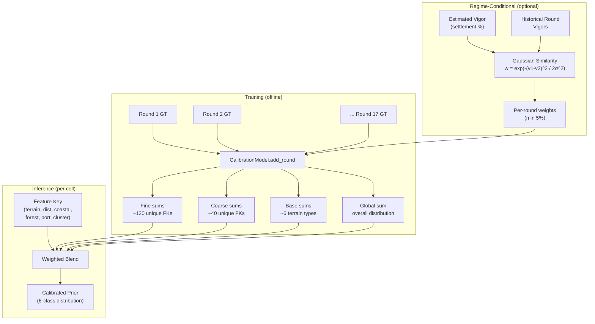
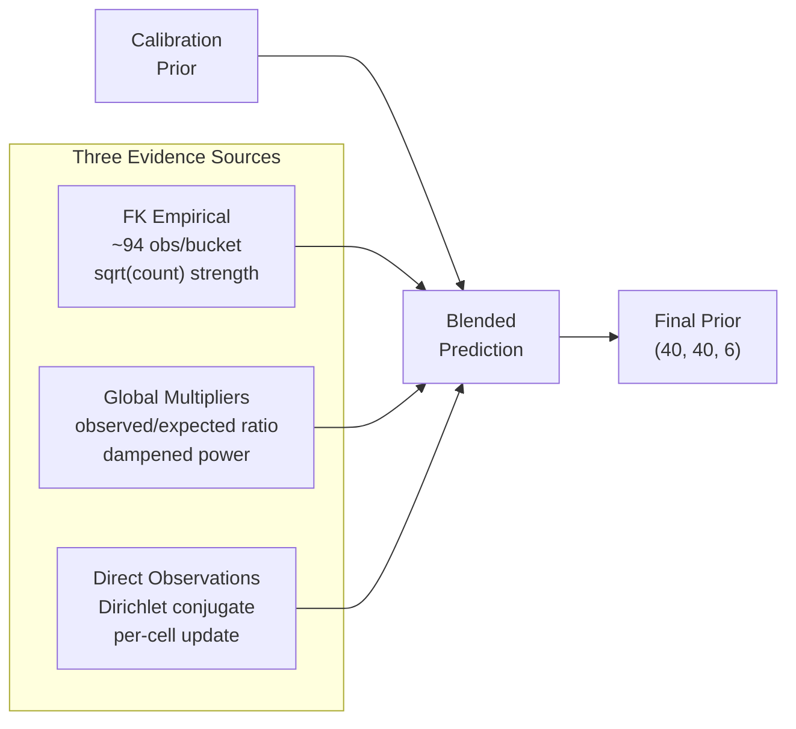

# Calibration Model -- Technical Reference

Hierarchical feature-key-based prior model trained on 17 rounds of historical ground truth. The backbone of the prediction system.

---

## Data Flow



---

## Hierarchy

```
                ┌─────────────────────────────────────────┐
                │ Global:  overall class distribution      │
                │ Weight: cal_global_weight (fixed 0.4)    │
                └─────────────────────────────────────────┘
                              ▲
                ┌─────────────────────────────────────────┐
                │ Base:    (terrain_code,)                  │
                │ Weight: cal_base_base + count/divisor     │
                │ Keys: ~6 unique terrain types             │
                └─────────────────────────────────────────┘
                              ▲
                ┌─────────────────────────────────────────┐
                │ Coarse:  (terrain, dist, coastal, port)  │
                │ Weight: cal_coarse_base + count/divisor   │
                │ Keys: ~40 unique combinations             │
                └─────────────────────────────────────────┘
                              ▲
                ┌─────────────────────────────────────────┐
                │ Fine:    (terrain, dist, coastal,         │
                │           forest_neighbors, port, cluster)│
                │ Weight: cal_fine_base + count/divisor      │
                │ Keys: ~120 unique combinations            │
                └─────────────────────────────────────────┘
```

---

## Feature Key Definition

```python
FeatureKey = (
    terrain_code: int,      # Raw terrain code (0, 1, 2, 3, 4, 5, 10, 11)
    dist_bucket: int,       # Manhattan distance to nearest settlement, bucketed
    coastal: bool,          # Adjacent to ocean cell (4-connected)
    forest_neighbors: int,  # Count of forest neighbors (0-3, capped)
    has_port_flag: int,     # -1=not settlement, 0=settlement no port, 1=port
    cluster_bucket: int,    # 0=isolated, 1=sparse(1-2), 2=dense(3+)
)
```

### Distance Bucketing

| Distance | Bucket | Rationale |
|----------|--------|-----------|
| 0 | 0 | On a settlement |
| 1 | 1 | Immediate neighbor |
| 2 | 2 | Close expansion zone |
| 3 | 3 | Moderate expansion |
| 4-5 | 4 | Nearby expansion zone |
| 6-8 | 5 | Moderate distance |
| 9+ | 6 | Far from settlements |

The d=4-5 vs d=6-8 split was added because cells at d=4-5 behave very differently from d=8+ but were previously lumped together, causing the biggest prediction errors.

---

## CalibrationModel Class

### Data Structures

```python
class CalibrationModel:
    fine_sums: dict[FeatureKey, ndarray(6)]     # Accumulated GT probability sums
    fine_counts: dict[FeatureKey, float]         # Observation count per FK
    coarse_sums: dict[tuple(4), ndarray(6)]     # Coarse level (drop forest, cluster)
    coarse_counts: dict[tuple(4), float]
    base_sums: dict[int, ndarray(6)]            # Terrain-only level
    base_counts: dict[int, float]
    global_sum: ndarray(6)                      # Overall class sum
    global_count: float
    global_probs: ndarray(6)                    # Normalized global prior
```

### Training (`add_round()`)

For each round directory containing `round_detail.json` and `analysis_seed_*.json`:

```python
for seed in range(seeds_count):
    terrain = analysis["initial_grid"]      # (40, 40) int
    ground_truth = analysis["ground_truth"]  # (40, 40, 6) float
    settlements = detail["initial_states"][seed]["settlements"]
    feature_keys = build_feature_keys(terrain, settlements)

    for y, x in all_cells:
        fk = feature_keys[y][x]
        gt = ground_truth[y, x] * weight  # weight for regime-conditional

        fine_sums[fk] += gt
        fine_counts[fk] += weight
        coarse_sums[(fk[0], fk[1], fk[2], fk[4])] += gt
        coarse_counts[coarse_key] += weight
        base_sums[fk[0]] += gt
        base_counts[fk[0]] += weight
        global_sum += gt
        global_count += weight
```

**Data volume:** 17 rounds x 5 seeds x 40x40 = 136,000 cells total.

### Inference (`prior_for()`)

```python
def prior_for(fk):
    vector = zeros(6)
    total_weight = 0

    if fine_count[fk] > 0:
        fine_w = min(4.0, 1.0 + fine_count / 120.0)
        vector += fine_w * normalize(fine_sums[fk])
        total_weight += fine_w

    if coarse_count[coarse_key] > 0:
        coarse_w = min(3.0, 0.75 + coarse_count / 200.0)
        vector += coarse_w * normalize(coarse_sums[coarse_key])
        total_weight += coarse_w

    if base_count[terrain] > 0:
        base_w = min(1.5, 0.5 + base_count / 1000.0)
        vector += base_w * normalize(base_sums[terrain])
        total_weight += base_w

    vector += 0.4 * global_probs  # regularizer
    total_weight += 0.4

    return floor_and_renormalize(vector / total_weight)
```

**Note:** The autoloop overrides these hardcoded weights with tunable params (`cal_fine_base`, `cal_fine_divisor`, etc.)

---

## Regime-Conditional Calibration

When estimated vigor is available, training rounds are weighted by similarity:

```python
@staticmethod
def compute_round_vigor(round_dir):
    # Mean settlement probability on dynamic cells across all seeds
    for seed in range(seeds_count):
        dynamic = (terrain != ocean) & (terrain != mountain)
        sett_probs.append(gt[dynamic, settlement_class].mean())
    return mean(sett_probs)

# During CalibrationModel construction:
for train_round in train_rounds:
    similarity = exp(-(train_vigor - test_vigor)^2 / (2 * sigma^2))
    similarity = max(similarity, 0.05)  # minimum floor
    cal.add_round(train_round, weight=similarity)
```

**sigma=0.06** means rounds with similar settlement densities contribute most. A collapse training round (vigor=0.01) gets ~5% weight when predicting a boom round (vigor=0.20).

---

## Observation-Based Enrichment



The calibration prior is enriched with live observation data through three mechanisms:

### 1. FeatureKeyBuckets (FK empirical)
Pool observations by feature key across all seeds.
- ~11,250 total observations (50 queries x 15x15 viewport x 5 seeds)
- ~120 unique FKs -> ~94 observations per bucket
- Empirical distribution with sqrt-count strength scaling

### 2. GlobalMultipliers
Track class ratio: observed/expected.
- Detects regime shift: collapse (ratio << 1), boom (ratio >> 1)
- Applied as dampened multiplicative correction

### 3. Direct Observation Overlay
Dirichlet-Multinomial conjugate update on directly observed cells.
- Per-cell, no spatial spreading
- Weight controlled by `obs_pseudo` parameter
