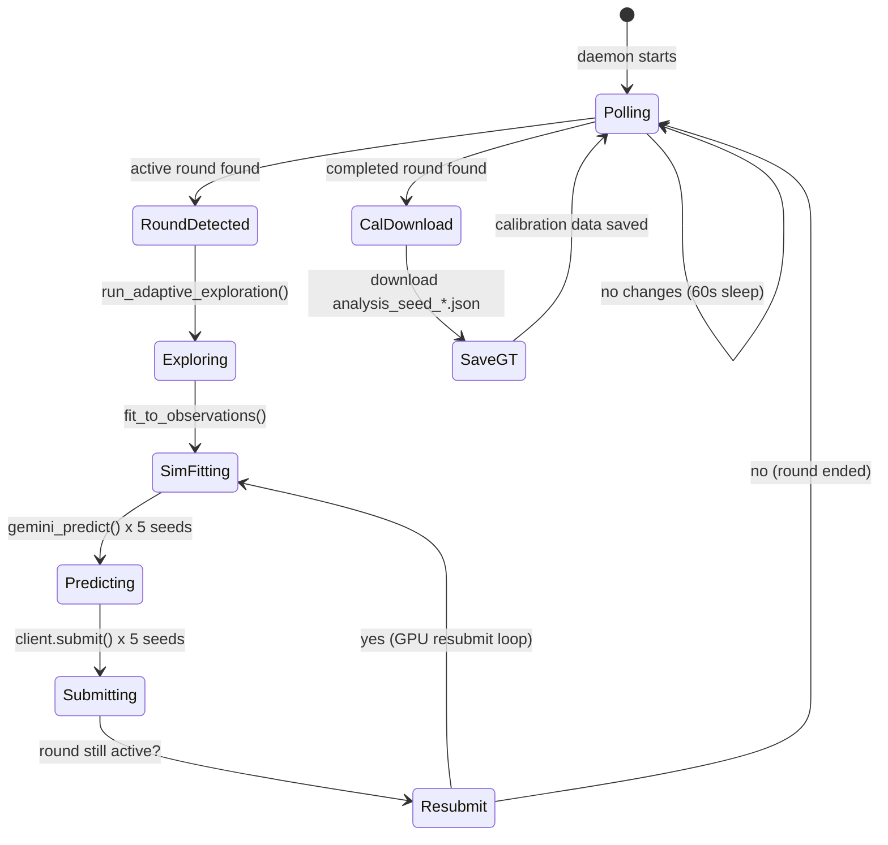
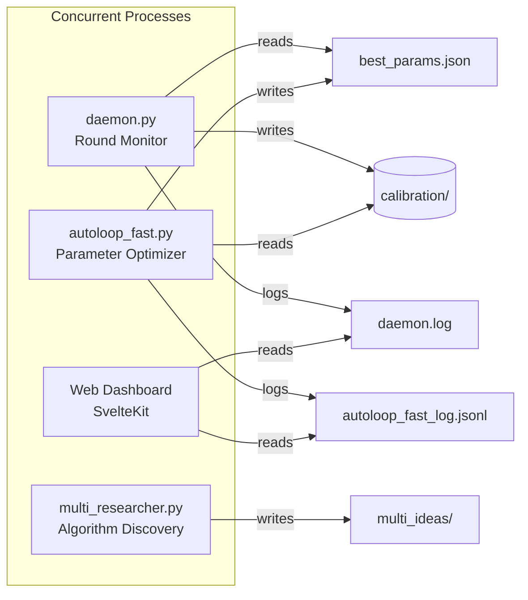
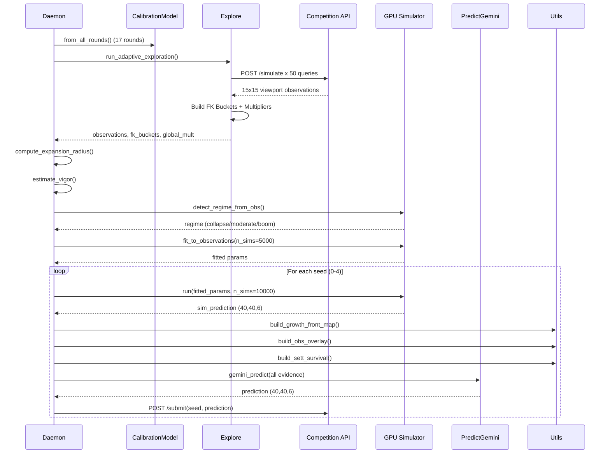

# Daemon System -- Technical Reference

Autonomous round detection, exploration, prediction, and iterative submission. Runs unattended 24/7.

---

## Architecture





---

## Round Monitor

```python
while True:
    rounds = client.get_rounds()
    for round in rounds:
        if round.status == "active" and round.id not in submitted:
            run_submission(client, round.id, detail)
            submitted.add(round.id)
        elif round.status == "completed" and round.number not in calibrated:
            download_round_analysis(client, round.id, round.number)
            calibrated.add(round.number)
    sleep(check_interval)  # default 60s
```

---

## Submission Pipeline (`run_submission()`)



### Step 1: Load Fresh Calibration
```python
cal = CalibrationModel.from_all_rounds()
predict._calibration = cal  # monkey-patch global singleton
```

### Step 2: Adaptive Exploration
```python
exploration = run_adaptive_exploration(client, round_id, detail)
# Returns: global_multipliers, fk_buckets, multi_store, variance_regime, observations
```

### Step 3: Compute Expansion Radius
```python
exp_radius = compute_expansion_radius(obs_list, detail)
# Returns: dict {distance: (sett_count, total_count)} per seed
```

Iterates through observations, computes Manhattan distance from each observed cell to nearest initial settlement, then accumulates settlement counts per distance bucket.

### Step 4: Estimate Vigor
```python
est_vigor = sett_observations / total_dynamic_observations
# Used for regime-conditional calibration
```

### Step 5: Simulator Inference
```python
# Detect regime from observations
regime = detect_regime_from_obs(obs_list, terrain)

# Choose GPU or CPU
use_gpu = torch.cuda.is_available()
fit_sims = 5000 if use_gpu else 500    # MC samples per CMA-ES eval
pred_sims = 10000 if use_gpu else 2000  # MC samples for final prediction

# Fit simulator parameters
sim_params, _ = fit_to_observations(rd, obs_list, n_sims=fit_sims,
                                     max_evals=200, use_gpu=use_gpu)

# Generate predictions per seed
for seed_idx in range(5):
    sim_predictions[seed_idx] = sim.run(sim_params, n_sims=pred_sims)
```

### Step 6: Build Per-Seed Evidence
```python
for seed_idx in range(5):
    growth_front_maps[seed_idx] = build_growth_front_map(seed_obs, terrain)
    obs_overlays[seed_idx] = build_obs_overlay(obs_list, terrain, seed_idx)
    sett_survivals[seed_idx] = build_sett_survival(obs_list, settlements, seed_idx)
```

### Step 7: Predict and Submit
```python
for seed_idx in range(5):
    prediction = gemini_predict(
        state, global_mult, fk_buckets,
        sim_pred=sim_predictions.get(seed_idx),
        sim_alpha=adaptive_alpha,
        growth_front_map=growth_front_maps.get(seed_idx),
        obs_overlay=obs_overlays.get(seed_idx),
        sett_survival=sett_survivals.get(seed_idx),
        est_vigor=est_vigor,
        obs_expansion_radius=exp_radius,
    )
    errors = validate_prediction(prediction)
    if errors:
        prediction = apply_floor(prediction)
    client.submit(round_id, seed_idx, prediction.tolist())
```

---

## GPU Resubmission Loop (`gpu_resubmit_round()`)

Called periodically while round is active. Each iteration uses a different strategy.

### Strategies by Iteration

| Iteration | Strategy |
|-----------|----------|
| 0 | Base: CMA-ES with default budget + alpha=0.25 |
| 1 | Tighter sigma (0.2), more evaluations |
| 2 | Different warm start (KNN neighbors only) |
| 3+ | Wider sigma (0.8), exploration mode |

### Iterative Improvement Process

```python
while round_is_active():
    # 1. Reload observations
    observations = load_all_obs(round_id)

    # 2. Rebuild multipliers and FK buckets (may have changed)
    gm = GlobalMultipliers()
    fk = FeatureKeyBuckets()
    for obs in observations:
        accumulate(gm, fk, obs)

    # 3. Re-fit simulator with different strategy per iteration
    sim_params = fit_varied_strategy(iteration)

    # 4. Predict and submit
    for seed in range(5):
        pred = gemini_predict(state, gm, fk,
                              sim_pred=sim.run(sim_params),
                              sim_alpha=adaptive_alpha)
        client.submit(round_id, seed, pred)

    iteration += 1
    wait(submission_cooldown)
```

---

## Calibration Download (`download_round_analysis()`)

```python
def download_round_analysis(client, round_id, round_number):
    cal_dir = data/calibration/round{N}/

    if analysis_seed_0.json exists:
        return  # Already downloaded

    detail = client.get_round_detail(round_id)
    save(cal_dir / "round_detail.json", detail)

    for seed in range(seeds_count):
        analysis = client.get_analysis(round_id, seed)
        save(cal_dir / f"analysis_seed_{seed}.json", analysis)
        # Contains: ground_truth (40,40,6), initial_grid, score
```

---

## Logging

All actions logged to `data/daemon.log` with timestamps:

```
[22:15:30] [INFO] Checking for active rounds...
[22:15:31] [INFO]   Round 18 detected (active)
[22:15:31] [INFO]   Calibration: 17 rounds, 136000 cells
[22:15:32] [INFO]   Starting adaptive exploration...
[22:15:45] [INFO]   Variance regime: MODERATE
[22:15:45] [INFO]   Multipliers: sett=0.823, port=0.156, forest=1.102
[22:15:45] [INFO]   Observed expansion radius: {0: (12, 15), 1: (8, 42), ...}
[22:15:46] [INFO]   Using params: prior_w=5.86, T_high=1.00, score_avg=89.389
[22:15:46] [INFO]   Estimated vigor: 0.0712
[22:15:47] [INFO]   Simulator: using GPU
[22:15:48] [INFO]   Simulator regime=moderate, alpha=0.35
[22:16:15] [INFO]   Simulator params fitted: base_surv=-0.47, exp_str=0.52
[22:16:35] [INFO]   Simulator predictions: 5 seeds, 10000 sims each
[22:16:36] [INFO]   Seed 0: ok (sett=0.0682)
[22:16:36] [INFO]   Seed 1: ok (sett=0.0715)
...
[22:16:38] [INFO]   All 5 seeds submitted for R18
```

---

## Error Handling

| Error | Handling |
|-------|----------|
| API 429 (rate limit) | Exponential backoff with retry |
| API timeout | Log warning, skip submission, retry next cycle |
| GPU OOM | Fall back to CPU simulator |
| Validation errors | Apply floor and re-normalize, then submit |
| Missing observations | Submit with calibration-only prediction (no obs enrichment) |
| Simulator fit failure | Log warning, submit without sim blend (sim_alpha=0) |
