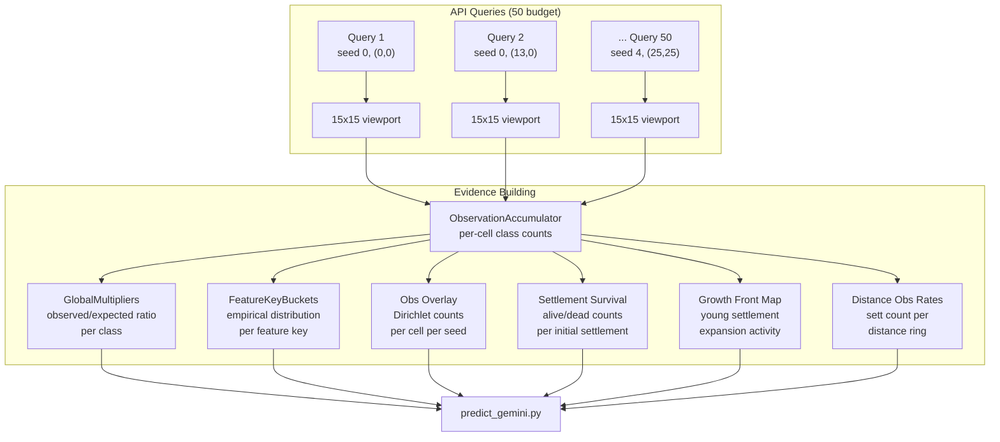
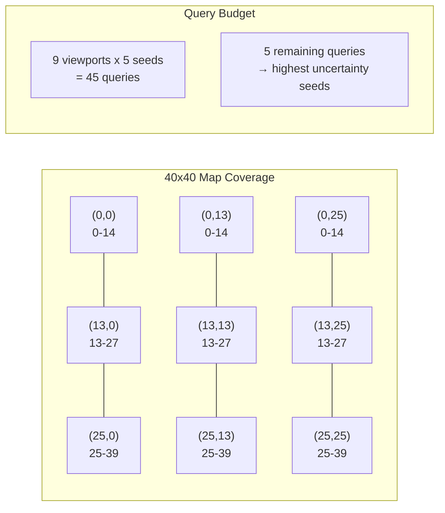
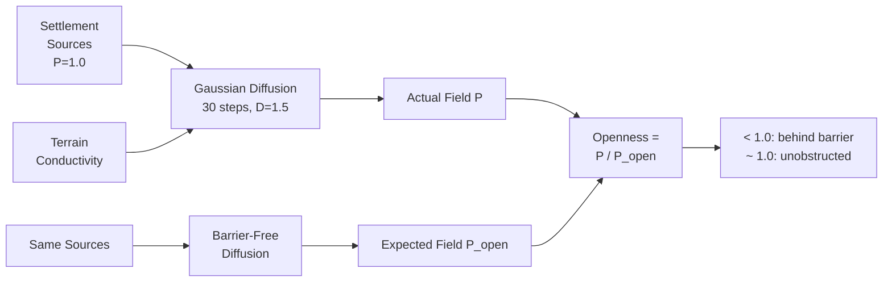

# Exploration System -- Technical Reference

Strategic data collection within the 50-query budget per round. Transforms raw API viewport observations into the statistical building blocks used by the prediction engine.

---

## Budget Constraint

- 50 simulation queries per round, shared across 5 seeds
- Each query returns a 15x15 viewport of the 40x40 map
- Rate limit: 5 queries/second

---

## Data Flow: Observations to Evidence



---

## Exploration Strategies

### Grid Strategy (Default)



Fixed 3x3 grid providing ~97% map coverage:

```python
GRID_POSITIONS = [
    (0, 0),  (13, 0),  (25, 0),   # Top row
    (0, 13), (13, 13), (25, 13),   # Middle row
    (0, 25), (13, 25), (25, 25),   # Bottom row
]
# Each viewport covers 15x15 cells
# Coverage per axis: 0-14, 13-27, 25-39 = 39/40 cells
# Overlap at columns/rows 13-14 and 25-27 gives double observations
```

Budget allocation:
- 9 viewports x 5 seeds = 45 queries (grid coverage)
- 5 remaining queries allocated to highest-uncertainty seeds

### Entropy-Targeted Strategy (Multi-Sample)

Information-theoretic viewport selection:

```python
1. Compute per-cell expected entropy from CalibrationModel (free)
   entropy_map = -sum(prior * log(prior))  # (40, 40)
   entropy_map[ocean] = 0  # static cells have zero information value
   entropy_map[mountain] = 0

2. Greedy viewport selection:
   for _ in range(n_viewports):
       score all (x, y) positions:
           region_entropy = sum(entropy_map[y:y+15, x:x+15] * ~covered)
           skip if >50% overlap with already-selected viewports
       select position with highest uncovered entropy
       mark region as covered

3. Query selected viewports (highest entropy first)
4. Repeat viewports with highest stochasticity (API randomness)
```

---

## Data Structures Built from Observations

### ObservationAccumulator

Per-cell class count accumulator across all viewport observations.

```python
class ObservationAccumulator:
    counts: ndarray(H, W, 6)   # Observation class counts
    total: ndarray(H, W)       # Total observations per cell

    def add_viewport(viewport, grid):
        for row, col in grid:
            cls = terrain_to_class(grid[row][col])
            counts[y+row, x+col, cls] += 1
            total[y+row, x+col] += 1
```

### GlobalMultipliers

Tracks observed vs expected class distributions across all seeds.

```python
class GlobalMultipliers:
    observed: ndarray(6)   # Total observed class counts
    expected: ndarray(6)   # Total expected class counts (from prior)

    def add_observation(obs_class, prior):
        observed[obs_class] += 1
        expected += prior    # prior distribution for that cell

    def get_multipliers():
        ratio = observed / expected
        return ratio         # >1 = more than expected, <1 = less
```

### FeatureKeyBuckets

Pools observations by feature key for empirical distributions.

```python
class FeatureKeyBuckets:
    counts: dict[FK, ndarray(6)]   # Per-FK class counts
    totals: dict[FK, int]          # Per-FK observation count

    def add_observation(fk, obs_class):
        counts[fk][obs_class] += 1
        totals[fk] += 1

    def get_empirical(fk) -> (ndarray(6), int):
        return normalize(counts[fk]), totals[fk]
```

**Statistics:** ~11,250 observations pooled into ~120 FK buckets = ~94 observations per bucket (vs 1-2 per cell).

### GlobalTransitionMatrix

Tracks terrain state transitions by distance and coastal status.

```python
class GlobalTransitionMatrix:
    # dist_buckets: 0-1, 2-3, 4-5, 6-7, 8+
    # coastal variants tracked separately
    transitions: dict[(dist_bucket, coastal), ndarray(6)]
```

### MultiSampleStore

Stores raw observation grids for variance analysis.

```python
class MultiSampleStore:
    grids: list[ndarray(H, W)]    # Raw observation grids
    # Computes per-FK settlement variance
    # Detects stochastic API behavior (different results per query)
```

---

## Observation Overlay Functions

### `build_obs_overlay()`

Per-cell empirical distribution from direct observations.

```python
def build_obs_overlay(observations, terrain, seed_idx):
    obs_counts = zeros(H, W, 6)  # Class counts per cell
    obs_total = zeros(H, W)      # Total observations per cell

    for obs in observations:
        if obs.seed_index != seed_idx: continue
        for row, col in obs.grid:
            cls = terrain_to_class(grid[row][col])
            obs_counts[y+row, x+col, cls] += 1
            obs_total[y+row, x+col] += 1

    return obs_counts, obs_total
```

Used in Dirichlet-Multinomial conjugate update (Stage 4.6 of prediction pipeline).

### `build_sett_survival()`

Per-initial-settlement alive/dead evidence.

```python
def build_sett_survival(observations, settlements, seed_idx):
    alive_counts = zeros(n_sett)  # Times observed alive
    dead_counts = zeros(n_sett)   # Times observed dead

    for obs in observations:
        if obs.seed_index != seed_idx: continue
        for cell in obs.grid:
            if cell_position in settlement_positions:
                if cls in (settlement, port): alive += 1
                else: dead += 1  # empty, ruin, forest = dead

    return alive_counts, dead_counts, (alive + dead) > 0
```

Strongest per-cell signal: binary alive/dead observed multiple times.

### `build_growth_front_map()`

Heat map of active expansion fronts from young settlements.

```python
def build_growth_front_map(observations, terrain):
    front_map = zeros(H, W)

    for settlement in obs.settlements:
        if settlement.population >= 1.0: continue  # Only young
        youth = 1.0 - population  # 0 (mature) to 1 (newborn)
        # Spread with Manhattan decay within r=3
        for dy, dx in manhattan_radius(3):
            front_map[sy+dy, sx+dx] += youth / (1 + manhattan_dist)

    return normalize_to_0_1(front_map)
```

### `compute_terrain_openness()`



Diffusion-based terrain accessibility metric.

```python
def compute_terrain_openness(terrain, settlements, n_steps=30, D=1.5, decay=0.12):
    # Initialize diffusion source at settlements
    P[settlement_cells] = 1.0

    # Diffusion with terrain conductivity
    conductivity[forest] = 0.7  # forests resist
    conductivity[ocean/mountain] = 0.0  # impassable

    for _ in range(n_steps):
        laplacian = sum(neighbor_conductivity * neighbor_P) - 4 * self_conductivity * P
        P += dt * (D * laplacian - decay * P)
        P[settlements] = 1.0  # source reset
        P[barriers] = 0.0     # hard boundary

    # Compare to barrier-free diffusion
    P_open = same_diffusion_but_uniform_conductivity()

    # Openness ratio: <1.0 = behind barrier, ~1.0 = unobstructed
    return clip(P / P_open, 0.0, 1.5)
```

Used in terrain barrier correction (autoloop `barrier_strength` parameter).
