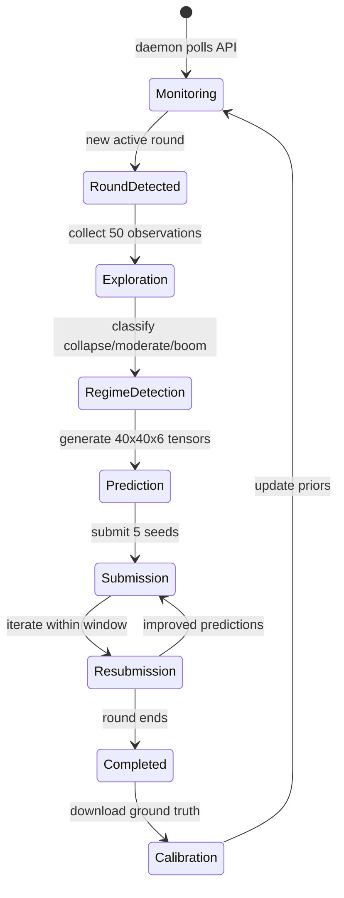

# Astar Island Prediction System

Autonomous system that observes a Norse civilization simulator, builds probabilistic models, and submits 40x40x6 probability tensor predictions across 5 seeds per round.

---

## Features

- Adaptive exploration: entropy-targeted viewport selection within 50-query budget
- Hierarchical Bayesian calibration from 17 rounds of ground truth
- Regime detection (collapse/moderate/boom) from early observations
- Parametric simulator fitting via CMA-ES optimization
- Feature-key bucketing for empirical distribution pooling
- Continuous autonomous parameter optimization (770k+ experiments)
- Real-time web dashboard for monitoring all subsystems
- Automatic round detection and multi-seed submission

---

## User Flows

### Round Lifecycle

---

## Subsystems

### 1. Daemon (daemon.py)
- Polls API every 60s for new rounds
- Downloads completed rounds' ground truth to `data/calibration/`
- Triggers exploration, prediction, and submission pipeline
- GPU resubmission loop for iterative improvement

### 2. Autoloop (autoloop_fast.py)
- Metropolis-Hastings parameter optimization
- Backtests against 8+ rounds x 5 seeds (leave-one-out)
- ~70ms per experiment (~160k experiments/hour)
- 40+ tunable parameters: FK blending, multipliers, temperature, calibration weights
- Greedy accept with 20% Metropolis exploration on near-misses

### 3. Prediction Engine (predict_gemini.py)
- Hierarchical calibration prior (fine/coarse/base/global)
- Empirical FK distribution blending
- Global multiplier adjustment (observed/expected ratios)
- Post-hoc corrections: growth fronts, survival evidence, terrain barriers
- Temperature scaling (entropy-aware)
- Optional simulator blend (alpha=0.20-0.35)

### 4. Simulator (sim_inference.py + sim_model_gpu.py)
- 17-parameter parametric simulator
- CMA-ES fitting with regime-specific warm starts
- KNN transfer learning from historical rounds
- GPU-accelerated: 10k simulations per evaluation

### 5. Web Dashboard (web/)
- SvelteKit app with 7 route pages
- Real-time: scores, autoloop progress, daemon status, logs
- Components: heatmaps, sparklines, gauge bars, flow diagrams

### 6. Multi-Researcher
- Claude Opus + Gemini Flash-Lite generate structural algorithm improvements
- Ideas saved as executable Python files in `data/multi_ideas/`
- Best ideas scored 86.7 (vs 89.4 baseline -- different evaluation scope)

---

## Edge Cases

- Boom rounds (settlement rate >15%) score ~2 points lower than non-boom
- Collapse rounds (settlement <3%) require aggressive prior narrowing
- Stochastic API: same query returns different results across calls
- Rate limiting (429 responses): exponential backoff with retry
