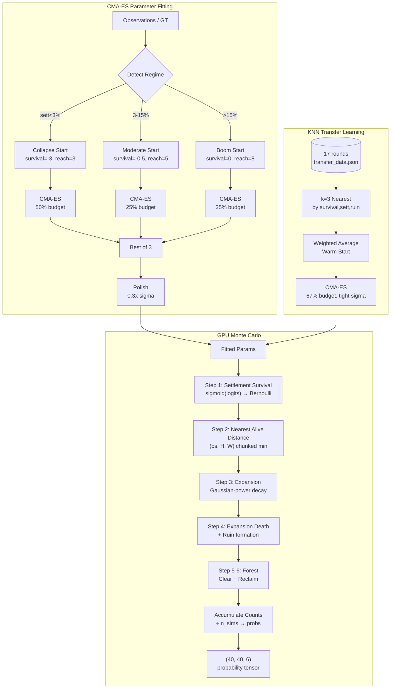
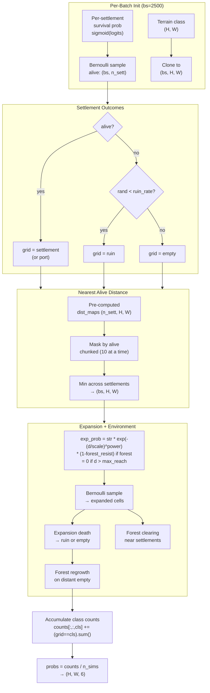
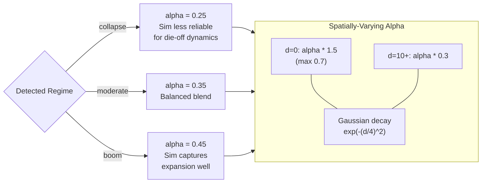

# GPU Simulator -- Deep Technical Reference

PyTorch CUDA-accelerated Monte Carlo simulator for the Astar Island Norse civilization model. Drop-in replacement for the CPU numpy version with ~100x speedup.

---

## Architecture



```
sim_model.py (CPU)          sim_model_gpu.py (GPU)
├── Simulator               ├── GPUSimulator
├── compute_score()         ├── fit_cma_gpu()
├── PARAM_SPEC (17 params)  └── (imports PARAM_SPEC from sim_model)
└── params_to_vec/vec_to_params

sim_inference.py
├── fit_to_gt()            # CMA-ES fitting against ground truth
├── fit_to_observations()  # CMA-ES fitting from live observations
├── WARM_STARTS            # 3 regime-specific starting points
└── _knn_warm_start()      # Transfer learning from historical rounds
```

---

## Simulator Parameters (17 dimensions)

Defined in `sim_model.PARAM_SPEC`, each with (default, min, max):

### Settlement Survival (5 params)
| Parameter | Purpose | Typical Range |
|-----------|---------|---------------|
| `base_survival` | Logit intercept for settlement survival | -3.0 to 0.0 |
| `food_coeff` | Forest/food production coefficient | 0.0 to 1.0 |
| `coastal_mod` | Coastal settlement survival modifier | -1.0 to 0.0 |
| `cluster_pen` | Cluster density linear penalty | -1.0 to 0.0 |
| `cluster_optimal` | Optimal cluster density for inverted-U | 1.0 to 5.0 |

**Survival probability:**
```python
logits = base_survival
       + food_coeff * (food_within_r2 / 12.0)
       + coastal_mod * is_coastal
       + cluster_pen * (cluster_r3 / 3.0)
       + cluster_quad * ((cluster_r3 - cluster_optimal)^2 / 9.0)
surv_prob = sigmoid(logits)
```

### Expansion (5 params)
| Parameter | Purpose | Typical Range |
|-----------|---------|---------------|
| `expansion_str` | Expansion probability coefficient | 0.1 to 1.0 |
| `expansion_scale` | Distance scale for expansion decay | 1.0 to 6.0 |
| `decay_power` | Power of distance decay (higher = sharper) | 1.0 to 4.0 |
| `max_reach` | Hard cutoff distance for expansion | 2.0 to 10.0 |
| `forest_resist` | Forest terrain expansion resistance | 0.0 to 0.5 |

**Expansion probability:**
```python
exp_prob = expansion_str * exp(-(d / expansion_scale)^decay_power)
exp_prob *= (1 - forest_resist) if cell_is_forest
exp_prob = 0 if d > max_reach
```

### Post-Expansion (4 params)
| Parameter | Purpose | Typical Range |
|-----------|---------|---------------|
| `exp_death` | Probability expanded cell dies | 0.1 to 0.8 |
| `ruin_rate` | Probability dead cell becomes ruin | 0.05 to 0.5 |
| `port_factor` | Probability expansion on coast becomes port | 0.05 to 0.5 |
| `forest_clear` | Forest clearing rate near settlements | 0.1 to 0.6 |

### Environment (2 params)
| Parameter | Purpose | Typical Range |
|-----------|---------|---------------|
| `forest_reclaim` | Empty cell forest regrowth rate | 0.01 to 0.15 |
| `cluster_quad` | Quadratic cluster penalty coefficient | -0.5 to 0.0 |

---

## GPUSimulator Internals

### Initialization (`__init__`)

Pre-computes and transfers to CUDA:

1. **Terrain data** `(H, W)` as int8 tensor
2. **Terrain class mapping** `(H, W)` - raw codes to 6-class indices
3. **Settlement features:**
   - `sett_coastal` (n_sett,) float32 - is coastal flag
   - `sett_has_port` (n_sett,) bool - has port flag
   - `sett_cluster` (n_sett,) float32 - cluster density within r=3
   - `sett_food_r2` (n_sett,) float32 - food (forest/plains) within Manhattan r=2
4. **Distance maps** `(n_sett, H, W)` float32 - pre-computed per-settlement distances
5. **Cell masks:**
   - `cell_coastal` (H, W) bool
   - `cell_is_forest` (H, W) bool
   - `expand_mask` (H, W) bool - buildable and not already settlement

### Simulation Loop (`run()`)



**Batched execution:** processes `batch_size` simulations in parallel (default 2500).

For each batch of `bs` simulations:

```
Step 1: Sample settlement survival
    alive = rand(bs, n_sett) < surv_prob   # Bernoulli sampling

Step 2: Initialize grids from terrain class
    grids = terrain_class.expand(bs, H, W)  # (bs, H, W)

Step 3: Apply settlement outcomes
    for each settlement:
        if alive: grid[sy,sx] = settlement (or port if has_port)
        if dead and rand < ruin_rate: grid[sy,sx] = ruin
        if dead and no ruin: grid[sy,sx] = empty

Step 4: Compute nearest alive distance
    # (bs, H, W) - minimum distance to any alive settlement
    # Processed in chunks of 10 settlements to balance memory
    nearest = min over settlements(dist_map * alive_mask)

Step 5: Compute expansion probability
    exp_prob = expansion_str * exp(-(nearest/scale)^power)
    exp_prob *= (1 - forest_resist) where forest
    exp_prob = 0 where nearest > max_reach
    exp_prob = 0 where not buildable

Step 6: Sample and apply expansion
    expanded = rand(bs, H, W) < exp_prob
    port_expanded = expanded & coastal & rand < port_factor
    sett_expanded = expanded & ~port_expanded

Step 7: Expansion death
    exp_dies = expanded & rand < exp_death
    exp_ruin = exp_dies & rand < ruin_rate

Step 8: Forest clearing
    clear_prob = forest_clear * exp(-(nearest/3)^2)
    cleared = is_forest & rand < clear_prob

Step 9: Forest reclamation
    reclaim_prob = base_rate * min(nearest/5, 1)
    # Higher regrowth on originally-forested cells
    reclaimed = is_empty & rand < reclaim_prob

Step 10: Accumulate counts
    for class in 0..5:
        counts[:,:,class] += (grids == class).sum(dim=0)
```

**Output:** `probs = counts / n_sims` -> `(H, W, 6)` numpy array

### Performance

| Setting | CPU (sim_model) | GPU (sim_model_gpu) |
|---------|-----------------|---------------------|
| 500 sims | ~0.5s | ~0.05s |
| 5000 sims | ~5s | ~0.3s |
| 10000 sims | ~10s | ~0.5s |
| Memory (L4 24GB) | N/A | ~2 GB per run |

---

## CMA-ES Fitting Pipeline

### `fit_to_gt()` -- Fitting Against Ground Truth

Used for offline calibration of all historical rounds.

```
Input: RoundData (terrain, settlements, ground_truth)

1. Detect regime from GT: collapse (<3% sett), boom (>15%), moderate
2. Multi-start CMA-ES:
   a. Detected regime start (50% of budget)
   b. Regime 2 start (25% of budget)
   c. Regime 3 start (25% of budget)
3. Polish: refine best with 0.3x sigma (25% of budget)

Objective: minimize -compute_score(gt, sim.run(params))
CMA-ES options:
  - bounds: PARAM_SPEC min/max
  - tolfun: 0.01 (stop if improvement < 0.01)
  - tolx: 1e-4 (stop if step < 1e-4)

Output: (best_params, best_score)
```

### `fit_to_observations()` -- Fitting From Live Observations

Used during live rounds when no ground truth is available.

```
Input: RoundData, observations (from API)

1. Compute observable features from observations:
   - survival_rate: initial settlements still alive / total observed
   - sett_rate: settlement class / total dynamic cells observed
   - ruin_rate: ruin class / total dynamic cells observed

2. KNN warm-start from transfer_data.json:
   - Load GT-fitted params from all 17 historical rounds
   - Find k=3 nearest neighbors by Euclidean distance in feature space
   - Average their params weighted by 1/(distance + 0.01)

3. CMA-ES optimization:
   a. KNN warm start (67% budget, sigma=0.2, tighter)
   b. Regime warm start (33% budget, sigma=0.5, wider)
   Pick best result.

Objective: maximize mean log-likelihood of observed cells
   pred = sim.run(params)
   ll = mean(log(pred[obs_y, obs_x, obs_class]))

Output: (best_params, best_score_on_gt_if_available)
```

### Transfer Learning Data

`data/sim_params/transfer_data.json` stores GT-fitted params and features for every historical round:

```json
[
  {
    "round": "round5",
    "params": {"base_survival": -0.47, "expansion_str": 0.52, ...},
    "features": {
      "gt_survival": 0.65,
      "gt_sett_rate": 0.08,
      "gt_ruin_rate": 0.02
    },
    "score": 82.5
  },
  ...
]
```

---

## Regime-Specific Warm Starts

Three pre-computed starting points learned from fitting 15+ rounds:

### Collapse (settlement <3%)
```python
base_survival=-3.0, expansion_str=0.3, expansion_scale=1.5,
decay_power=3.0, max_reach=3.0, exp_death=0.7
```
Key: very low survival, narrow expansion, high death rate.

### Moderate (3-15% settlement)
```python
base_survival=-0.5, expansion_str=0.5, expansion_scale=2.5,
decay_power=2.5, max_reach=5.0, exp_death=0.4
```
Key: balanced survival and expansion.

### Boom (settlement >15%)
```python
base_survival=0.0, expansion_str=0.8, expansion_scale=4.0,
decay_power=1.5, max_reach=8.0, exp_death=0.3
```
Key: high survival, wide expansion, low death.

---

## Adaptive Alpha (Simulator Blend Weight)



The blend weight between statistical model and simulator varies by regime:

```python
REGIME_ALPHAS = {
    "collapse": 0.25,  # Simulator less reliable for collapse dynamics
    "moderate": 0.35,  # Balanced blend
    "boom": 0.45,      # Simulator captures expansion well in boom
}
```

In `predict_gemini.py`, the blend is spatially varying:
```python
alpha_near = min(sim_alpha * 1.5, 0.7)   # Higher weight near settlements
alpha_far = sim_alpha * 0.3               # Lower weight far from settlements
alpha_map = alpha_far + (alpha_near - alpha_far) * exp(-(dist/4)^2)
pred = (1 - alpha_map) * statistical_pred + alpha_map * sim_pred
```

---

## `fit_cma_gpu()` -- GPU-Optimized CMA-ES

Dedicated GPU fitting function with normalized parameter space:

```python
# Normalize parameters to [0,1] for uniform step sizes
x_norm = (x - lo) / (hi - lo)

# CMA-ES in normalized space
es = CMA(x0_norm, sigma=0.5, bounds=[0, 1])

# Each evaluation:
x = lo + x_norm * (hi - lo)  # denormalize
pred = gpu_sim.run(params, n_sims=1000)
score = compute_score(target, pred)
```

Used by `daemon.py:gpu_resubmit_round()` for iterative improvement during active rounds.
