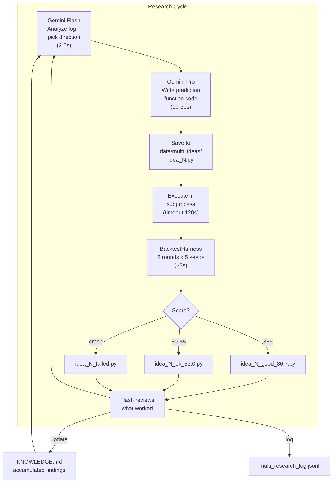
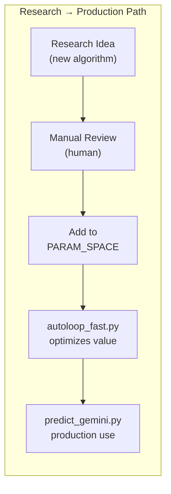

# Multi-Researcher -- Technical Reference

Autonomous research agent that uses LLMs to generate, evaluate, and iterate on structural algorithm improvements for the prediction pipeline.

---

## Architecture





---

## Models Used

| Model | Role | Latency | Cost |
|-------|------|---------|------|
| Gemini 3.1 Pro Preview | Code generation (replaces Claude Opus) | 10-30s | Higher |
| Gemini 3 Flash Preview | Fast analysis, direction picking (replaces Claude Haiku) | 2-5s | Lower |

Both accessed via `google-genai` SDK with `GOOGLE_API_KEY` from `.env`.

---

## Research Cycle

### Step 1: Direction Selection (Flash)

Flash receives:
- Current best score and parameters
- Last 5-10 experiment results (accepted + rejected)
- Knowledge base (`KNOWLEDGE.md`) of accumulated findings
- Available parameter space and current values

Flash outputs:
- 1-3 promising research directions
- Rationale for each
- Specific parameters/code areas to modify

### Step 2: Code Generation (Pro)

Pro receives:
- Selected direction from Flash
- Current prediction function source code
- Full parameter space definition
- Calibration model interface
- Examples of previous successful modifications

Pro outputs:
- Complete modified prediction function
- Wrapped in executable Python that matches BacktestHarness interface

### Step 3: Evaluation

```python
# Extract Python code from LLM response
code = extract_code_block(response)

# Write to data/multi_ideas/idea_{N}.py
idea_path = save_idea(code, idea_number)

# Execute in subprocess for safety
result = subprocess.run(["python", str(idea_path)], capture_output=True, timeout=120)

# Parse score from stdout
score = extract_score(result.stdout)
```

### Step 4: Analysis (Flash)

Flash receives:
- Generated code and its score
- How it compares to current best
- Per-round breakdown (boom vs non-boom)

Flash decides:
- Whether this direction is promising (continue iterating)
- What to modify next (narrow search)
- Or abandon direction (try something else)

---

## Idea Files

Generated algorithms saved to `data/multi_ideas/idea_{N}_{status}.py`:

| Status | Meaning | Example |
|--------|---------|---------|
| `ok_83.0` | Ran successfully, scored 83.0 | `idea_0001_ok_83.0.py` |
| `good_86.7` | Scored above threshold (85+) | `idea_0076_good_85.7.py` |
| `failed` | Crashed, timeout, or invalid output | `idea_0002_failed.py` |

### Current Statistics (as of 2026-03-21)

- Total ideas: 166+
- Successful (ok): ~60
- Good (85+): ~8
- Failed: ~40
- Best score: 86.7 (idea_0153, idea_0155)

**Note:** Research ideas are evaluated on a different harness configuration than autoloop, so scores are not directly comparable. The best research score (86.7) doesn't beat autoloop's 89.4 because research ideas don't use the full production pipeline (observation overlays, survival evidence, etc.).

---

## Knowledge Base

`KNOWLEDGE.md` accumulates findings across all research iterations:

- Which directions improved scores
- Which directions are dead ends
- Key insights about the scoring function
- Discovered parameter interactions
- Structural improvements that worked

---

## Integration with Autoloop

Research ideas that show improvement are manually reviewed and integrated:

1. Researcher generates structural improvement (new feature/algorithm)
2. If score improves: extract the innovation
3. Add as new parameter to `PARAM_SPACE` in `autoloop.py`
4. Add implementation to `autoloop_fast.py:FastHarness.evaluate()`
5. Add production implementation to `predict_gemini.py`
6. Autoloop optimizes the new parameter's value

---

## Logging

`data/multi_research_log.jsonl` tracks every research iteration:

```json
{
    "id": 153,
    "direction": "entropy-aware temperature with settlement proximity boost",
    "model": "gemini-3.1-pro-preview",
    "code_file": "idea_0153_good_86.7.py",
    "score": 86.7,
    "per_round": {"round2": 88.1, "round3": 85.2, ...},
    "accepted": true,
    "timestamp": "2026-03-21T18:30:00Z"
}
```
