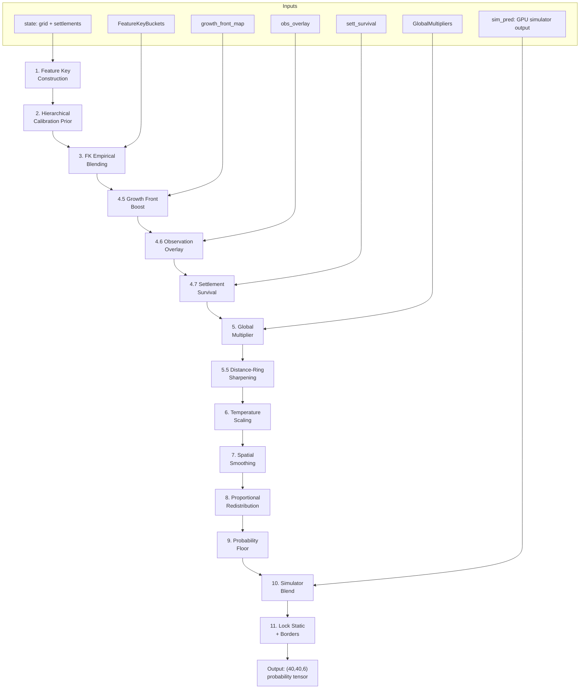
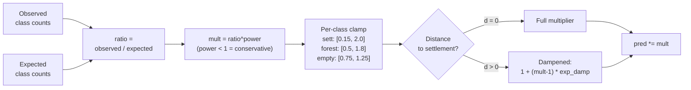
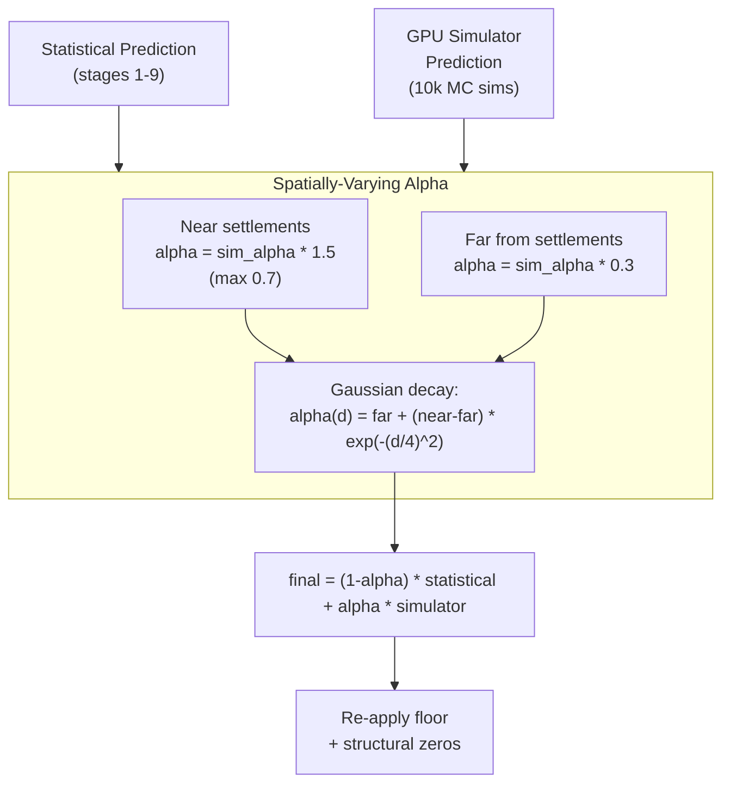

# Prediction Pipeline -- Step-by-Step Technical Reference

Complete walkthrough of `predict_gemini.py:gemini_predict()` -- the 11-stage production prediction engine.

---

## Pipeline Overview



---

## Input

```python
gemini_predict(
    state: dict,           # {"grid": [[int]], "settlements": [{"x","y","has_port"}]}
    global_mult,           # GlobalMultipliers instance
    fk_buckets,           # FeatureKeyBuckets instance
    multi_store=None,     # MultiSampleStore (unused in current best)
    variance_regime=None, # "EXTREME_BOOM" or None
    obs_expansion_radius=None,  # dict {dist: (sett_count, total)} or int
    est_vigor=None,       # float: estimated settlement % on dynamic cells
    sim_pred=None,        # (40,40,6) numpy array from GPU simulator
    sim_alpha=0.25,       # blend weight for simulator predictions
    growth_front_map=None,  # (40,40) float: young settlement expansion activity
    obs_overlay=None,     # (obs_counts, obs_total) per-cell observation data
    sett_survival=None,   # (alive_counts, dead_counts, observed) per settlement
) -> np.ndarray  # (40, 40, 6) probability tensor
```

---

## Stage 1: Feature Key Construction

```python
fkeys = build_feature_keys(grid, settlements)
# Returns (40, 40) grid of 6-tuples:
# (terrain_code, dist_bucket, coastal, forest_neighbors, has_port_flag, cluster_bucket)
```

**Distance buckets:** 0, 1, 2, 3, 4-5, 6-8, 9+
**Cluster buckets:** 0 (isolated), 1 (sparse, 1-2), 2 (dense, 3+)

```python
idx_grid, unique_keys = _build_feature_key_index(fkeys)
# idx_grid: (40, 40) int array -> index into unique_keys
# unique_keys: list of unique feature tuples (typically ~120 unique)
```

---

## Stage 2: Hierarchical Calibration Prior

If `est_vigor` is provided, uses regime-conditional calibration:
```python
cal = predict.get_regime_calibration(est_vigor)
# Weights training rounds by Gaussian similarity to estimated vigor
```

Otherwise uses uniform calibration from all historical rounds.

**Lookup table construction** (`build_calibration_lookup`):

For each unique feature key:

```
fine_weight = min(cal_fine_max, cal_fine_base + fine_count / cal_fine_divisor)
coarse_weight = min(cal_coarse_max, cal_coarse_base + coarse_count / cal_coarse_divisor)
base_weight = min(cal_base_max, cal_base_base + base_count / cal_base_divisor)
global_weight = cal_global_weight (fixed)

prior = (fine_weight * fine_dist + coarse_weight * coarse_dist
       + base_weight * base_dist + global_weight * global_dist)
prior /= sum(weights)
```

Output: `(N_unique, 6)` lookup table indexed by `idx_grid`.

---

## Stage 3: FK Empirical Blending

Builds empirical distributions from observation-derived FK bucket data:

```python
empiricals, counts = build_fk_empirical_lookup(fk_buckets, unique_keys, min_count=5)
# Only FKs with >= 5 observations get empirical data

strengths = min(emp_max, sqrt(counts))  # default: sqrt scaling
blended = pred * prior_w + empirical * strength
blended /= sum(blended)

pred = where(has_fk, blended, pred)  # only blend where sufficient data
```

**EXTREME_BOOM regime adjustment:**
```python
prior_w -= 0.5    # Trust observations more in extreme boom
emp_max *= 1.2    # Allow stronger empirical signal
```

---

## Stage 4.5: Growth Front Boost

Identifies cells near young, actively expanding settlements:

```python
gf_factor = 1.0 + growth_front_boost * growth_front_map
pred[:, :, 1] *= gf_factor  # boost settlement probability
pred /= sum(pred)  # renormalize
```

`growth_front_map` is built from observation data: cells where settlements have population < 1.0 (young) get Manhattan-decay influence within r=3.

---

## Stage 4.6: Observation Overlay (Dirichlet-Multinomial)

Conjugate Bayesian update on directly observed cells:

```python
# obs_counts: (40, 40, 6) - observed class counts per cell
# obs_total: (40, 40) - total observations per cell
# obs_pseudo: model weight (higher = trust model more)

pred[observed] = (obs_pseudo * pred[observed] + obs_counts[observed]) / (obs_pseudo + obs_total)
```

**Interpretation:** With `obs_pseudo=50` and `obs_total=5`:
- Model contributes 50/55 = 91% weight
- Observations contribute 5/55 = 9% weight

---

## Stage 4.7: Settlement Survival Correction

Per-initial-settlement Bayesian update based on alive/dead evidence:

```python
for each initial settlement (sy, sx):
    if observed:
        sett_counts = zeros(6)
        sett_counts[alive_cls] = alive_count       # alive -> settlement (or port)
        sett_counts[0] = dead_count * 0.5           # dead -> 50% empty
        sett_counts[3] = dead_count * 0.5           # dead -> 50% ruin

        pred[sy, sx] = (sett_pseudo * pred[sy, sx] + sett_counts) / (sett_pseudo + n_obs)
```

**Key insight:** Settlement cells have the strongest per-cell signal because alive/dead is binary and observed multiple times across queries.

---

## Stage 5: Global Multiplier



Adjusts predictions based on observed-vs-expected class distributions.

```python
ratio = observed / expected  # per-class ratio from GlobalMultipliers
mult = ratio^power           # dampened (power < 1 = conservative)
mult[1] = ratio[1]^sett_power  # settlement-specific power
mult[2] = ratio[2]^port_power  # port-specific power
mult[class] = clip(mult[class], lo, hi)  # per-class clamping
```

**Distance-aware application:**
```python
# Settlements (dist=0): full multiplier
pred[dist==0] *= mult

# Expansion zone (dist>0): dampened multiplier
mult_exp[c] = 1.0 + (mult[c] - 1.0) * exp_damp
pred[dist>0] *= mult_exp
```

---

## Stage 5.5: Distance-Ring Sharpening

Corrects the spatial profile of settlement predictions using per-distance observed rates:

```python
for distance d in 0..12:
    if observed_total[d] < 30: continue  # need statistical significance
    obs_rate = observed_sett[d] / observed_total[d]
    pred_rate = mean(pred[dist==d, settlement_class])
    correction = clip(obs_rate / pred_rate, 0.2, 5.0)
    adjustment = 1.0 + dist_sharpen * (correction - 1.0)
    pred[dist==d, settlement_class] *= adjustment
```

**Purpose:** If observations show settlements concentrated at d=1-3 but the model predicts d=5+, this corrects the spatial distribution.

---

## Stage 6: Entropy-Weighted Temperature

```python
cal_entropy = -sum(cal_prior * log(cal_prior))  # per-cell entropy from calibration
t_frac = clip((cal_entropy - T_ent_lo) / (T_ent_hi - T_ent_lo), 0, 1)
T = T_low + t_frac * (T_high - T_low)

# Near-settlement boom boost
boom_boost = 0.10 * sqrt(min(ratio[settlement], 1.0))
T[dist <= sett_radius] += boom_boost

pred = pred^(1/T)  # T>1 softens (high entropy), T<1 sharpens (low entropy)
```

---

## Stage 7: Selective Spatial Smoothing

3x3 uniform filter on settlement and ruin channels only:

```python
for class in [settlement, ruin]:
    smoothed = uniform_filter(pred[:,:,class], size=3)
    pred[:,:,class] = pred[:,:,class] * (1 - smooth_alpha) + smoothed * smooth_alpha
```

---

## Stage 8: Proportional Redistribution

Removes probability mass from impossible classes and redistributes:

```python
# Mountain mass on non-mountain cells
mountain_mass = pred[non_mountain, mountain_class]
pred[non_mountain, mountain_class] = 0

# Port mass on non-coastal cells
port_mass = pred[inland, port_class]
pred[inland, port_class] = 0

# Redistribute freed mass proportionally to calibration prior
redist_weights = cal_prior (excluding zeroed classes)
pred += freed_mass * redist_weights
```

---

## Stage 9: Probability Floor

```python
pred = max(pred, floor)           # default floor = 0.008
pred[non_mountain, mountain] = 0  # re-zero structural impossibilities
pred[non_coastal, port] = 0
pred /= sum(pred)                 # renormalize
```

---

## Stage 10: Simulator Ensemble Blend



Spatially-varying blend with parametric simulator predictions:

```python
alpha_near = min(sim_alpha * 1.5, 0.7)
alpha_far = sim_alpha * 0.3
alpha_map = alpha_far + (alpha_near - alpha_far) * exp(-(dist/4)^2)

pred = (1 - alpha_map) * pred + alpha_map * sim_pred
# Re-apply floor and structural zeros after blending
```

---

## Stage 11: Lock Static + Borders

```python
pred[ocean] = [1, 0, 0, 0, 0, 0]
pred[mountain] = [0, 0, 0, 0, 0, 1]
pred[border_rows_and_cols] = [1, 0, 0, 0, 0, 0]  # borders always empty
```

---

## Output

`(40, 40, 6)` numpy float64 array where each cell sums to 1.0. Classes:
- 0: Empty (ocean, plains, cleared land)
- 1: Settlement
- 2: Port
- 3: Ruin
- 4: Forest
- 5: Mountain
