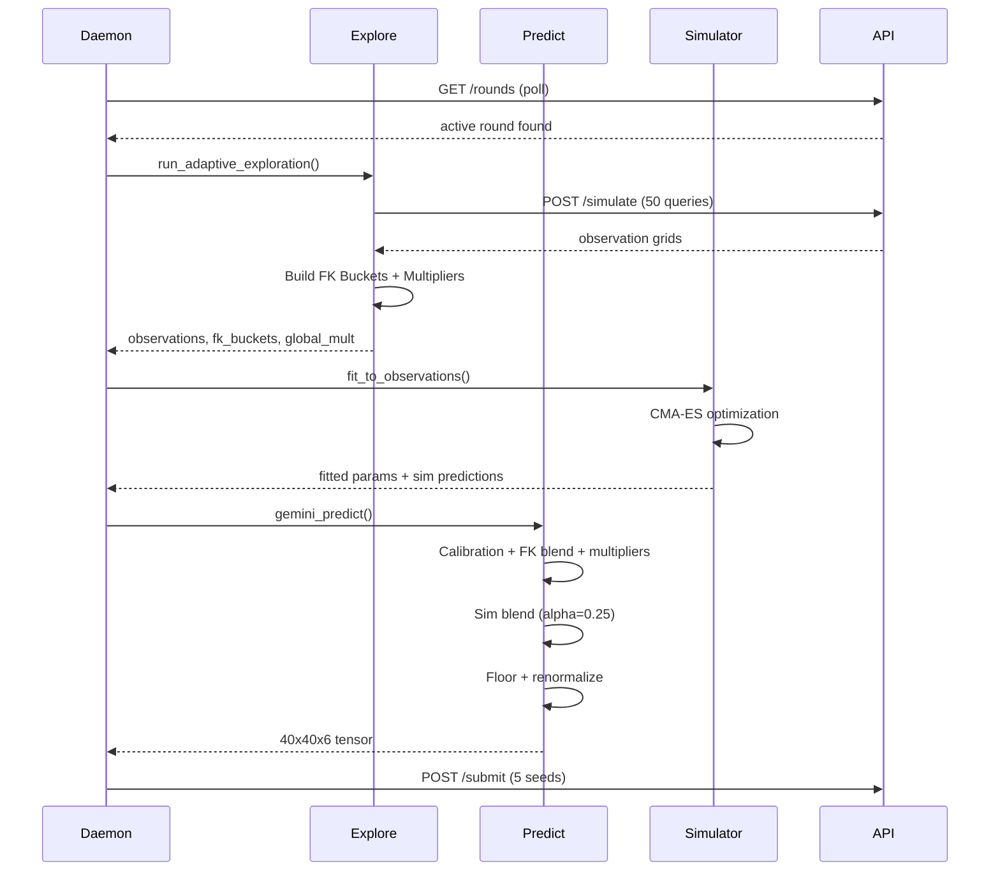

# Astar Island - Technical Design

Three-stage prediction pipeline: exploration, modeling, and submission, backed by continuous autonomous optimization.

---

## Core Data Models

### Prediction Tensor
```python
prediction: np.ndarray  # shape (40, 40, 6), dtype float64
# Classes: [empty, settlement, port, ruin, forest, mountain]
# Constraints: sum per cell = 1.0, min per class = 0.01
```

### Feature Key (per cell)
```python
feature_key = (
    terrain_code,       # int: terrain type at cell
    dist_bucket,        # int: distance to nearest initial settlement
    coastal,            # bool: adjacent to ocean
    forest_neighbors,   # int: count of adjacent forest cells
    has_port,           # bool: initial port present
    cluster_bucket,     # int: settlement cluster density bucket
)
```

### Calibration Model
```python
class CalibrationModel:
    fine: dict[tuple, np.ndarray]    # 6-tuple FK -> class distribution
    coarse: dict[tuple, np.ndarray]  # 4-tuple FK -> class distribution
    base: dict[tuple, np.ndarray]    # 1-tuple (terrain,) -> class distribution
    global_: np.ndarray              # overall distribution
```

### Simulator Parameters (17 dimensions)
```python
params = {
    "base_survival", "expansion_str", "expansion_scale",
    "decay_power", "max_reach", "coastal_mod",
    "food_coeff", "cluster_pen", "cluster_optimal", "cluster_quad",
    "ruin_rate", "port_factor", "forest_resist",
    "forest_clear", "forest_reclaim", "exp_death"
}
```

---

## API Endpoints

| Method | Path | Description |
|--------|------|-------------|
| GET | `/rounds` | List all rounds |
| GET | `/rounds/{id}` | Round detail + initial states |
| POST | `/rounds/{id}/simulate` | Query 15x15 viewport (costs 1 query) |
| POST | `/rounds/{id}/submit` | Submit 40x40x6 prediction for a seed |

---

## Prediction Pipeline



---

## Autoloop Optimization

### Parameter Space (40+ dimensions)
| Group | Parameters | Examples |
|-------|-----------|----------|
| FK Blending | 4 | prior_weight, max_strength, min_count, strength_fn |
| Multipliers | 10 | power, per-class bounds, dampening |
| Temperature | 4 | T_low, T_high, entropy thresholds |
| Spatial | 2 | smooth_alpha, barrier_strength |
| Calibration | 9 | fine/coarse/base weights and divisors |
| Growth/Obs | 3 | growth_front_boost, obs_overlay_alpha |

### Optimization Algorithm
```
1. Load best_params.json (current best: 89.389)
2. Perturb 1-3 random parameters (widened after 500+ rejections)
3. Backtest against 8 rounds x 5 seeds (vectorized, ~70ms)
4. Accept if score improves (greedy)
5. Accept with 20% probability if within 0.05 of best (Metropolis)
6. Write best_params.json on improvement
7. Repeat indefinitely
```

---

## Key Algorithms

### Hierarchical Calibration Lookup
```
weight_fine = cal_fine_base + count / cal_fine_divisor  (capped at cal_fine_max)
weight_coarse = cal_coarse_base + count / cal_coarse_divisor
weight_base = cal_base_base + count / cal_base_divisor

prior = weighted_average(fine, coarse, base, global)
```

### Score Blending (empirical FK + calibration)
```
blended = prior_weight * calibration + emp_strength * empirical
blended /= sum(blended)  # renormalize
```

### Global Multiplier
```
ratio = observed_count[class] / expected_count[class]
dampened = ratio ^ power[class]
clamped = clip(dampened, class_min, class_max)
prediction *= clamped  # per class
```

---

## File Map

| File | Purpose |
|------|---------|
| `daemon.py` | Round monitor, exploration trigger, submission loop |
| `explore.py` | Viewport selection, observation collection |
| `predict_gemini.py` | Production prediction engine |
| `fast_predict.py` | Vectorized prediction (numpy, for autoloop) |
| `calibration.py` | Hierarchical prior model |
| `sim_inference.py` | CMA-ES simulator fitting |
| `sim_model_gpu.py` | PyTorch GPU simulator |
| `autoloop_fast.py` | Continuous parameter optimization |
| `utils.py` | GlobalMultipliers, FeatureKeyBuckets, ObservationAccumulator |
| `client.py` | API client with rate limiting |
| `config.py` | Constants (MAP_W=40, NUM_CLASSES=6, PROB_FLOOR=0.01) |
| `best_params.json` | Current best parameters (auto-updated by autoloop) |
