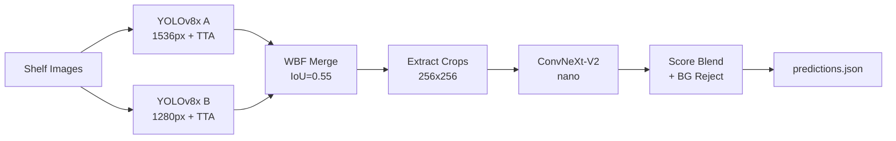
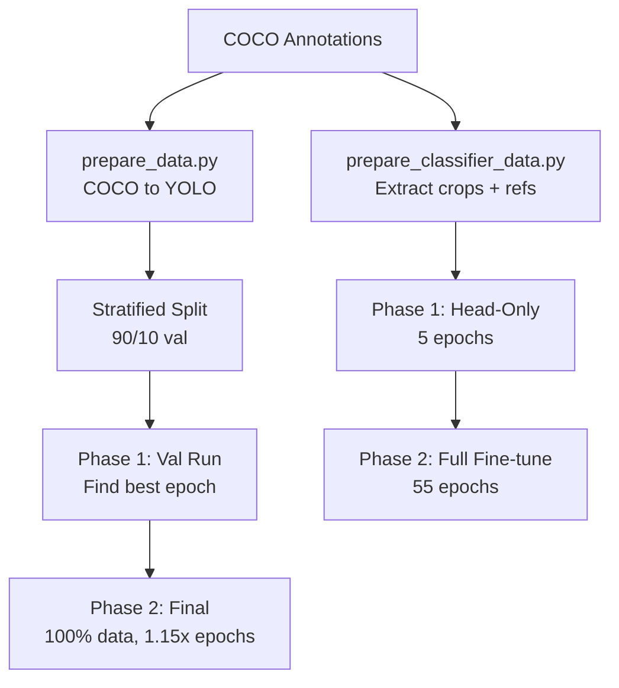

# NorgesGruppen Object Detection

Detect and classify grocery products on store shelf images using a two-stage ensemble pipeline: multi-model YOLO detection fused with Weighted Boxes Fusion, followed by ConvNeXt-V2 re-classification.

---

## Features

- Dual YOLOv8x detection with test-time augmentation (TTA)
- Weighted Boxes Fusion (WBF) for multi-model ensemble merging
- ConvNeXt-V2 nano re-classification with smart score blending
- Background rejection via trained class 356
- Rare category protection through stratified data splitting
- Sandbox-compatible inference (blocked imports, torch.load patch)
- 285s safety timeout (300s sandbox limit)

---

## User Flows

### Inference Pipeline

### Training Pipeline

---

## Acceptance Criteria

- [x] Detection mAP@0.5 > 0.95 on train set
- [x] Classification mAP@0.5 > 0.95 on train set
- [x] Combined score > 0.97 on train set
- [x] Runs within 300s on L4 GPU
- [x] Zip under 420 MB
- [x] No blocked imports
- [x] torch.load monkeypatch applied before ultralytics import
- [ ] Test set combined score > 0.95

---

## Edge Cases

- Products with identical packaging but different sizes (e.g., 500g vs 1kg)
- Occluded products where only partial label is visible
- Empty shelf regions triggering false positive detections (mitigated by BG class)
- Rare categories with 1-3 training examples (protected by stratified split)
- TTA timeout risk on large images (mitigated by 285s safety cutoff)
