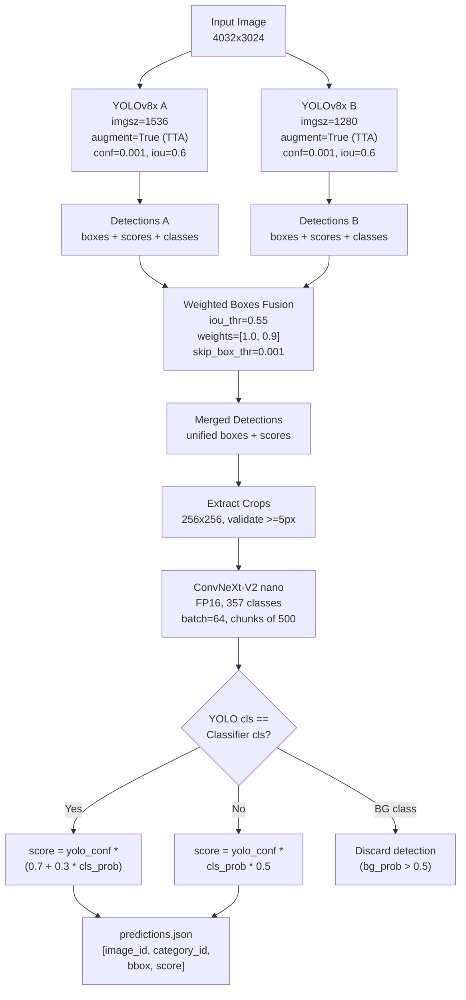
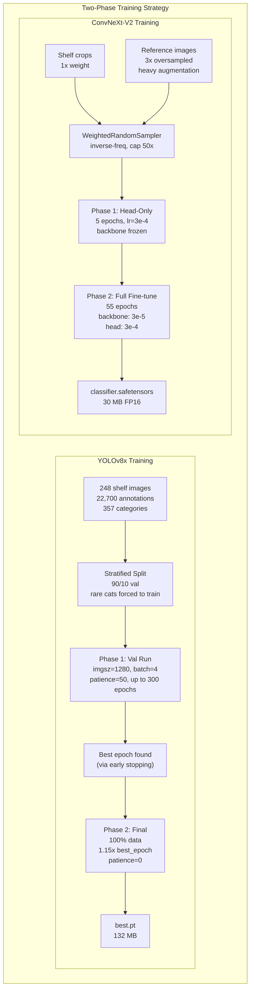
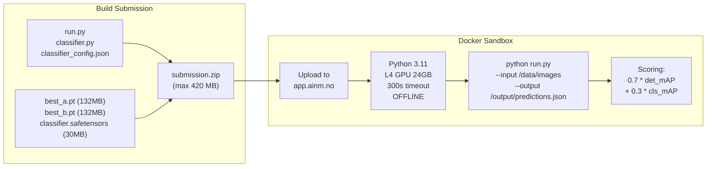

# NorgesGruppen Detection - Technical Design

Two-stage detection + classification pipeline optimized for grocery shelf product recognition within a constrained Docker sandbox.

---

## Inference Pipeline Detail





---

## Data Models

### COCO Annotation Format (Input)
```json
{
  "images": [{"id": 42, "file_name": "img_00042.jpg", "width": 4032, "height": 3024}],
  "annotations": [{"id": 1, "image_id": 42, "category_id": 15, "bbox": [x, y, w, h]}],
  "categories": [{"id": 0, "name": "product_0"}, ..., {"id": 356, "name": "unknown_product"}]
}
```

### Prediction Format (Output)
```json
[
  {"image_id": 42, "category_id": 15, "bbox": [x, y, w, h], "score": 0.87},
  ...
]
```

### Training Data
- 248 shelf images, ~22,700 annotations, 357 categories
- 327 product reference images with multi-angle photos
- Stratified split: rare categories (<=3 annotations) forced to training set

---

## Inference Pipeline

### Stage 1: Detection (YOLO)

| Model | Weight File | Input Size | TTA | Weight |
|-------|------------|------------|-----|--------|
| YOLO-A | `best_a.pt` | 1536px | Yes | 1.0 |
| YOLO-B | `best_b.pt` | 1280px | Yes | 0.9 |

Parameters: `conf=0.001`, `iou=0.6`, `max_det=3000`

### Stage 2: WBF Fusion

```python
from ensemble_boxes import weighted_boxes_fusion
# Normalize boxes to [0,1], merge, denormalize
# iou_thr=0.55, skip_box_thr=0.001
```

### Stage 3: Classification (ConvNeXt-V2)

- Model: ConvNeXt-V2 nano (15.2M params, 30 MB FP16 safetensors)
- Input: 256x256 crops extracted from detection boxes
- Output: 357 class probabilities
- Batch size: 64 crops, chunked at 500 crops

### Stage 4: Score Blending

```python
if classifier_class == yolo_class:
    score = yolo_conf * (0.7 + 0.3 * cls_prob)    # agreement boost
elif classifier_class == BG_CLASS:
    score = 0  # reject detection (bg_prob > 0.5)
else:
    score = yolo_conf * cls_prob * 0.5              # disagreement penalty
```

---

## Training Architecture

### YOLOv8x Training (train_yolo.py)

**Phase 1 -- Validation Run (90/10 split)**
- `imgsz=1280`, `batch=4`, `epochs=300`, `patience=50`
- AdamW optimizer, lr=0.001, cosine annealing to 0.00001
- Mosaic=1.0, mixup=0.0, copy_paste=0.1
- Output: best epoch count via early stopping

**Phase 2 -- Final Training (100% data)**
- Same hyperparameters, epochs = 1.15 * best_epoch
- No early stopping (`patience=0`)
- Output: `best.pt` trained on all data

### ConvNeXt-V2 Classifier Training (train_classifier.py)

**Phase 1 -- Head-Only (5 epochs)**
- Freeze backbone, train classification head only
- lr=3e-4

**Phase 2 -- Full Fine-tune (55 epochs)**
- Unfreeze all, differential learning rates (backbone: 3e-5, head: 3e-4)
- CosineAnnealingLR, label smoothing=0.1
- WeightedRandomSampler (inverse-frequency, capped at 50x)
- Reference images 3x oversampled (bridge white-bg to shelf-bg domain gap)

---

## Submission Pipeline



---

## Sandbox Compatibility

### Critical: torch.load Monkeypatch
```python
# MUST be before `from ultralytics import YOLO`
_original_torch_load = torch.load
def _patched_torch_load(*args, **kwargs):
    if "weights_only" not in kwargs:
        kwargs["weights_only"] = False
    return _original_torch_load(*args, **kwargs)
torch.load = _patched_torch_load
```

### Package Version Pinning
| Package | Sandbox Version | Breaking Change |
|---------|----------------|-----------------|
| ultralytics | 8.1.0 | 8.2+ weights fail to load |
| timm | 0.9.12 | 1.0+ weights fail to load |
| PyTorch | 2.6.0+cu124 | weights_only=True default |
| onnxruntime | 1.20.0 | opset > 20 fails |

### Submission Structure
```
submission.zip (max 420 MB)
├── run.py              # Entry point
├── classifier.py       # Model loader
├── classifier_config.json
├── classifier.safetensors  # 30 MB
├── best_a.pt               # 132 MB
└── best_b.pt               # 132 MB (optional)
```

---

## Timing Budget (~285s safety margin)

| Stage | Per Image | Total (248 imgs) |
|-------|-----------|-------------------|
| Model loading | -- | 10-15s |
| YOLO-A (1536 + TTA) | ~1.0s | ~248s |
| YOLO-B (1280 + TTA) | ~0.8s | ~198s |
| WBF merge | <0.01s | <2s |
| Classifier (batch 64) | ~0.05s/crop | ~15s |
| **Total** | | **~270s** |

---

## File Map

| File | Purpose |
|------|---------|
| `run.py` | Submission entry point (detection + classification) |
| `classifier.py` | ConvNeXt-V2 model loader (timm + safetensors) |
| `train_yolo.py` | Two-phase YOLOv8x training |
| `train_classifier.py` | Two-phase ConvNeXt-V2 training |
| `prepare_data.py` | COCO to YOLO format + stratified split |
| `prepare_classifier_data.py` | Crop extraction + reference image organization |
| `evaluate.py` | COCO evaluation (det mAP + cls mAP) |
| `sweep.py` | Hyperparameter sweep testing |
| `synth_test.py` | Local synthetic evaluation |
