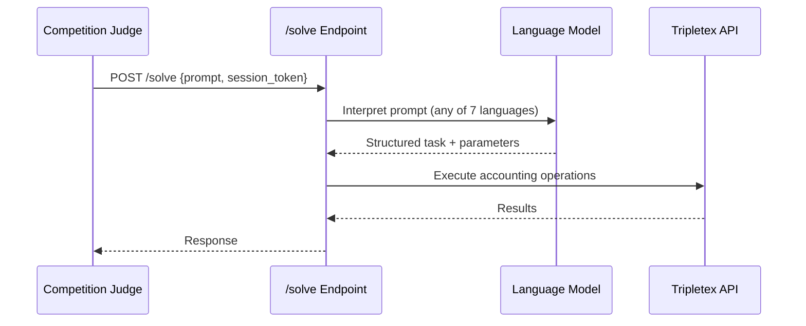
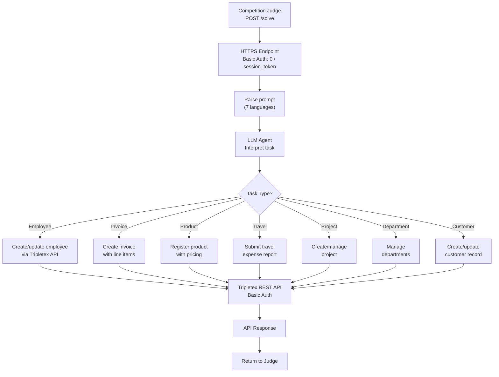

# Tripletex AI Accounting Agent

HTTPS endpoint that receives accounting task prompts in 7 languages and executes them via the Tripletex API.

---

## Features

- HTTPS `/solve` endpoint accepting task prompts
- Multi-language prompt interpretation (nb, en, es, pt, nn, de, fr)
- 30 task types across 7 categories: employees, customers, products, invoicing, travel expenses, projects, departments
- 56 variants per task type (1,680 total scenarios)
- Tiered scoring with efficiency bonuses

---

## User Flows

### Task Execution



---

## Scoring

```
score_per_task = correctness * tier_multiplier + efficiency_bonus
max_per_task = 6.0
```

- **Correctness:** Binary (task completed correctly or not)
- **Tier multiplier:** Higher for harder task types
- **Efficiency bonus:** Fewer API calls = higher bonus

---

## Acceptance Criteria

- [ ] HTTPS endpoint deployed and accessible
- [ ] Basic Auth: username `0`, password = session token
- [ ] Handles all 30 task types
- [ ] Handles all 7 input languages
- [ ] Response within timeout limits
- [ ] Correct Tripletex API usage per task type

---

## Intended Architecture



## Status

**Not started.** Requires:
1. HTTPS endpoint deployment (not a zip submission like NorgesGruppen)
2. LLM integration for prompt interpretation
3. Tripletex API client for task execution
4. Task type routing and parameter extraction

Documentation available at `docs/tripletex/` (overview, endpoint, scoring, examples, sandbox).
