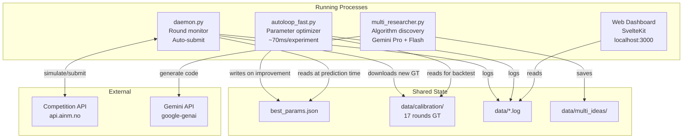

# Operations Guide

How to start, monitor, and manage all running systems.

---

## System Process Map



---

## Astar Island -- Full System Startup

All Python processes require the `-u` flag for unbuffered output (real-time logging).

### 1. Daemon (round monitor + auto-submission)

```bash
cd astar-island-solution
python -u daemon.py 2>&1 | tee data/daemon.log
```

Monitors API every 60s. On new round: explores, predicts, submits, then iterates.

### 2. Autoloop (parameter optimization)

```bash
cd astar-island-solution
python -u autoloop_fast.py 2>&1 | tee data/autoloop_fast_output.log
```

Runs continuously. Updates `best_params.json` on improvements. ~70ms per experiment.

### 3. Multi-Researcher (structural improvements)

```bash
cd astar-island-solution
python -u <researcher_script>.py 2>&1 | tee data/multi_researcher_output.log
```

Generates algorithm variants in `data/multi_ideas/`. Requires API keys in `.env`.

### 4. Web Dashboard

```bash
cd astar-island-solution/web
npm run dev
```

Opens at `http://localhost:3000`. Connects to API at `localhost:7091`.

---

## NorgesGruppen -- Training & Submission

### Training YOLOv8x

```bash
cd norgesgruppen-solution
python train_yolo.py
```

Two-phase: validation split (finds best epoch) then full data training. Takes ~4-6 hours on GPU. **Never run concurrent GPU training jobs.**

### Training Classifier

```bash
cd norgesgruppen-solution
python train_classifier.py
```

Two-phase: head-only warmup then full fine-tune. Takes ~2-3 hours.

### Building Submission

```bash
cd norgesgruppen-solution
zip -r ../submission.zip . -x ".*" "__MACOSX/*" "datasets/*" "classifier_data/*" "runs/*"
```

Verify zip is under 420 MB and contains `run.py` + weight files.

### Local Evaluation

```bash
cd norgesgruppen-solution
python evaluate.py
python synth_test.py  # synthetic test
```

---

## Environment Variables

API keys and tokens stored in `.env` file (not committed). Required for:
- Astar Island API authentication
- Gemini API (researcher agents)
- Any other external service calls

---

## Monitoring

### Astar Island Scores
- Web dashboard: `http://localhost:3000` (scores, autoloop, daemon status)
- Autoloop log: `data/autoloop_fast_output.log` (experiment results)
- Daemon log: `data/daemon.log` (round detection, submissions)
- Best params: `best_params.json` (current optimal, auto-updated)

### NorgesGruppen Scores
- Competition leaderboard: `https://app.ainm.no`
- Local eval: `python evaluate.py` (train set mAP)

---

## Troubleshooting

| Issue | Cause | Fix |
|-------|-------|-----|
| CUDA OOM | Concurrent GPU jobs | Kill other GPU processes first |
| ultralytics load error | Wrong version weights | Retrain with `ultralytics==8.1.0` |
| torch.load fails | Missing monkeypatch | Add patch before `from ultralytics import YOLO` |
| Rate limit 429 | Too many API calls | Daemon handles with exponential backoff |
| Submission rejected | Blocked import detected | Replace with allowed alternative (pathlib, json) |
| Autoloop stagnant | Local optimum | Will auto-widen perturbation after 500 rejections |
